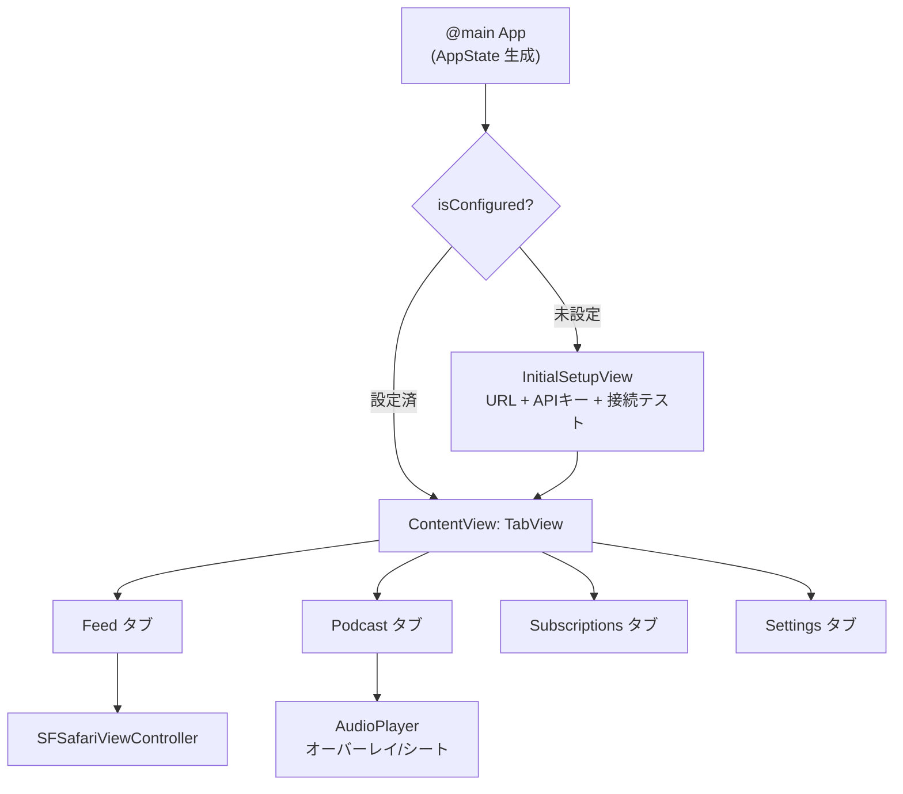
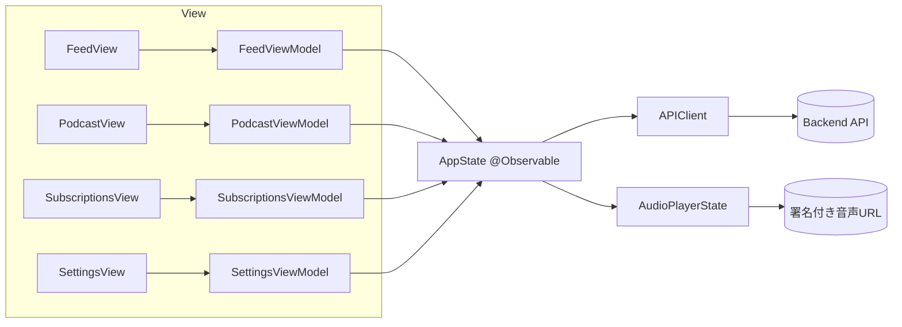
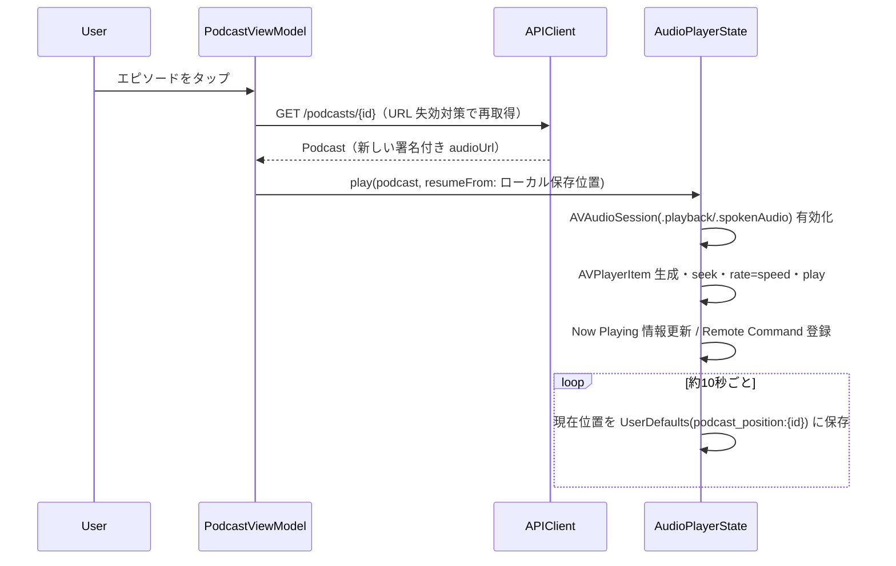

# iOS アプリ設計書（design / 設計）

**対象読者:** iOS 開発担当・レビュアー
**ステータス:** ドラフト
**最終更新日:** 2026-06-14
**関連:** [要件](../plan/2026-06-14-ios-app-requirements.md) / ADR [007](../adr/007-ios-direct-backend-access.md)〜[011](../adr/011-podcast-generation-status.md) / [Web フロントエンド仕様書](../spec/2026-06-10-web-frontend-spec.md)

> 本書は `docs/design/ios-design.html`（先行ビジュアル案）を**契約面で是正した正本**。乖離点は要件 §1.1 を参照。本書はルール `agent-rules/30` に従い、コードスニペットを最小化し意図・インターフェースを自然言語で記述する。

---

## 1. 技術スタック

| 項目 | 採用 | 理由 |
|---|---|---|
| UI | SwiftUI（iOS 17+） | 宣言的 UI・`ContentUnavailableView`/`@Observable` 等のモダン API |
| アーキテクチャ | MVVM | View と状態ロジックの分離・ViewModel 単体テスト容易（[ADR-010](../adr/010-ios-architecture-swiftui-mvvm.md)） |
| 非同期 | Swift Concurrency（async/await） | コールバック回避・型安全 |
| ネットワーク | URLSession | 標準のみで完結・追加依存なし |
| 音声 | AVFoundation（AVPlayer） | 速度制御・ストリーミング・バックグラウンド再生 |
| 永続化 | UserDefaults（@AppStorage） | API 設定・既定値・再生位置（[ADR-008](../adr/008-ios-local-state-persistence.md)） |
| テスト | XCTest / Swift Testing | ViewModel・APIClient のモックテスト |

---

## 2. ナビゲーション構成

Web はサイドバーナビだが、iOS は標準 `TabView`（4 タブ）に置換する。再生中はミニプレイヤーを常時表示し、タップで全画面プレイヤーを展開する（Web の AudioPlayerBar 相当）。

---

## 3. レイヤー構成と責務

- **AppState（@Observable・全 View 共有）**: API 設定・既定値の保持、`APIClient` の生成（設定変更時に再生成）、共有 `AudioPlayerState` の保持、`isConfigured` 等の派生状態。
- **APIClient**: 全エンドポイント呼び出し。`URLSessionProtocol` を注入しテスト可能化。レスポンスを Codable でデコードし、非 2xx を `APIError` に正規化。
- **AudioPlayerState（@Observable）**: AVPlayer ラッパー。再生制御・速度・音量・再生位置のローカル保存・Now Playing 連携。
- **各 ViewModel（@Observable・@MainActor）**: 画面単位の状態（loading/error/items）と操作。`AppState.apiClient` を介して通信。

---

## 4. データモデル（バックエンド契約に一致）

JSON は snake_case のため `CodingKeys` で Swift の camelCase に対応させる。**実 API に存在しないフィールドは持たせない**。

### Article（`GET /feed` の要素）
`id` / `title` / `url` / `source` / `score`(0〜1) / `publishedAt`(`published_at`, ISO 8601)。

### Podcast（`GET /podcasts` の要素・`GET /podcasts/{id}`）
`id` / `type`（"single"|"digest"） / `articleIds`(`article_ids`) / `difficulty`(難易度 enum) / `audioUrl`(`audio_url`, **1 時間有効の署名付き URL**) / `japaneseIntroText`(`japanese_intro_text`) / `durationSeconds`(`duration_seconds`) / `createdAt`(`created_at`)。
> `status` は現行 API レスポンスに含まれない（[ADR-011](../adr/011-podcast-generation-status.md)）。

### RssSource（`/settings/sources` の要素）
`name` / `url`。**ID は無く URL が一意キー**。

### DifficultyLevel（enum）
`toeic_600` / `toeic_900` / `ielts_55` / `ielts_7` / `eiken_2` / `eiken_p1`。UI 表示は 易/中/難 の 3 トーンへマップ。

### 端末ローカル状態（API モデルではない）
- `apiBaseURL` / `apiKey`（@AppStorage）
- `defaultDifficulty` / `defaultPlaybackSpeed`（@AppStorage）
- 音量（@AppStorage）
- 再生位置: キー `podcast_position:{id}` で秒数を保存（Web の localStorage と同一規約）。

---

## 5. API クライアント設計

Web の BFF プロキシは CORS 回避用であり、ネイティブには不要なため iOS はバックエンドへ**直接接続**する（[ADR-007](../adr/007-ios-direct-backend-access.md)）。全リクエストに `X-API-Key` を付与する。

| メソッド | パス | 用途 |
|---|---|---|
| GET | `/health` | 接続テスト（認証不要） |
| GET | `/feed` | 記事一覧 |
| POST | `/articles/{id}/star` | Star |
| POST | `/articles/{id}/dismiss` | Dismiss |
| GET | `/podcasts` | エピソード一覧 |
| GET | `/podcasts/{id}` | エピソード単体（再生直前の再取得に使用） |
| GET | `/settings/sources` | RSS 一覧 |
| POST | `/settings/sources` | RSS 追加（body `{name, url}`） |
| DELETE | `/settings/sources?url={encoded}` | RSS 削除（URL キー） |

**エラー正規化:** 通信失敗 → `APIError.network`、非 2xx → `APIError.http(status, detail)`（body の `detail` を抽出）。主要コード: 401（キー不正）/ 404（不存在）/ 409（重複）/ 422（不正フィード）。

**テスト戦略:** `URLSessionProtocol` に準拠する `MockURLSession` を注入し、固定レスポンスでデコード・エラー分岐を検証。ViewModel テストでは `APIClientProtocol` を差し替える。

---

## 6. 音声再生設計

- **単一インスタンス**: `AudioPlayerState` を `AppState` 経由でアプリ全体に 1 つだけ共有（Web の単一 `<audio>` 相当）。
- **バックグラウンド再生**: Info.plist の `UIBackgroundModes` に `audio`。`AVAudioSession` カテゴリ `.playback`・モード `.spokenAudio`。
- **ロック画面操作**: `MPNowPlayingInfoCenter`（タイトル=日本語イントロ抜粋・所要時間・再生位置）と `MPRemoteCommandCenter`（play/pause/skipForward+30/skipBackward−15）。
- **割り込み**: `AVAudioSession.interruptionNotification` を購読し、中断で一時停止、`.shouldResume` で再開。
- **位置保存/復元**: 再生中は約 10 秒ごと、終了時は 0 を保存。読み込み時に保存値へ seek。
- **速度/音量**: 速度は 8 段階、`AVPlayer.rate` に反映。音量・既定速度は永続化。

---

## 7. 画面別設計（要点）

- **InitialSetupView**: URL/APIキー入力、`GET /health` で接続テスト、成功で `AppState` に保存し遷移。
- **FeedView**: `List`、leading=Star / trailing=Dismiss の `swipeActions`、`.refreshable`、`.task` 初回ロード、`ContentUnavailableView` で空/エラー、タップで `SFSafariViewController`。スコアは横バーで可視化。
- **PodcastView**: `List`（難易度バッジ・種別・イントロ抜粋・再生時間・続き位置）、タップで再生（§6 フロー）、再生中インジケータ。詳細はサブ画面で全文表示。
- **SubscriptionsView**: 一覧 + ツールバー `+`、`onDelete`→確認→削除、`AddSubscriptionSheet`（名前/URL・クライアントバリデーション・409/422 をインライン表示、成功でシートを閉じ一覧更新）。
- **SettingsView**: 既定難易度 `Picker`、既定速度 `Slider`/`Picker`、API 設定（`SecureField` でキー）、テーマ切替。すべて端末ローカル保存。

---

## 8. ファイル構成（`ios/`）

ルートを `ios/NewsListen/` とし、機能単位（Feature ごと）にディレクトリを分割する。各ディレクトリの責務は次のとおり。

| ディレクトリ / ファイル | 含む要素・責務 |
|---|---|
| `NewsListenApp`（ルート） | `@main` エントリ・`AppState` 生成・設定有無によるルーティング |
| `ContentView`（ルート） | 4 タブの `TabView` + 常時表示のミニプレイヤー |
| `InitialSetupView`（ルート） | API 未設定時の初回セットアップ画面 |
| `AppState`（ルート） | `@Observable` のグローバル共有状態 |
| `Models/` | `Article` / `Podcast` / `RssSource` / `DifficultyLevel`（いずれも `Codable`） |
| `Networking/` | `APIClient` / `APIClientProtocol` / `APIError` / `URLSessionProtocol` |
| `Feed/` | `FeedView` / `FeedViewModel` / `ArticleRowView` / `SafariView` |
| `Podcast/` | 一覧・詳細・`PodcastViewModel` / 行ビュー / 全画面・ミニプレイヤー / `AudioPlayerState` |
| `Subscriptions/` | 一覧・`SubscriptionsViewModel` / 行ビュー / 追加シート |
| `Settings/` | `SettingsView` / `SettingsViewModel` |
| `Common/` | `DifficultyBadge` / 共有フォーマッタ（duration・date）/ トースト相当 |
| `Tests/` | `APIClient`・各 `ViewModel`・`AudioPlayerState` のユニットテスト |

> `Subscriptions` は専用タブ（Web では Settings と分離済み）。`/settings/sources` を URL キーで操作する点に注意。

---

## 9. 開発環境セットアップ方針

- Xcode 16+ で SwiftUI App テンプレートからプロジェクト作成、`ios/` 配下に配置。
- Capabilities: Background Modes（Audio）を有効化。
- 依存: 追加サードパーティ無し（標準フレームワークのみ）。
- ビルド/テストは Xcode（`xcodebuild`）で実行。CI 連携は Phase 2。
- 実機検証: `agent-rules/00` の開発サイクルに従い、フィーチャーブランチ上で実施。`develop`/`main` へ直接コミットしない。
</content>
