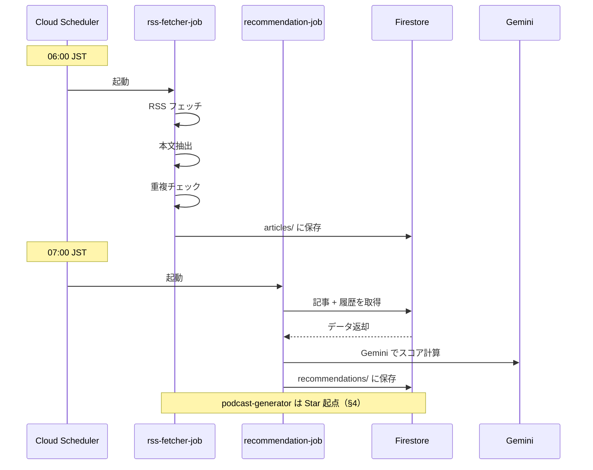

# バックエンド設計書

GCP 上の REST API・バッチ処理・Podcast 生成パイプラインの設計。**本書は設計・仕様の正本**です。

**メタデータ:**
- 言語: Python 3.12
- フレームワーク: FastAPI
- インフラ: Google Cloud
- リージョン: asia-northeast1
- 最終更新: 2026-06-29
- 認証: セッション（ADR-013）+ Passkey（ADR-035）反映
- 通知: Web Push（ADR-020）反映
- 本書: 設計・仕様の正本（Markdown）

> **本書の位置づけ:** バックエンドの設計・仕様の**正本**。確定内容を本書に集約する（旧 `docs/spec/2026-06-10-backend-spec.md` は本書へ統合し廃止）。実装の正本はコード、本書は責務・契約・意図の記述に徹する。

> ⚠️ **是正済み（2026-06-24）:** 旧版に残っていた **Cloud Tasks 前提の記述は実装と乖離していたため全面是正した**。
> Star/Dismiss を起点とした非同期処理は **Cloud Tasks ではなく Cloud Run Jobs を `JobTrigger` で起動する**方式（[ADR-005](../adr/005-job-trigger-on-action.md)）。
> Podcast 音声は**クロスユーザー共有キャッシュ**（[ADR-006](../adr/006-cross-user-podcast-cache.md)）で生成・配布する。
> 実装されている公開 API は `GET /health` / `GET /feed`（`?filter=all·unread`）/ `POST /articles/{id}/star·dismiss·mark-read` / `GET /articles/search` /
> `GET /podcasts` / `GET /podcasts/{id}` / `PATCH /podcasts/{id}/position` / `GET /podcasts/storage/usage` / `POST /podcasts/storage/cleanup` / `GET·POST·DELETE /settings/sources` /
> `GET /settings/featured-sources` / `GET·POST /settings/onboarding` / `GET·PUT /settings/preferences` /
> `GET·POST·DELETE /notifications/*` / `/auth/*`（`/auth/password/forgot·reset` 含む）/ `/admin/*`。
> 再生位置（`PATCH /podcasts/{id}/position`）と既定難易度・速度（`GET·PUT /settings/preferences`）は**サーバー保存し端末間で同期する**（[ADR-022](../adr/022-server-side-playback-position-and-preferences.md) が [ADR-008](../adr/008-ios-local-state-persistence.md) のローカル保存方針を上書き）。

---

## 1. インフラ構成

```mermaid
graph TB
    subgraph scheduler["SCHEDULER"]
        SCHED["Cloud Scheduler<br/>06:00 / 07:00 JST"]
    end
    
    subgraph batch["BATCH JOBS"]
        RSS["rss-fetcher-job<br/>feedparser + trafilatura"]
        REC["recommendation-job<br/>Gemini + Context Caching"]
    end
    
    subgraph api_server["API SERVER"]
        APIV["Cloud Run Service<br/>FastAPI :8080<br/>/feed /articles /podcasts<br/>/settings/sources"]
        JOBT["JobTrigger ADR-005<br/>jobLocks デバウンス → Jobs 起動"]
        POD_GEN["podcast-generator-job<br/>Gemini TTS → MP3 → 共有キャッシュ"]
    end
    
    subgraph data["DATA"]
        FS["Firestore<br/>articles/ userPrefs/ users/ sessions/<br/>recommendations/ podcasts/ podcastCache/<br/>asia-northeast1"]
        GCS["Cloud Storage<br/>WAVファイル · 30日 Lifecycle"]
        SM["Secret Manager<br/>podcast-api-key · gemini-api-key"]
    end
    
    subgraph external["EXTERNAL"]
        GEMINI["Gemini 2.5 Flash API<br/>スクリプト生成 Text · 音声合成 TTS · レコメンドスコア計算"]
        FEEDS["RSS Feeds 外部<br/>HackerNews · Zenn · ユーザー追加"]
    end
    
    SCHED -->|起動| RSS
    SCHED -->|起動| REC
    
    RSS -->|articles/ に保存| FS
    REC -->|recommendations/ に保存| FS
    
    APIV -->|リクエスト| FS
    APIV -->|起動| JOBT
    JOBT -->|起動| POD_GEN
    
    POD_GEN -->|署名付き URL 配布| GCS
    POD_GEN -->|API 呼び出し| GEMINI
    REC -->|API 呼び出し| GEMINI
    
    RSS -.->|フェッチ| FEEDS
    
    style SCHED fill:#1e1808,stroke:#f0a050
    style RSS fill:#1e1808,stroke:#f0a050
    style REC fill:#1e1808,stroke:#f0a050
    style APIV fill:#0f1e28,stroke:#4fc3f7
    style JOBT fill:#0f1e18,stroke:#4caf82
    style POD_GEN fill:#1e1a30,stroke:#7c6af7
    style FS fill:#0f1e18,stroke:#4caf82
    style GCS fill:#0f1e18,stroke:#4caf82
    style SM fill:#28181e,stroke:#e05c5c
    style GEMINI fill:#231e35,stroke:#7c6af7
    style FEEDS fill:#1a1d27,stroke:#8b8fa8
```



**凡例:**
- 実線: 同期リクエスト
- 点線: 非同期/バックグラウンド

---

## 2. 共有クライアント（shared/）

外部依存（Firestore / Cloud Storage / Gemini）を薄いラッパーに閉じ込め、ジョブと API から再利用する。

### FirestoreClient（shared/firestore_client.py）

Firestore の CRUD を集約する薄いラッパー。外部に Firestore 依存を漏らさない。主な責務:

| 対象 | 主な操作 / 契約 |
|------|-----------------|
| articles | `article_id = SHA-256(url)[:20]`（決定論的）。`save_article`（merge）/ `get_article` / `article_exists` / `get_recent_articles(limit=200)`（published_at DESC、フィードのフォールバックに使用） |
| userPrefs | `get_user_prefs`（不在時は `default_difficulty="toeic_900"` の既定値）/ `save_user_prefs` / `add_starred_article` / `add_dismissed_article` / `add_read_article`（ArrayUnion） |
| users / sessions | ユーザー・セッション CRUD（[認証](#6-認証ユーザー管理adr-013)・ADR-013）。`delete_sessions_for_user` で一括失効 |
| recommendations | doc-id `{user_id}_{date}`。`save_recommendation` / `get_recommendation` |
| podcasts | `save_podcast` / `get_podcast` / `get_podcasts_for_user(limit=50)`（created_at DESC）/ `podcast_exists_for_article`（重複生成チェック） |
| podcastCache | クロスユーザー共有キャッシュ（[ADR-006](../adr/006-cross-user-podcast-cache.md)）。`try_acquire_cache`（トランザクションで processing 確保）/ `get_podcast_cache` / `save_podcast_cache` |
| jobLocks | `try_acquire_job_lock(user_id, job_name, ttl)`（ジョブのデバウンス・ADR-005） |
| featuredSites | システム提供おすすめサイト CRUD（order 昇順） |
| loginAttempts | ログイン試行カウンタ（[レートリミット](#ログイン試行レートリミットadr-014)・ADR-014） |
| auditLogs | 監査ログの追記・参照（[監査ログ](#監査ログadr-015)・ADR-015）。`append_audit_log`（add で自動採番・追記専用）/ `list_audit_logs`（timestamp DESC・action フィルタ） |

### StorageClient（shared/storage_client.py）

| メソッド | 責務 / 契約 |
|---------|-----------|
| `upload_cached_audio(cache_key, pcm_bytes)` | 生 PCM（Gemini TTS 出力・24kHz/mono/16bit）を `shared/audio.py` の `pcm_to_wav` で WAV コンテナ化し、決定論的パス `podcasts/cache/{cache_key}.wav` へアップロード（`content_type=audio/wav`）し GCS blob パスを返す。再アップロードは同一 blob に収束（べき等）。公開せず署名付き URL のみで配布。 |
| `generate_audio_url(blob_name, expiration=3600s)` | v4 署名付き URL を生成。Cloud Run の SA 認証情報は秘密鍵を持たないため、ADC のアクセストークン + SA メールで **IAM signBlob** 署名する（SA に `roles/iam.serviceAccountTokenCreator` 必須）。 |

> **旧仕様からの変更:** 旧 `upload_audio(podcast_id, difficulty, …)` / `get_signed_url(…)` は廃止。保存キーは `podcast_id` 単位から共有キャッシュの `cache_key` 単位へ、署名は public URL から IAM signBlob 方式へ変更（[ADR-006](../adr/006-cross-user-podcast-cache.md)）。生 PCM を受け取り WAV 化する点が `shared/audio.py::pcm_to_wav` で追加実装される。

### GeminiClient（shared/gemini_client.py）

| 項目 | 内容 |
|-----|------|
| テキストモデル | `gemini-2.5-flash`（スクリプト生成・レコメンドスコア） |
| TTS モデル | `gemini-2.5-flash-preview-tts`（voice: Kore / Puck） |
| 認証 | `GEMINI_API_KEY`（未設定時は初期化で `KeyError`）。API エラーは呼び出し元へ伝播 |

---

## 3. バッチ／ジョブ処理

### シーケンス図



### 各ジョブの責務

| ジョブ | 責務 / 契約 |
|--------|-----------|
| rss-fetcher-job<br>（jobs/rss_fetcher） | ユーザーの RSS ソースを `feedparser` で取得し新規記事を保存。記事 URL の SHA-256（先頭 20 文字）を doc-id とし、`article_exists` で重複排除。`content` が 200 文字未満なら `trafilatura`（ContentExtractor）で本文補完。外部取得は SSRF 対策の `safe_fetch` 経由（[§7](#7-セキュリティssrfレートリミット)）。 |
| recommendation-job<br>（jobs/recommendation） | Star（好み）/ Dismiss（非好み）履歴と直近記事を Gemini に渡し 0.0〜1.0 のスコアを付与（`score_articles(candidates, starred, dismissed)`、temperature 0.2）。**安定部分（指示＋履歴）を Gemini Context Caching し可変部分（候補）のみ毎回送信してコスト削減**（[ADR-028](../adr/028-recommendation-context-caching.md)。ADR-005 由来の同日再実行で効く。min-token 未満／失敗時は通常呼び出しへ安全縮退・結果不変）。候補集合外の ID（幻覚）は除外。Gemini 失敗時は全候補に 0.5 のフォールバック。当日の `recommendations/{user_id}_{date}` に保存。 |
| podcast-generator-job<br>（jobs/podcast_generator） | Star 済み記事から日本語イントロ + 英語本編のスクリプトを生成（難易度別指示）し、TTS で音声（PCM 24kHz/mono/16bit、Kore + Puck）を合成。クロスユーザー共有キャッシュで生成・配布（[§5](#5-podcast-生成キャッシュadr-006)）。 |
| digest-generator-job<br>（jobs/digest_generator） | 毎朝、ユーザーの Star ∩ 当日高スコア記事を上位 `digest_article_count`（3〜10）件選び、1 本のダイジェスト Podcast（`type="digest"`・複数 article_ids）を生成（[ADR-024](../adr/024-daily-digest-generation.md)）。**クロスユーザーキャッシュは使わず**、決定論的 doc-id `{user_id}_{date}_digest` で冪等に `save_podcast` する。`digest_enabled=false` や対象 0 件は生成しない。TTS 部分失敗は `partial_failed`（ADR-023）。Cloud Scheduler で recommendation の後に起動。 |

> **難易度:** `toeic_600 / toeic_900 / ielts_55 / ielts_7 / eiken_2 / eiken_p1` の 6 種。プレーン文字列として扱い、スクリプト生成プロンプトに難易度別の語彙・文構造の指示を埋め込む。

---

## 4. Star/Dismiss 起点のジョブトリガ（[ADR-005](../adr/005-job-trigger-on-action.md)）

> ⚠️ **Cloud Tasks は使用しない。** 旧設計の Cloud Tasks ワーカー（`/internal/generate-podcast`・202 Accepted ポーリング）は実装されていない。Star/Dismiss を起点に API が `shared/job_trigger.py` の `JobTrigger` で **Cloud Run Jobs** を起動する。

### 処理フロー

| # | 主体 | 処理 |
|---|------|------|
| 1 | クライアント | `POST /articles/{id}/star`（または `/dismiss`） |
| 2 | API | Firestore に Star/Dismiss を記録（ArrayUnion・冪等）。star は `processing` 行を原子的に確保し **`202`**（`{status:"processing", article_id}`、[ADR-021](../adr/021-podcast-generation-status-visualization.md)）、dismiss は `200`（`{status:"dismissed", article_id}`）を返す |
| 3 | API → JobTrigger | star → `recommendation` + `podcast-generator`、dismiss → `recommendation` を起動。`jobLocks` の TTL ロックでデバウンス（短時間の連続操作で多重起動しない） |
| 4 | JobTrigger | 起動先は `JOB_TRIGGER_BACKEND` で切替: `cloud_run`（Cloud Run Jobs Admin API）/ `local_process`（サブプロセス・PoC）/ `disabled`（起動せずバッチに委ねる＝既定） |
| 5 | Job | 非同期で記事スコアリング / Podcast 生成を実行（後者は §5 のキャッシュ戦略） |
| 6 | クライアント | `GET /podcasts` / `GET /feed` を pull-to-refresh で再取得し結果を反映 |

> ジョブ起動に失敗してもアクション自体は成功扱い（記録は完了）。起動失敗はログのみ。

### コスト監視・ユーザー別日次生成上限（[ADR-042](../adr/042-cost-monitoring-and-daily-generation-limit.md)）

PRD §6/§10 のコスト SLO（月次 5USD 以下）を二層で守る。

| 層 | 仕組み | 担保 |
|----|--------|------|
| ハード（最終防衛線） | Cloud Billing Budget + 閾値アラート（`infra/setup.sh`・`GCP_BILLING_ACCOUNT_ID` で opt-in・既定 5USD/月） | GCP 請求額そのものを監視し 50/90/100% で通知 |
| ソフト（best-effort） | ユーザー別日次生成上限。star エンドポイントで新規 per-user 予約時に `consume_daily_generation` を消費。超過は予約をリリースし **429 + Retry-After（翌 UTC 0 時）+ 理由**を同期返却し star も記録しない | `PODCAST_DAILY_LIMIT_PER_USER`（既定 20・0 で無効）。`dailyGenerationCounts/{user_id}_{day}` で日次バケット計数（暗黙リセット）。上限到達は監査 `generation_limit_reached` |

> ソフト層は star 時点判定のため非厳密（cross-user キャッシュヒットも計数／failed 再 star は非計数／同時 star 境界で最大 1 回超過しうる）。厳密なコスト上限はハード層（Billing Budget）で担保する。詳細は ADR-042。

---

## 5. Podcast 生成キャッシュ（[ADR-006](../adr/006-cross-user-podcast-cache.md)）

同一記事 × 同一難易度の音声は内容が同一になるため、ユーザー横断で 1 度だけ生成し共有する。

| 観点 | 設計 |
|-----|------|
| キャッシュキー | `cache_key = cache_key_for(article_id, difficulty, language)`。`language` は現状 `"ja-en"` 固定（将来の多言語化に備えた次元） |
| 競合制御 | `try_acquire_cache()`（Firestore トランザクション）で `processing` を原子的に確保。確保できたジョブのみ生成し、他は待たずにスキップ（無駄な再生成をしない） |
| ユーザー単位の冪等 | 生成前に `podcast_exists_for_article()` で当該ユーザーが既に所有していればスキップ |
| 保存先 | `StorageClient.upload_cached_audio` → `podcasts/cache/{cache_key}.wav`。配布は `generate_audio_url()` の署名付き URL のみ（公開しない） |
| 所有関係 | 各ユーザーは自身の `Podcast` を持ち、音声 blob はキャッシュを共有参照する |
| 失敗時 | キャッシュ / Podcast を `failed` でマークし再試行可能にする（`error_message` 保持） |
| TTS 一部失敗 | セグメント（JP イントロ / EN 本編）単位でリトライ（`ValueError` のみ・既定 2 回・スリープ無し）し、成功分のみスキップ結合して音声を完成させる。per-user Podcast は `partial_failed`＋失敗セグメント名の `error_message`、共有キャッシュは `failed` に留め自己修復（[ADR-023](../adr/023-tts-partial-failure-skip-join.md)・issue #41） |

> **ダイジェストはキャッシュ外（[ADR-024](../adr/024-daily-digest-generation.md)）:** `type="digest"` はユーザーの Star 集合＋当日スコアに依存し共有できないため、本節のクロスユーザーキャッシュ（`PodcastCache`）を**使わない**。digest-generator-job が決定論的 doc-id で直接 `save_podcast` する。

> **生成ステータス（[ADR-021](../adr/021-podcast-generation-status-visualization.md)・[ADR-023](../adr/023-tts-partial-failure-skip-join.md)）:** `Podcast.status` は `processing → completed / failed / partial_failed`。`PodcastResponse` に `status`・`error_message` を公開済み（issue #38）。Star は 202 で processing 行を原子的に保存し、生成完了で completed へ昇格。**TTS が一部セリフのみ失敗した場合は成功分をスキップ結合して `partial_failed` を記録**する（generator 側実装は ADR-023・issue #41）。`CacheStatus` は 3 値（`partial_failed` を持たない）。iOS 側の status 消費（生成中ポーリング表示）は別途対応予定。

---

## 6. 認証・ユーザー管理（ADR-013）

> **方針:** 基盤の `X-API-Key`（共有 API ゲート）は据え置いたまま、利用者はセッションベース認証でログインする方式を導入。
> ロールは `admin` / `user` の 2 種で、データは利用者単位（`user_id` パーティション）で分離する。
> これにより ADR-007 で前提としていた単一ユーザー（環境変数 `USER_ID` 固定）はマルチユーザーへ更新される（[ADR-013](../adr/013-session-auth-and-user-management.md)）。

### 認証フローと責務

| 関心事 | 責務 / 契約 |
|--------|-----------|
| API ゲート | 全リクエストに共有 `X-API-Key` を要求（基盤防御）。`/health` のみ免除。検証は不変だが、キーの**クライアントへの配布方法**は [ADR-037](../adr/037-gateway-api-key-client-distribution.md) 参照（web=BFF サーバー env 注入 / iOS=ビルド時注入、ユーザー入力廃止）。 |
| ログイン | username + password を検証し、セッショントークンを発行。Web は Cookie、iOS はレスポンスボディでトークンを受け取る。 |
| トークン抽出順序 | ① `Authorization: Bearer`（iOS） → ② Cookie `nl_session`（Web）の順で解決する。 |
| セッション検証 | 受領トークンを SHA-256 でハッシュ化し、`sessions/{session_id}` と突合。無効・期限切れは `401`。期限切れは遅延削除する。 |
| データ分離 | 認証済みセッション由来の `user_id` をデータパーティションキーとして利用（旧: 環境変数固定）。 |
| ロール制御 | ユーザー管理 API は `require_admin` で保護し、非 admin は `403`。 |

### セキュリティ設計

- **パスワード:** bcrypt でハッシュ化して保存（平文・可逆形式は保存しない）。UTF-8 で 72 バイトを超える入力は bcrypt 仕様に合わせて切り詰める。
- **セッショントークン:** `secrets.token_urlsafe(32)` で生成。生トークンは保存せず、SHA-256 ハッシュ（= `session_id`）のみを Firestore に保存する。
- **Cookie:** `nl_session` は `httpOnly`。`Secure` 属性は `SESSION_COOKIE_SECURE` で制御（本番 true / ローカル http は false）。
- **ログイン失敗:** ユーザーの存在有無を伏せた汎用メッセージで `401` を返す（列挙攻撃対策）。
- **エラー応答:** 内部情報・トークン値をエラーメッセージに含めない。
- **セッション即時失効:** 降格（admin→user）・パスワードリセット・ユーザー削除のいずれでも、対象ユーザーの全セッションを `delete_sessions_for_user` で即時失効させる。
- **最後の admin 保護:** 唯一の admin の降格・削除は `409` で拒否する。

### セキュリティヘルパー（shared/security.py）

| 関数 | 責務 |
|-----|-----|
| `hash_password` / `verify_password` | bcrypt によるパスワードのハッシュ化・照合（72 バイト超は切り詰め）。 |
| `generate_session_token` | セッションの生トークンを生成（`secrets.token_urlsafe(32)`）。 |
| `hash_token` | 生トークンを SHA-256 でハッシュ化し `session_id` を導出。 |

### 認証依存（api/dependencies.py）

| 依存 | 責務 |
|-----|-----|
| `get_current_user` | トークン抽出（Bearer→Cookie）→ セッション検証。無効は `401`、`expires_at` 超過は遅延削除のうえ `401`。検証成功時に `last_used_at` をスロットル更新（後述・[ADR-041](../adr/041-self-service-session-management.md)）。 |
| `get_user_id` | ログインセッション由来の `user_id` を返す（旧: 環境変数 `USER_ID` 固定。ADR-007 の単一ユーザー前提を更新）。 |
| `require_admin` | ロールが `admin` でない場合は `403`。ユーザー管理 API に適用。 |

### 自分のセッション管理（[ADR-041](../adr/041-self-service-session-management.md)）

利用者本人が、ログイン中のデバイス（有効セッション）を一覧し、不審なものや紛失端末の
セッションを個別／一括で失効できる自衛機能。admin による一括失効（ADR-013）とは別に、
**本人のみ**が自分のセッションを操作する。

| 観点 | 設計 |
|-----|------|
| セッションメタ情報 | `Session` に `device_label`（User-Agent 由来の表示名・「ブラウザ on OS」）・`ip_hash`・`last_used_at` を追加。既存ドキュメント互換のため全て Optional+default。発行時（`issue_session`）に埋める |
| IP の扱い | 生 IP は保存せず `hash_token(ip)` を `ip_hash` に保持（[ADR-014](../adr/014-login-rate-limiting.md) 踏襲）。IPv4 はエントロピーが低く無塩ハッシュは復元しうるため、強い匿名化ではなく「生値非保存」目的に留め、**クライアントには返さない** |
| 最終利用時刻 | `get_current_user` が認証成功時に `last_used_at` を更新。高頻度な認証経路の書き込みコストを抑えるため `SESSION_LASTUSED_THROTTLE_SECONDS`（既定 300 秒）でスロットルし、ベストエフォート（失敗で認証を妨げない） |
| 一覧 | `GET /auth/sessions`。本人の有効セッション（期限切れ除外）を最終利用降順で返す。現在のセッションは**リクエスト由来のトークン**から算出して `current=true`（クライアント値に依存しない）。`id` は `session_id`（= SHA-256(token)・不可逆で認証突破に使えない） |
| 個別失効 | `DELETE /auth/sessions/{session_id}`。所有権検証（`user_id` 一致）つき。他人のセッション・不在は `404`（存在秘匿）。失効後そのセッションは次回 `401` |
| 一括失効 | `POST /auth/sessions/revoke-others`。現在以外を全失効（「他の全デバイスからログアウト」）。保持する現在セッションはリクエスト由来で算出 |
| 監査ログ | 失効は既存 `session_revoke` アクションで記録。`details.scope` に `self_single` / `self_others`（件数）を入れて admin 失効と区別 |
| FirestoreClient | `list_sessions_for_user` / `revoke_session`（所有権検証）/ `delete_sessions_for_user_except` / `update_session_last_used` を追加。所有権検証は `delete_credential`（Passkey）と同流儀 |

### 初期データ投入

`backend/scripts/seed_users.py` が環境変数から初期 admin / user を冪等に投入する
（`INITIAL_ADMIN_USERNAME` / `INITIAL_ADMIN_PASS`・`INITIAL_USER_USERNAME` / `INITIAL_USER_PASSWORD`）。

> ⚠️ **運用必須:** 初回デプロイ後は既定パスワードを必ず変更すること。

### 環境変数（認証関連）

| 変数 | 既定 | 説明 |
|-----|-----|------|
| `SESSION_TTL_HOURS` | 168（7 日） | セッションの有効期間。 |
| `SESSION_COOKIE_SECURE` | true | Cookie の `Secure` 属性。ローカル http では false。 |
| `SESSION_LASTUSED_THROTTLE_SECONDS` | 300（5 分） | 自分のセッション一覧用 `last_used_at` 更新のスロットル間隔（[ADR-041](../adr/041-self-service-session-management.md)）。 |
| `INITIAL_ADMIN_USERNAME` / `INITIAL_ADMIN_PASS` | — | 初期 admin の資格情報（seed 用）。 |
| `INITIAL_USER_USERNAME` / `INITIAL_USER_PASSWORD` | — | 初期 user の資格情報（seed 用）。 |
| `PASSWORD_RESET_TOKEN_TTL_MINUTES` | 30 | リセットトークンの寿命（分・[ADR-026](../adr/026-self-service-password-reset.md)）。 |
| `PASSWORD_RESET_RATELIMIT_MAX_REQUESTS` / `_WINDOW_SECONDS` | 0 / 3600 | `/auth/password/forgot` の IP 単位レート制限（0 で無効）。 |
| `PASSWORD_RESET_URL_BASE` | — | リセットリンクのベース URL（`?token=...` を付与）。 |
| `SMTP_HOST` / `_PORT` / `_USERNAME` / `_PASSWORD` / `SMTP_FROM` | — | メール送信（全て揃えば SmtpEmailSender、未設定で NoOp 降格）。 |

### パスワード強度・セッションローテーション（[ADR-017](../adr/017-password-strength-and-session-rotation.md)）

弱いパスワードの新規作成を防ぎ、固定セッションのリスクを下げる。

| 観点 | 設計 |
|-----|------|
| 強度ポリシー | 純粋関数 `validate_password_strength`（`shared/password_policy.py`）。最小長 12・文字クラス（小文字/大文字/数字/記号）3 種以上・オフライン同梱ブロックリスト（`shared/data/common_passwords.txt`）不該当・ユーザー名非包含。違反は `ValueError`（平文 PW 非含有）→ `422` |
| 適用範囲 | **新規・変更パスワードのみ**（`UserCreateRequest.password`・`PasswordChangeRequest.new_password`・`UserUpdateRequest.new_password`）。`LoginRequest.password` は**対象外**（既存ユーザーのログインを壊さない） |
| しきい値 | 定数固定（環境変数化しない）。運用者が緩める方向の事故を防ぐ |
| セッションローテーション | `login` で**認証成功後・新トークン発行前**に、提示された旧トークンがあれば `delete_session(hash_token(old))` で失効（固定化対策・冪等）。失敗ログインでは実行されない |
| 機微情報秘匿 | `api/main.py` の `RequestValidationError` ハンドラが、検証エラー本文から機微フィールド（`password`/`new_password`/`current_password`）の送信値（`input`/`ctx`）を伏せる。弱い PW を送っても 422 本文に平文が出ない |

### Passkey（WebAuthn/FIDO2）認証フロー（[ADR-035](../adr/035-passkey-webauthn-adoption.md)）

フィッシング耐性・リスト型攻撃耐性を持つ Passkey を追加認証手段として導入。既存パスワード認証と並存し、ユーザーが任意で credential を登録・利用可能。

#### 基本方針

| 観点 | 設計 |
|-----|------|
| credential 保存 | Firestore `credentials` コレクション。doc-id = `SHA-256(credential_id)`（平文保存なし）。public_key / sign_count / transports / registered_at / last_used_at / user_id / name を保持 |
| challenge（登録・検証時） | Firestore `webauthnChallenges` に短命（TTL `WEBAUTHN_CHALLENGE_TTL_MINUTES`=10分）で保存。検証時に `get + delete` をトランザクションで実行（ワンタイム方式・リプレイ防止） |
| RP 設定 | 環境変数化：`WEBAUTHN_RP_ID`（FQDN）・`WEBAUTHN_RP_NAME`（Display Name）・`WEBAUTHN_ORIGIN`（CSV・複数 origin 対応）・`WEBAUTHN_TIMEOUT_MS`（challenge timeout）。厳格検証で CSRF・詐欺サイト対策 |
| sign_count 後退検知 | 認証時に保存値以下を検知 → `401` で認証拒否。credential は削除しない（ユーザーの自発的選択に委ねる） |
| セッション発行 | 認証成功後は既存セッション発行機構に合流（`issue_session` ヘルパ）。token + httpOnly Cookie / Bearer dual transport。ADR-013 と同一 TTL・検証・失効 |
| ユーザー名非開示 | usernameless / discoverable credential 専用。`/auth/passkey/login/options` は `username` を送らない。登録済み credential 情報はクライアント側で保有（同期・キャッシュ）。サーバーの `allowCredentials` は常に空配列（credential_id 漏洩防止・ユーザー列挙防止） |
| CSRF 対策 | login系（options/verify）は CSRF 免除。register・delete・credentials list は CSRF 必須（ADR-019・`CSRF_EXEMPT_PATHS` に `/auth/passkey/login/*` 追記） |
| 監査ログ | `passkey_register` / `passkey_used` / `passkey_removed` を記録。秘密情報（public_key・credential_id）は details に入れない |
| ライブラリ | backend: `py_webauthn`・web: `@simplewebauthn/browser`・iOS: `AuthenticationServices` |

#### API エンドポイント

| Method | Path | 説明 | 認証 | CSRF |
|--------|------|------|------|------|
| POST | `/auth/passkey/register/options` | 登録の challenge 取得 | 不要 | 不要 |
| POST | `/auth/passkey/register/verify` | 登録の検証・credential 保存 | 不要 | 不要 |
| POST | `/auth/passkey/login/options` | ログインの challenge 取得 | 不要 | 不要 |
| POST | `/auth/passkey/login/verify` | ログインの検証・セッション発行 | 不要 | 不要 |
| GET | `/auth/passkey/credentials` | 登録済み credential 一覧 | 必須 | 不要 |
| DELETE | `/auth/passkey/credentials/{credential_id}` | credential 削除 | 必須 | 必須 |

#### リクエスト/レスポンス形式

**Registration（登録）:**

```
POST /auth/passkey/register/options
Request:  { "username": "user123", "display_name": "Alice iPhone" }
Response: { "challenge": "base64url(...)", "rp": { "id": "news-listen.example.com", "name": "News Listen" }, ... }

POST /auth/passkey/register/verify
Request:  { "challenge": "...", "attestationObject": "...", "clientDataJSON": "..." }
Response: { "status": "ok" }
```

**Authentication（ログイン）:**

```
POST /auth/passkey/login/options
Request:  {}（usernameless 専用、username を送らない）
Response: { "challenge": "...", "rp": { "id": "..." }, "timeout": 60000, "allowCredentials": [] }

POST /auth/passkey/login/verify
Request:  { "challenge": "...", "id": "...", "rawId": "...", "response": { "authenticatorData": "...", "clientDataJSON": "...", "signature": "..." } }
Response: { "status": "success", "session_token": "...", "user_id": "...", ... }（session 発行・Cookie SET）
```

**Credentials List & Delete:**

```
GET /auth/passkey/credentials
Response: [ { "credential_id": "...", "name": "Alice iPhone", "registered_at": "...", "last_used_at": "..." }, ... ]
（public_key・sign_count 非含）

DELETE /auth/passkey/credentials/{credential_id}
Response: { "status": "ok" }
```

#### セキュリティ実装

- **challenge ワンタイム検証**: `webauthnChallenges` から get+delete を Firestore トランザクションで実行。重複使用・期限超過は `400` / `401`。
- **challenge.type 多層検証**: verify リクエストの `clientDataJSON` をデコードし `type` フィールドを抽出。Firestore 保存時の `operation`（registration / authentication）と照合。不一致は登録時 `400`、ログイン時 `401` で拒否。
- **challenge 期限判定**: Pydantic レスポンス再構築後、サーバー側 `datetime.utcnow()` と challenge `expires_at`（タイムスタンプ）を型安全に比較。
- **sign_count 後退検知**: credential 検証時に `attestedCredentialData.sign_count >= saved_sign_count` を確認。後退時は `401`。
- **RP ID / origin 厳格検証**: `py_webauthn.verify_registration_response` / `verify_authentication_response` が自動実行。環境変数と不一致なら例外→`400`。
- **public_key は API 返却しない**: server-side 検証のみ。credentials list では public_key を含めない。
- **秘密情報非ログ**: audit logs は `passkey_register` / `passkey_used` / `passkey_removed` で記録。public_key / credential_id / sign_count を details に入れない。

#### 環境変数（新規）

| 変数 | 既定 | 説明 |
|------|------|------|
| `WEBAUTHN_RP_ID` | `localhost` | Relying Party ID（FQDN）|
| `WEBAUTHN_RP_NAME` | `News Listen` | RP Display Name |
| `WEBAUTHN_ORIGIN` | `http://localhost:3000` | Origin（カンマ区切り複数対応） |
| `WEBAUTHN_TIMEOUT_MS` | 60000 | challenge timeout（ミリ秒） |
| `WEBAUTHN_CHALLENGE_TTL_MINUTES` | 10 | challenge 有効期限（分） |

#### 実装モジュール

| ファイル | 責務 |
|---------|-----|
| `backend/shared/webauthn_service.py` | `py_webauthn` ラッパー。`generate_registration_options_wrapper` / `verify_registration_response_wrapper` / `generate_authentication_options_wrapper` / `verify_authentication_response_wrapper` / `is_sign_count_valid` |
| `backend/shared/webauthn_config.py` | WebAuthn 設定・環境変数解析（`WebAuthnConfig.from_env`） |
| `backend/api/routers/passkey.py` | Passkey エンドポイント実装（register/options/verify・login/options/verify・credentials list・delete） |
| `backend/shared/firestore_client.py` | `credentials` / `webauthnChallenges` / `pushSubscriptions` コレクション操作メソッド |
| `backend/api/session_service.py` | `issue_session` ヘルパ（認証方式に依存しない） |
| `backend/shared/audit.py` / `backend/api/audit.py` | Passkey 操作ログ出力（`passkey_register` / `passkey_used` / `passkey_removed`） |

---

## 7. セキュリティ（SSRF / レートリミット）

### API キー比較

グローバルの `X-API-Key` は `hmac.compare_digest` による**定数時間比較**で検証する（タイミング攻撃対策）。

### CORS・セキュリティヘッダ（[ADR-016](../adr/016-cors-and-security-headers.md)）

ブラウザからの別オリジン直接アクセスを安全に許可しつつ、httpOnly Cookie 認証の防御（クリックジャッキング・MIME スニッフィング対策）を補完する。`api/main.py` で **CORS（内側）→ SecurityHeaders（外側）** の順にミドルウェアを登録する（Starlette は逆順適用。最外層となる SecurityHeaders がプリフライト応答にもヘッダを付与し、CORS ヘッダは上書きしない）。

| 観点 | 設計 |
|-----|------|
| CORS 許可オリジン | `CORS_ALLOWED_ORIGINS`（カンマ区切り）を `build_cors_options`（`api/cors_config.py`）で解析。未設定/空は**全拒否**（安全側）。`*` 不使用、`allow_credentials=True` |
| CORS メソッド/ヘッダ | `allow_methods`=`GET/POST/PUT/PATCH/DELETE/OPTIONS`（`PATCH`/`PUT` は実使用中）。`allow_headers`=`X-API-Key`・`Authorization`・`Content-Type` |
| セキュリティヘッダ | `build_security_headers`（`api/middleware/security_headers.py`）が構築し `SecurityHeadersMiddleware` が全レスポンスに付与。CSP（既定 `default-src 'none'; frame-ancestors 'none'`）・`X-Frame-Options: DENY`・`X-Content-Type-Options: nosniff`・`Referrer-Policy: no-referrer` |
| HSTS | `SECURITY_HSTS_ENABLED` が真のときのみ `Strict-Transport-Security: max-age={SECURITY_HSTS_MAX_AGE}; includeSubDomains` を付与（既定無効。ローカル HTTP を壊さない） |
| 環境変数 | `CORS_ALLOWED_ORIGINS`・`SECURITY_CSP`・`SECURITY_X_FRAME_OPTIONS`・`SECURITY_X_CONTENT_TYPE_OPTIONS`・`SECURITY_REFERRER_POLICY`・`SECURITY_HSTS_ENABLED`・`SECURITY_HSTS_MAX_AGE`（`.env.example` 参照） |
| ADR-001 との関係 | バックエンド CORS の用意により、Web の BFF プロキシ撤去（[ADR-001](../adr/001-web-bff-proxy.md) フェーズ2残課題）に着手可能となる |

### ログイン試行レートリミット（[ADR-014](../adr/014-login-rate-limiting.md)）

ブルートフォース対策。`POST /auth/login` でパスワード検証**前**にロック状態を確認する。

| 観点 | 設計 |
|-----|------|
| 集計単位 | `ip:{SHA256(ip)}` と `user:{username}` の 2 系統（Firestore `loginAttempts`）。IP は生値を保存せずハッシュ化する |
| 挙動 | 窓内（`LOGIN_RATELIMIT_WINDOW_SECONDS`=900）で上限（`LOGIN_RATELIMIT_MAX_ATTEMPTS`=5）超過 → ロック（`LOGIN_RATELIMIT_LOCKOUT_SECONDS`=900）。ロック中は `429` + `Retry-After` |
| 状態遷移 | 失敗で `register_failed_login` 加算、成功で `clear_login_attempts` リセット。`MAX_ATTEMPTS=0` で無効化（開発用） |

### 汎用 API レートリミット（[ADR-018](../adr/018-generic-api-rate-limiting.md)）

DoS 攻撃対策。全エンドポイント（`/feed`・`/articles`・`/podcasts` 等）と計算負荷が高いエンドポイント（`/articles/{id}/star`）に対して、user 単位 + IP 単位の 2 層制御を適用する。

| 観点 | 設計 |
|-----|------|
| スキーマ | Firestore 新規コレクション `rateLimits/{doc_id}`。doc_id = `f"rateLimits_{key}"`（`key` = `"api:ip:{hash}"` or `"api:user:{user_id}"` 等）。スキーマ: `{ "key": str, "count": int, "window_start": timestamp }` |
| 集計単位 | user 軸（セッション由来の `user_id`）+ IP 軸（SHA-256 ハッシュ化した `X-Forwarded-For`・直接接続時は `request.client.host`）。ウィンドウ内で いずれか超過 → 429 |
| 固定ウィンドウ | 経過秒数が `window_seconds` 以上で自動リセット（`consume_rate_limit` が原子的にチェック）。カウント値の一貫性はトランザクション保証 |
| 既定値テーブル | `_DEFAULTS = { "api": (120, 60), "star": (10, 3600) }`。`api` は全エンドポイント、`star` は `POST /articles/{id}/star` 専用（計算負荷） |
| 環境変数 | `API_RATELIMIT_MAX_REQUESTS`・`API_RATELIMIT_WINDOW_SECONDS`・`STAR_RATELIMIT_MAX_REQUESTS`・`STAR_RATELIMIT_WINDOW_SECONDS`（`.env.example` 参照）。`MAX_REQUESTS=0` で無効化（開発用） |
| 実装 | `shared/firestore_client.py::consume_rate_limit`（トランザクション）+ `api/ratelimit.py::evaluate_rate_limit`（純関数ポリシー）+ `api/ratelimit.py::rate_limit(bucket)`（依存関数ファクトリ） |
| 依存配線 | `api/main.py` 各ルータに `Depends(rate_limit("api"))` 追加。`api/routers/articles.py` の `star_article` に追加で `Depends(rate_limit("star"))` 適用 |
| エラーレスポンス | 429 Too Many Requests。ボディ: `{ "detail": "Too many requests. Please try again later." }`。ヘッダ: `Retry-After: {秒数}`。トークン・IP・user_id など内部詳細は含めない |
| 超過試行の非カウント | max_requests 超過時、DB ドキュメントを更新しない（count は据え置き）。制限中クライアントの再試行が他ユーザーをカウント消費しない |

### CSRF 対策（Double-submit cookie）（[ADR-019](../adr/019-csrf-double-submit-cookie.md)）

ブラウザが自動的に Cookie をリクエストに付与する仕様を悪用した CSRF 攻撃を防止する。Web のモダンブラウザからの状態変更リクエスト（POST / PUT / DELETE）に対して、**Cookie と Header の両方にトークンを要求**し、両者が一致する正規リクエストのみを受け入れる。

| 観点 | 設計 |
|-----|------|
| 方式 | Double-submit cookie（ステートレス）。`secrets.token_urlsafe(32)` で生成した URL-safe Base64 文字列を Cookie `csrf_token`（非 httpOnly）と `X-CSRF-Token` ヘッダに配置。両者が `hmac.compare_digest` で一致すれば正規リクエスト |
| Cookie 属性 | `HttpOnly: False`（JS アクセス可）・`SameSite: Lax`・`Secure: {SESSION_COOKIE_SECURE 準拠}`・`Max-Age: 604800`（7 日） |
| ミドルウェア | ASGI `CsrfMiddleware`（`api/middleware/csrf.py`）。ただし以下は免除: 安全メソッド（GET/HEAD/OPTIONS）・Bearer 認証（iOS）・免除パス（既定 `/auth/login`） |
| 配置 | `api/main.py` で **CSRF（内側）→ SecurityHeaders（外側）** の順でミドルウェア登録。CSRF は OPTIONS を免除するため CORS 内側に置き、プリフライト短絡応答が CSRF チェックを受けない |
| 発行タイミング | ログイン成功時（`POST /auth/login` レスポンス）+ 補填（`GET /auth/me` で未発行時に新規発行） |
| 環境変数 | `CSRF_PROTECTION_ENABLED`（既定 false。本番で true）・`CSRF_EXEMPT_PATHS`（未設定時の既定は `/auth/login`・`/auth/password/forgot`・`/auth/password/reset`＝未認証の事前認証経路。カンマ区切り・空白のみは安全側へ縮退・[ADR-026](../adr/026-self-service-password-reset.md)） |
| 実装 | `backend/api/middleware/csrf.py`（トークン生成・検証・ミドルウェア）・`backend/api/main.py`（登録）・`web/lib/api.ts`（Header 付与）・`web/app/api/backend/[...path]/route.ts`（BFF パススルー） |
| iOS | Bearer 認証のため CSRF 不適用。免除条件で自動スキップ |

### 生成完了通知の送信基盤（Web Push / VAPID）（[ADR-020](../adr/020-push-notification-web-push.md)）

Podcast 生成完了時にユーザーへ Web Push で非同期通知する。W3C 標準 Web Push（VAPID）を採用し、プロトコル抽象で将来 iOS APNs を差し込める。

| 観点 | 設計 |
|-----|------|
| 送信機構 | Protocol ベース `Notifier`（`shared/notifier.py`）の 2 実装: `WebPushNotifier`（VAPID で Web Push 送信）・`NoOpNotifier`（no-op・ローカル/テスト安全） |
| 購読 API | Firestore `pushSubscriptions` コレクション。3 エンドポイント: `GET /notifications/vapid-public-key`（未設定 404）・`POST /notifications/subscriptions`（W3C 標準形式・冪等 upsert）・`DELETE /notifications/subscriptions?endpoint=...`（冪等） |
| Firestore スキーマ | `pushSubscriptions/{doc_id}`：`{ user_id, endpoint, p256dh, auth, platform, created_at }`。doc_id は `sha256(endpoint)`で一意化。`platform` は通知方式（`"webpush"`・将来 `"apns"` 対応時に拡張） |
| 送信タイミング | ジョブ完了時（`jobs/podcast_generator/main.py`）にインライン送信。失敗は warning のみで非致命（ジョブは成功）。購読なければ no-op |
| 失効掃除 | 送信時に 404/410 エラーなら自動削除（Firestore ゴミ溜め防止） |
| ペイロード | `{ title, body, url, podcast_id, article_id }`。Web の Service Worker が通知表示・クリック時に URL へ遷移 |
| 環境変数 | `VAPID_PUBLIC_KEY`・`VAPID_PRIVATE_KEY`・`VAPID_CLAIMS_EMAIL`（`.env.example` プレースホルダのみ）。未設定で NoOpNotifier に自動降格 |
| Web 実装 | Service Worker（`public/sw.js`・push イベント受信）・PushManager Hook（`hooks/useWebPushSubscription.ts`・状態機械・機能検出）・設定画面に購読 ON/OFF トグル |
| 拡張性 | `Notifier` Protocol で `ApnsNotifier` を将来実装可能。ジョブコード不変 |

### 監査ログ（[ADR-015](../adr/015-audit-logging.md)）

「誰がいつ何をしたか」を事後追跡するため、認証イベント・admin 操作・**利用者のデータ変更操作**を `auditLogs` コレクションへ追記する。記録の意思決定は薄いサービス層 `AuditLogger`（`api/audit.py`）に集約し、各ルータからは1行の `record(...)` 呼び出しだけにする。

| 観点 | 設計 |
|-----|------|
| 記録対象 | ログイン成功/失敗・ロックアウト・ログアウト・ユーザー CRUD（作成/更新/ロール変更/PW リセット/削除）・セッション失効、および**データ変更操作**（記事 star/dismiss/既読マーク・RSS ソース追加/削除・プリファレンス更新・オンボーディング完了・ストレージ一括削除。issue #42 で拡大・#44 で既読・#47 で `storage_cleanup` を追加）。データ変更系の actor は `get_current_user`（Session）から取得し、`details` には対象（article_id・RSS url/name）のみを記録。**プリファレンス更新は変更フィールド名のみで値は記録しない** |
| 記録項目 | action（Literal 列挙）・timestamp・actor（user_id / username）・target_username・ip・details。**平文 PW・生トークン・password_hash は記録しない** |
| IP の扱い | フォレンジック用途のため**生 IP を保存**する（レートリミットの IP ハッシュ化とは方針が異なる・ADR-015）。`get_client_ip` の値をそのまま記録 |
| ベストエフォート | 監査書き込みの失敗で本操作（ログイン/CRUD）を失敗させない。例外は `AuditLogger.record` の1箇所で捕捉し error ログ化する（`append_audit_log` は握り潰さず伝播）。clock は注入可能でテスト時に固定する |
| 改竄防止 | 追記専用。`FirestoreClient` に更新・削除メソッドを設けない |
| 参照 | `GET /admin/audit-logs`（admin 限定・§8）。レスポンスに `actor_user_id` は含めない（内部 UUID 秘匿） |

### 外部 URL の SSRF 対策（shared/url_guard.py）

RSS ソース登録・記事フェッチで外部 URL を扱うため、内部リソースへの到達を多層で防ぐ。

| 層 | 対策 |
|----|------|
| 登録時（多層防御） | `RssSourceRequest` / `FeaturedSiteRequest` の `url`・`thumbnail_url` は `HttpUrl` 型 + `field_validator` で `validate_url` を実行。違反は `422` |
| URL 検証 | `validate_url`: スキーム（http/https）・DNS 解決・private/loopback/reserved/multicast/link-local IP の拒否（IPv4-mapped IPv6 も考慮） |
| フェッチ時 | `safe_fetch(url, max_bytes=10MB, timeout=10s, max_redirects=5)`: 検証済み IP へ**ピンニング**し、リダイレクト毎に再検証（DNS リバインディング対策）。ストリーミングでサイズ上限を強制 |

---

## 8. API エンドポイント仕様

> 基盤の API ゲートとして全エンドポイントに `X-API-Key: {key}` ヘッダーが必要（`/health` のみ認証不要）。これに加え、利用者向けデータ API（`/feed`・`/articles`・`/podcasts`・`/settings`・`/auth/me`）とすべての管理 API（`/admin/users`・`/admin/featured-sites`）はログインセッション（[§6 認証・ユーザー管理](#6-認証ユーザー管理adr-013)／ADR-013）を要求し、管理 API はさらに `role=="admin"` を要求する（[ADR-038](../adr/038-featured-sites-require-admin.md)）。`/auth/login`・`/auth/logout` はセッション不要。

### Feed

#### `GET /feed`

当日のフィードを返す。レコメンドが基準件数（100 件）以上あればその上位 50 件、基準未満（None・空・疎を含む）なら**全記事フォールバック**（dismiss 済みを除外し、未スコア記事は中立 0.5）。コールドスタートで空・極端に少ない状態を避ける。

任意クエリ `filter`（`Literal["all","unread"]`・既定 `all`・不正値は 422）で未読タブを実現する（issue #44）。`filter=unread` は通常経路・フォールバック経路の**両方**で `read_article_ids ∪ dismissed_article_ids` を除外する。`filter=all`（既定）は従来挙動（dismissed のみ・後方互換）。各 `ArticleResponse` には `is_read`（`article.id ∈ read_article_ids`）を付与する。

| レスポンス | 型 | 説明 |
|-----------|-----|------|
| articles | Article[] | スコア付き記事（通常経路はスコア降順・最大 50 件） |
| date | string | YYYY-MM-DD |

### Articles

#### `POST /articles/{id}/star` <span style="background: rgba(79,195,247,.15); color: #4fc3f7; padding: 2px 8px; border-radius: 4px; font-size: 11px; font-weight: 600; display: inline;">ジョブ起動</span>

記事を Star 登録（ArrayUnion・冪等）。`processing` 行を原子的に確保して **`202`** を返し、バックグラウンドで `recommendation` + `podcast-generator` ジョブを起動（[§4 ジョブトリガ](#4-stardismiss-起点のジョブトリガadr-005)・ADR-005・[ADR-021](../adr/021-podcast-generation-status-visualization.md)）。

| レスポンス | 型 | 説明 |
|-----------|-----|------|
| status | "processing" | star 受付で生成中行を確保した状態 |
| article_id | string | |

| エラー | 説明 |
|--------|------|
| 404 | article_id に対応する記事が存在しない |

#### `POST /articles/{id}/dismiss` <span style="background: rgba(79,195,247,.15); color: #4fc3f7; padding: 2px 8px; border-radius: 4px; font-size: 11px; font-weight: 600; display: inline;">ジョブ起動</span>

記事を Dismiss（以降フィードから除外）。即時 `200`（`{status:"dismissed", article_id}`）を返し、バックグラウンドで `recommendation` ジョブを起動する。

#### `POST /articles/{id}/mark-read`

記事を既読として記録する（`read_article_ids` に ArrayUnion・冪等）。即時 `200`（`{status:"read", article_id}`）。**ジョブ起動なし**。記事が存在しなければ 404。既読は star/dismiss とは**独立した関心事**で、star/dismiss では自動既読化しない。未読タブは `GET /feed?filter=unread` が `read ∪ dismissed` を除外して実現する（issue #44）。

#### `GET /articles/search`

取得済み記事のキーワード全文検索（要認証・read-only・監査なし・[ADR-029](../adr/029-article-full-text-search.md)）。Firestore はネイティブ全文検索を持たないため、最新 200 件をメモリに載せ **title/content への部分一致**（大文字小文字不問・日本語対応）で絞る純粋関数 `_search_articles` を用いる。クエリ `q`（必須・1〜100 文字。**空白のみは空結果**）・`limit`（既定20・1〜200）・`offset`・`filter`（`all`/`unread`＝dismissed/read 除外）。レスポンス `ArticleSearchResponse{ articles[], total_count }`（`total_count` はページング前の全一致件数、`is_read` 付与）。

| エラー | 説明 |
|--------|------|
| 401 | 未認証 |
| 422 | `q` が空（min_length=1）または 100 文字超 |

### Podcasts

#### `GET /podcasts`

ユーザーの Podcast エピソード一覧（最新 50 件）。

#### `GET /podcasts/{id}`

エピソード詳細。`status` で生成中/完了/失敗を確認できる。

#### `PATCH /podcasts/{id}/position`

再生位置をサーバー保存し端末間で同期する（[ADR-022](../adr/022-server-side-playback-position-and-preferences.md) が [ADR-008](../adr/008-ios-local-state-persistence.md) のローカル保存方針を上書き）。所有権チェック（他人の Podcast は 404）後、クライアント申告値を `duration_seconds` に **clamp** して `Podcast.playback_position_seconds` を更新し、更新後の `PodcastResponse` を返す。

| リクエスト | 型 | 説明 |
|-----------|-----|------|
| position_seconds | number | 再生位置（秒）。`duration_seconds` を超える値は clamp |

| エラー | 説明 |
|--------|------|
| 404 | podcast が存在しない、または呼び出しユーザーの所有でない |

#### `GET /podcasts/storage/usage`

所有 Podcast の音声ストレージ使用量を返す（read-only・監査なし）。各 `audio_url` の GCS `blob.size` 実測を合計（不在・失敗は 0）。レスポンス: `total_bytes`・`podcast_count`・`items[]`（id/type/size_bytes/created_at）。[ADR-025](../adr/025-storage-management-safe-cleanup.md)・issue #47。

#### `POST /podcasts/storage/cleanup`

所有 Podcast を一括削除する（要認証・監査 `storage_cleanup`）。リクエスト `older_than_days`（`int|null`・null=全件・N=`created_at < now-N日`）。**安全不変条件**: per-user Podcast doc は type 問わず削除するが、**blob は digest（per-user）のみ削除し、single の共有キャッシュ blob（`podcasts/cache/`）は決して削除しない**（他ユーザーの再生を守り 30 日 Lifecycle GC に委ねる。[ADR-025](../adr/025-storage-management-safe-cleanup.md)・[ADR-006](../adr/006-cross-user-podcast-cache.md)）。`deleted_blob_count`・`freed_bytes` は実削除成功分のみ計上。

### RSS 購読管理（Subscriptions）

#### `GET /settings/sources`

購読中の RSS ソース一覧を返す。各ソースは URL をキーとして識別し、ID は持たない。

| レスポンス | 型 | 説明 |
|-----------|-----|------|
| sources | Source[] | 購読中の RSS ソース一覧 |
| sources[].name | string | 表示名（例: HackerNews / Zenn.dev） |
| sources[].url | string | RSS フィード URL（識別キー） |

#### `POST /settings/sources`

新しい RSS ソースを追加する。成功時は更新後の一覧（sources）を返す。

| リクエスト | 型 | バリデーション |
|-----------|-----|-------|
| name | string | 表示名 |
| url | string | HTTP/HTTPS URL・重複不可（識別キー） |

| エラー | 説明 |
|--------|------|
| 409 | URL 重複（登録済み） |
| 422 | URL フォーマット不正（Pydantic 検証） |

#### `DELETE /settings/sources?url={url}`

RSS ソースを削除する。削除対象はクエリパラメータ `url`（URL キー）で指定する。ID は用いない。成功時は更新後の一覧を返し、該当 URL が無い場合は 404。

### おすすめサイト・オンボーディング（[ADR-012](../adr/012-featured-sites-and-onboarding.md)）

#### `GET /settings/featured-sources`

システム提供のおすすめサイト一覧（`featuredSites` コレクション・グローバル）を `order` 昇順で返す。表示順は配列順で表現し `order` 値は含めない。0 件なら `sites=[]`。

| レスポンス | 型 | 説明 |
|-----------|-----|------|
| sites[].id / name / url | string | doc-id（slug）/ 表示名 / RSS URL |
| sites[].thumbnail_url / description | string \| null | サムネイル / 説明（任意） |

#### `GET /settings/onboarding · POST /settings/onboarding/complete`

初回オンボーディング完了状態の参照・記録。状態は `UserPrefs.onboarding_completed` に永続化（既存ドキュメントは default=false で後方互換）。`complete` は全置換更新。

### 既定設定（難易度・再生速度）

既定難易度・既定再生速度・ダイジェスト設定を `userPrefs`（`user_id` ドキュメント）にサーバー保存し端末間で同期する（[ADR-022](../adr/022-server-side-playback-position-and-preferences.md) が [ADR-008](../adr/008-ios-local-state-persistence.md) のローカル保存方針を上書き）。難易度は記事スター時の Podcast 生成パラメータの**正本**として扱われ（generator は env 未指定時に `prefs.default_difficulty` へフォールバック）、生成済み Podcast の `difficulty` は不変。

#### `GET /settings/preferences`

既定難易度・既定再生速度・ダイジェスト設定を返す。

| レスポンス | 型 | 説明 |
|-----------|-----|------|
| default_difficulty | string | 既定難易度 |
| default_playback_speed | number | 既定再生速度（既定 1.0） |
| digest_enabled / digest_article_count | boolean / number | ダイジェスト設定（既定 true / 5） |

#### `PUT /settings/preferences`

上記プリファレンスを部分更新する（指定フィールドのみ反映、未指定は保持）。成功時は更新後の全プリファレンスを返す。

### 認証（Auth）

#### `POST /auth/login`

username + password を検証し、セッショントークンを発行する。Web には `Set-Cookie: nl_session`（httpOnly、`Secure` は `SESSION_COOKIE_SECURE` 制御）を返し、iOS にはレスポンスボディの `token` を返す。

| エラー | 説明 |
|--------|------|
| 401 | 資格情報が不正（ユーザーの存在は伏せた汎用メッセージ） |

#### `POST /auth/logout`

現在のセッションを失効させる（冪等）。

#### `GET /auth/me`

ログイン中ユーザーの情報（username / role / display_name）を返す。

#### `PATCH /auth/me`

自身の `display_name` を更新する。

#### `POST /auth/password`

自身のパスワードを変更する。`current_password` の検証を必須とする。

#### `POST /auth/password/forgot`（認証不要・[ADR-026](../adr/026-self-service-password-reset.md)）

パスワードリセット要求。**ユーザー列挙対策として常に `200`・同一レスポンス**（実在有無を秘匿）。実在かつ `User.email` 有のときのみ短命・使い捨てトークンを発行（生は `secrets.token_urlsafe`、DB は SHA-256 ハッシュのみ・doc-id=ハッシュ・TTL `PASSWORD_RESET_TOKEN_TTL_MINUTES` 既定 30 分）し、`EmailSender`（SMTP env 未設定なら NoOp 降格）でリセットリンクを送る。IP 単位レート制限（`PASSWORD_RESET_RATELIMIT_*`・既定無効）。CSRF 既定免除（未認証の事前認証経路・ADR-019）。

#### `POST /auth/password/reset`（認証不要・[ADR-026](../adr/026-self-service-password-reset.md)）

トークンで再設定。ハッシュ照合→トランザクションで `consume_reset_token`（期限・使用済み検証＋`used_at` 原子更新＝使い捨て）→強度検証（[ADR-017](../adr/017-password-strength-and-session-rotation.md)）→`password_hash` 更新→**全セッション失効**（強制ログアウト）。不正/期限/既用は**汎用 `400`**（原因秘匿）、弱 PW は `422`。CSRF 既定免除。

### 管理（Admin）

> **認可ポリシー:** おすすめサイト CRUD `/admin/featured-sites` とユーザー管理 `/admin/users`・監査ログ `/admin/audit-logs` は同一ポリシーで、共有 `X-API-Key`（API ゲート）に加えて `require_admin`（ログインセッションの `role=="admin"`）で保護する。非 admin は `403`、未ログインは `401`（[ADR-038](../adr/038-featured-sites-require-admin.md)／ADR-013）。

#### `GET · POST /admin/featured-sites · PUT /admin/featured-sites/{site_id} · DELETE /admin/featured-sites/{site_id}`

おすすめサイトの一覧・作成（doc-id は name を slug 化）・全置換更新（`PUT`）・削除。`url`・`thumbnail_url` は `HttpUrl` + SSRF 検査。重複 slug は `409`、不在 site_id は `404`、非 admin は `403`、未認証は `401`。

#### `GET /admin/users · POST /admin/users`

ユーザー一覧の取得・新規ユーザー作成。

#### `PATCH /admin/users/{username} · DELETE /admin/users/{username}`

ロール変更・パスワードリセット・表示名変更・削除。

| 挙動 / エラー | 説明 |
|-------------|------|
| 409 | 唯一の admin の降格・削除（最後の admin 保護） |
| セッション失効 | 降格（admin→user）・PW リセット（`new_password` 指定）・削除のいずれでも対象ユーザーの全セッションを `delete_sessions_for_user` で即時失効 |

> **監査:** 上記ユーザー CRUD・ロール変更・PW リセット・セッション失効は `auditLogs` に記録される（[ADR-015](../adr/015-audit-logging.md)）。

#### `GET /admin/audit-logs`

監査ログ一覧を timestamp 降順で返す（`require_admin`）。フォレンジック・運用事故/内部不正の事後追跡に用いる（[ADR-015](../adr/015-audit-logging.md)）。

| クエリ | 型 | 説明 |
|--------|-----|------|
| action | string \| null | アクション種別フィルタ（例 `login_failure`）。未指定で全件 |
| limit | int | 取得上限（既定 50・範囲 1〜500。範囲外は `422`） |

| レスポンス | 型 | 説明 |
|-----------|-----|------|
| logs[].action / timestamp | string | アクション種別 / ISO 8601 |
| logs[].actor_username / target_username / ip | string \| null | 操作者 / 対象 / クライアント IP（生値） |
| logs[].details | object \| null | アクション固有の補足（PW・トークンは含まない） |

> `actor_user_id`（内部 UUID）はレスポンスに含めない。

---

## 9. Firestore データモデル

### articles コレクション

ドキュメント ID は `SHA-256(url)[:20]`（URL から決定論的に生成）。

| フィールド | 型 | 説明 |
|-----------|-----|------|
| title | string | 記事タイトル |
| url | string | 記事 URL |
| source | string | "HackerNews" / "Zenn.dev" / ユーザー定義名 |
| content | string | フェッチ済み本文（最大 10,000 文字） |
| published_at | timestamp | 記事公開日時 |
| fetched_at | timestamp | RSS 取得日時 |
| content_fetched_at | timestamp \| null | 本文フェッチ日時（未取得時 null） |

### users コレクション（ADR-013）

ドキュメント ID は `username`（ログイン ID 兼キー・不変スラッグ）。

| フィールド | 型 | 説明 |
|-----------|-----|------|
| username | string | ログイン ID 兼ドキュメントキー（不変スラッグ） |
| user_id | string | データパーティションキー（username とは独立に採番） |
| password_hash | string | bcrypt ハッシュ（平文は保存しない） |
| role | "admin" \| "user" | 権限ロール |
| display_name | string | 表示名 |
| email | string \| null | パスワードリセット送信先（任意・後方互換で既定 null・[ADR-026](../adr/026-self-service-password-reset.md)） |
| created_at | timestamp | 作成日時 |
| updated_at | timestamp | 更新日時 |

### passwordResetTokens コレクション（[ADR-026](../adr/026-self-service-password-reset.md)）

ドキュメント ID は `token_hash`（= 生トークンの SHA-256 ハッシュ。**生トークンは保存しない**）。短命・使い捨て。

| フィールド | 型 | 説明 |
|-----------|-----|------|
| token_hash | string | 生トークンの SHA-256 ハッシュ（doc-id） |
| user_id / username | string | 対象ユーザー |
| expires_at | timestamp | 失効時刻（TTL `PASSWORD_RESET_TOKEN_TTL_MINUTES`・既定 30 分） |
| used_at | timestamp \| null | 使用時刻（使い捨て。`consume_reset_token` がトランザクションで原子セット） |
| created_at | timestamp | 発行日時 |

### sessions コレクション（ADR-013）

ドキュメント ID は `session_id`（= 発行トークンの SHA-256 ハッシュ。生トークンは保存しない）。

| フィールド | 型 | 説明 |
|-----------|-----|------|
| session_id | string | 発行トークンの SHA-256 ハッシュ（ドキュメントキー） |
| user_id | string | セッション所有者の user_id |
| username | string | username（キャッシュ） |
| role | "admin" \| "user" | ロール（キャッシュ） |
| created_at | timestamp | 発行日時 |
| expires_at | timestamp | 失効日時（`SESSION_TTL_HOURS` 由来。超過時は遅延削除） |

### userPrefs コレクション

ドキュメント ID は `user_id`（マルチユーザー化により利用者ごとに分離。ADR-013）。

| フィールド | 型 | 説明 |
|-----------|-----|------|
| user_id | string | ユーザー ID |
| starred_article_ids | string[] | Star 登録済み記事 ID 一覧 |
| dismissed_article_ids | string[] | Dismiss 済み記事 ID 一覧 |
| read_article_ids | string[] | 既読記事 ID 一覧（`mark-read` で追記・未読フィルタに使用・issue #44。既存ドキュメントは既定 `[]` で後方互換） |
| rss_sources | RssSource[] | 購読 RSS ソース一覧（name / url） |
| default_difficulty | string | デフォルト難易度（プレーン文字列。必須） |
| default_playback_speed | number | デフォルト再生速度（既定 1.0） |
| digest_enabled / digest_article_count | boolean / number | ダイジェスト設定（P1、既定 true / 5） |
| onboarding_completed | boolean | 初回オンボーディング完了（既存ドキュメントは default=false で後方互換） |

### recommendations コレクション

ドキュメント ID は `{user_id}_{YYYY-MM-DD}`。

| フィールド | 型 | 説明 |
|-----------|-----|------|
| user_id | string | ユーザー ID |
| date | string | 対象日（YYYY-MM-DD） |
| articles | RecommendedArticle[] | スコア付き記事一覧（スコア降順） |
| articles[].article_id | string | 記事 ID |
| articles[].score | number | レコメンドスコア（0.0〜1.0） |
| generated_at | timestamp | レコメンド生成日時 |

### podcasts コレクション

ドキュメント ID は UUID v4。ユーザー所有のエピソード。音声 blob は共有キャッシュを参照する（§5）。

| フィールド | 型 | 説明 |
|-----------|-----|------|
| type | "single" \| "digest" | 単一記事 / ダイジェスト |
| article_ids | string[] | 対象記事 ID 一覧 |
| difficulty | string | 難易度 |
| audio_url | string | GCS blob パス。API レスポンスでは署名付き URL に変換して返す |
| japanese_intro_text | string | 日本語イントロ文 |
| duration_seconds | number | 音声の長さ（秒） |
| status | "processing" \| "completed" \| "failed" \| "partial_failed" | 生成ステータス（ADR-011） |
| error_message | string \| null | エラー詳細（失敗時） |
| created_at | timestamp | 作成日時 |
| user_id | string | ユーザー ID |
| playback_position_seconds | number | 再生位置（秒、既定 0.0）。`PATCH /podcasts/{id}/position` でサーバー保存し端末間同期（[ADR-022](../adr/022-server-side-playback-position-and-preferences.md)） |

### podcastCache コレクション（ADR-006）

ドキュメント ID は `cache_key`（`{article_id}__{difficulty}__{language}`）。クロスユーザー共有。

| フィールド | 型 | 説明 |
|-----------|-----|------|
| cache_key / article_id / difficulty / language | string | キー構成要素（language は現状 "ja-en" 固定） |
| status | "processing" \| "completed" \| "failed" | キャッシュ状態（partial_failed は持たない） |
| audio_url / japanese_intro_text / duration_seconds | (任意) | processing 確保時点は未確定のため Optional |
| created_at | timestamp | 作成日時 |

### pushSubscriptions コレクション（[ADR-020](../adr/020-push-notification-web-push.md)）

ドキュメント ID は `sha256(endpoint)`（endpoint の一意化）。

| フィールド | 型 | 説明 |
|-----------|-----|------|
| endpoint | string | Web Push エンドポイント URL |
| p256dh / auth | string | VAPID 検証用の暗号化鍵（W3C 標準） |
| platform | string | 通知プラットフォーム（現状 `"webpush"` 固定。将来 `"apns"` 等を追加可能） |
| user_id | string | 所有ユーザー |
| created_at | timestamp | 登録日時 |

### credentials コレクション（ADR-035・Passkey）

ドキュメント ID は `SHA-256(credential_id)`（平文保存なし）。

| フィールド | 型 | 説明 |
|-----------|-----|------|
| credential_id | string | WebAuthn credential_id（base64url） |
| public_key | string | 公開鍵（PEM または JWK） |
| sign_count | number | 署名カウンタ（クローニング検知） |
| transports | string[] | 認証器の通信方式（例 `["usb", "internal"]`） |
| aaguid | string | Authenticator AAGUID |
| user_id | string | 所有ユーザー |
| name | string | 登録時の表示名（例 "iPhone Pro"） |
| registered_at | timestamp | 登録日時 |
| last_used_at | timestamp \| null | 最後の使用日時 |

### webauthnChallenges コレクション（ADR-035）

ドキュメント ID は `{challenge_id}`（サーバー生成・ワンタイム）。

| フィールド | 型 | 説明 |
|-----------|-----|------|
| challenge_id | string | チャレンジ ID（base64url・doc-id） |
| challenge | string | チャレンジ値本体（base64url） |
| operation | "registration" \| "authentication" | 用途（登録・認証） |
| user_id | string \| null | 対象ユーザー（認証時のみ） |
| expires_at | timestamp | TTL 期限（既定 10 分。超過は `400` / `401`） |
| created_at | timestamp | 生成日時 |

### rateLimits コレクション（[ADR-018](../adr/018-generic-api-rate-limiting.md)）

ドキュメント ID は `f"rateLimits_{key}"`（`key` = `"api:ip:{hash}"` or `"api:user:{user_id}"` 等）。

| フィールド | 型 | 説明 |
|-----------|-----|------|
| key | string | レート制限キー |
| count | number | ウィンドウ内のリクエスト数 |
| window_start | timestamp | ウィンドウ開始時刻 |

### featuredSites / loginAttempts / jobLocks コレクション

| コレクション | doc-id | 役割 |
|------------|--------|------|
| featuredSites | slug(name) | システム提供おすすめサイト（グローバル・order 昇順）。id / name / url / thumbnail_url? / description? / order |
| loginAttempts | `ip:{hash}` / `user:{username}` | ログイン試行カウンタ（レートリミット・ADR-014） |
| jobLocks | `{user_id}:{job_name}` | ジョブトリガのデバウンス用 TTL ロック（ADR-005） |

### auditLogs コレクション（ADR-015）

ドキュメント ID は Firestore 自動採番（追記専用・`add()`）。

| フィールド | 型 | 説明 |
|-----------|-----|------|
| action | string | アクション種別（`login_success` / `login_failure` / `logout` / `login_lockout` / `user_create` / `user_update` / `user_role_change` / `user_password_reset` / `user_delete` / `session_revoke` / `article_star` / `article_dismiss` / `article_mark_read` / `rss_source_add` / `rss_source_remove` / `preferences_update` / `onboarding_complete` / `storage_cleanup` / `password_reset_requested` / `password_reset_completed` / `passkey_register` / `passkey_used` / `passkey_removed`） |
| timestamp | timestamp | 記録日時（ISO 8601・UTC） |
| actor_user_id | string \| null | 操作者の user_id（未認証ログイン失敗時は null） |
| actor_username | string \| null | 操作者の username |
| target_username | string \| null | 操作対象ユーザー（CRUD 系） |
| ip | string \| null | クライアント IP（**生値**・ハッシュ化しない・ADR-015） |
| details | object \| null | アクション固有の補足（PW・トークンは含めない） |

### Firestore インデックス

正本は `backend/firestore.indexes.json`。`scripts/deploy_firestore_indexes.sh` で冪等に適用する。

| コレクション | フィールド（複合インデックス） | 用途 |
|------------|--------------------------|------|
| podcasts | user_id ASC, created_at DESC | ユーザー別エピソード一覧 |
| podcasts | user_id ASC + difficulty ASC + type ASC + article_ids (array_contains) | Star 済み記事の重複生成防止 |
| auditLogs | action ASC, timestamp DESC | action フィルタ付き監査ログ一覧（ADR-015） |

---

## 10. ジョブ実行・環境変数

### ジョブ実行モデル（ADR-005）

ジョブは **Cloud Run Jobs** として実行する（Cloud Tasks は使用しない）。起動経路は 2 系統:

- **定時バッチ**: Cloud Scheduler から毎日 JST に順次起動（`trigger-*` ジョブ、OAuth SA 認証で Cloud Run Jobs の `:run` を POST）。06:00 rss-fetcher → 06:30 recommendation → 07:00 podcast-generator → 07:30 digest-generator。`SETUP_SCHEDULER=1 bash infra/deploy.sh` で有効化（冪等）。順序は固定時刻オフセットで、各ジョブが 30 分以内に完了する前提。
- **アクション起点**: Star/Dismiss を契機に `JobTrigger` が起動（`jobLocks` でデバウンス）。`JOB_TRIGGER_BACKEND` で `cloud_run` / `local_process` / `disabled` を切替。

### 主な環境変数

| 変数 | 既定 | 説明 |
|-----|-----|------|
| `API_KEY` | — | グローバル X-API-Key（未設定時は起動時に警告） |
| `JOB_TRIGGER_BACKEND` | disabled | アクション起点ジョブの起動先（cloud_run / local_process / disabled） |
| `JOB_DEBOUNCE_SECONDS` | 120 | ジョブトリガのデバウンス秒（jobLocks TTL） |
| `GOOGLE_CLOUD_PROJECT` / `GCP_REGION` | — / asia-northeast1 | Cloud Run Jobs ディスパッチ先 |
| `GEMINI_API_KEY` / `GCS_BUCKET_NAME` | — | Gemini / 音声ストレージ（ジョブ必須） |
| `LOGIN_RATELIMIT_MAX_ATTEMPTS` / `_WINDOW_SECONDS` / `_LOCKOUT_SECONDS` | 5 / 900 / 900 | ログイン試行レートリミット（0 で無効化・ADR-014） |

認証関連（`SESSION_TTL_HOURS` / `SESSION_COOKIE_SECURE` / `INITIAL_*`）は [§6](#6-認証ユーザー管理adr-013) を参照。初期ユーザー投入は `python -m scripts.seed_users`（`INITIAL_*` を使用）で**手動実行**する（起動時自動投入のフックは無い）。

---

## 11. エラーハンドリング方針

| シナリオ | 対応 |
|--------|------|
| RSS フェッチ失敗 | ソース単位でスキップ、ログ記録。他のソースは継続処理。 |
| 本文スクレイピング失敗 | RSS の summary をそのまま使用（空でも続行）。 |
| Gemini スクリプト生成失敗 | ジョブ内で例外伝播 → 当該 Podcast / キャッシュを `status=failed` でマークし再試行可能にする。 |
| Gemini TTS 失敗 | イントロ or 本編の片方が失敗した場合は `status=partial_failed`、空セグメントはスキップして結合。 |
| キャッシュ確保競合 | `try_acquire_cache` 失敗（他ジョブが担当中/完了済み）はスキップ（無駄な再生成をしない）。 |
| Cloud Storage 保存失敗 | 例外伝播 → `status=failed`。次回トリガで再試行。 |
| Gemini レコメンド失敗 | 全候補にデフォルトスコア 0.5 を設定して推薦を保存。 |

---

## 12. ファイル構成

### shared/（共有クライアント・ユーティリティ）

| ファイル | 責務 |
|---------|-----|
| models.py | Pydantic モデル: Article / UserPrefs / Recommendation / Podcast / PodcastCache / FeaturedSite / User / Session / PasswordResetToken / PushSubscription / WebAuthnCredential / WebAuthnChallenge / AuditLog |
| security.py | パスワードハッシュ（bcrypt）・セッショントークン生成 / ハッシュ化（ADR-013） |
| password_policy.py | パスワード強度検証（最小長・文字クラス・ブロックリスト・ADR-017） |
| password_reset.py | パスワードリセット補助（ハッシュ照合・期限・使い捨て検証・ADR-026） |
| email_sender.py | メール送信基盤（SMTP / NoOp・リセットリンク配信・ADR-026） |
| firestore_client.py | Firestore CRUD ヘルパー（全コレクション・トランザクション） |
| storage_client.py | Cloud Storage（WAV 音声 upload / IAM signBlob 署名付き URL） |
| audio.py | 音声フォーマット変換（生 PCM → RIFF/WAVE） |
| gemini_client.py | Gemini テキスト生成 + TTS ラッパー |
| notifier.py | 通知送信基盤（Web Push / NoOp・Protocol-based・ADR-020） |
| webauthn_service.py | WebAuthn ラッパー（`py_webauthn`・登録・認証・challenge 検証・ADR-035） |
| webauthn_config.py | WebAuthn 環境変数設定（`WebAuthnConfig.from_env`・ADR-035） |
| url_guard.py | SSRF 対策（validate_url / safe_fetch・IP ピンニング） |
| job_trigger.py | JobTrigger ディスパッチャ（Cloud Run / local_process・デバウンス・ADR-005） |
| utils.py | slugify / normalize_username / article_id_for_url / cache_key_for |

### api/（API サーバー）

#### ルータ

| ファイル | 責務 |
|---------|-----|
| routers/auth.py | POST /auth/login·logout·password（レートリミット・セッション・監査）、GET /auth/me、PATCH /auth/me、POST /auth/password/forgot·reset（ADR-026） |
| routers/passkey.py | POST /auth/passkey/register·login/options·verify（WebAuthn・ADR-035）、GET·DELETE /auth/passkey/credentials |
| routers/feed.py | GET /feed（レコメンド・フォールバック・未読フィルタ） |
| routers/articles.py | GET /articles/search、POST /articles/{id}/star·dismiss·mark-read（JobTrigger・監査） |
| routers/podcasts.py | GET /podcasts·{id}、PATCH /podcasts/{id}/position（再生位置同期・ADR-022）、GET /podcasts/storage/usage·POST /storage/cleanup（ADR-025） |
| routers/notifications.py | GET /notifications/vapid-public-key、POST·DELETE /notifications/subscriptions（Web Push・ADR-020） |
| routers/settings.py | RSS ソース CRUD / featured-sources / onboarding / preferences（ADR-022） |
| routers/admin.py | ユーザー管理 CRUD（/admin/users）、おすすめサイト CRUD（/admin/featured-sites）、監査ログ参照（/admin/audit-logs・ADR-015・require_admin） |

#### コア・ミドルウェア

| ファイル | 責務 |
|---------|-----|
| main.py | FastAPI app・X-API-Key 認証（定数時間比較）・ミドルウェア登録 |
| dependencies.py | 認証依存: get_current_user / get_user_id / require_admin（ADR-013） |
| session_service.py | セッション発行ヘルパ（`issue_session`・トークン生成・Cookie 設定・ADR-013） |
| audit.py | AuditLogger（監査ログ記録・ベストエフォート・clock 注入・ADR-015） |
| cors_config.py | CORS オプション構築（許可オリジン・メソッド・ヘッダ・ADR-016） |
| ratelimit.py | API レート制限ポリシー（user/IP 軸・固定ウィンドウ・ADR-018） |
| storage_cleanup.py | ストレージクリーンアップロジック（Blob 削除・安全不変条件・ADR-025） |
| schemas.py | Pydantic リクエスト/レスポンス（SSRF バリデータ含む） |
| middleware/csrf.py | CSRF double-submit cookie（`CsrfMiddleware`・トークン検証・ADR-019） |
| middleware/security_headers.py | セキュリティヘッダ（CSP・X-Frame-Options・HSTS・ADR-016） |

### jobs/（バッチ処理）

| ファイル | 責務 |
|---------|-----|
| rss_fetcher/{main.py,rss_fetcher.py,content_extractor.py} | RSS 取得ジョブ（feedparser + trafilatura + safe_fetch） |
| recommendation/{main.py,recommender.py} | レコメンドジョブ（Gemini スコアリング・Context Caching・ADR-028） |
| podcast_generator/{main.py,script_generator.py,tts_generator.py} | Podcast 生成ジョブ（スクリプト生成・TTS・キャッシュ・ADR-006・ADR-023） |
| digest_generator/{main.py,script_generator.py,tts_generator.py} | ダイジェスト Podcast 生成（毎朝・決定論的 doc-id・キャッシュ外・ADR-024） |

### その他

| ファイル | 責務 |
|---------|-----|
| scripts/seed_users.py / seed_featured_sites.py | 初期ユーザー / おすすめサイトの冪等投入 |
| scripts/deploy_firestore_indexes.sh / firestore.indexes.json | 複合インデックスの正本と適用スクリプト |
| tests/ | 各モジュールの単体テスト（models / firestore / storage / security / webauthn / passkey / notifier / password / ratelimit / csrf / api_* / jobs_*） |
| Dockerfile.jobs / Dockerfile.api | Cloud Run Job / API 用コンテナ定義 |
| requirements.txt | Python 依存パッケージ |
