# news-listen 基本設計書

海外テックニュース自動収集・Podcast化アプリ — 全体システム概要

| | |
|---|---|
| バージョン | 1.0 |
| 作成日 | 2026-05-31 |
| 最終更新 | 2026-06-29 |
| ステータス | 本番運用中（Phase 6 Vercel デプロイ完了、Phase 7 E2E 検証中） |
| 想定ユーザー | 1～5人 |

---

## 1. システム概要

news-listen は HackerNews・Zenn.dev 等の海外テックニュースを毎日自動収集し、AI が生成した Podcast 形式の音声コンテンツとして配信するパーソナル向けアプリケーション。Web（Vercel）・iOS（SwiftUI）で同一バックエンド API を共有し、記事の購読・スター・推薦・Podcast 生成・再生を実現する。

### システムコンテキスト図

```mermaid
graph TB
    subgraph clients ["CLIENTS"]
        WEB["Web App<br/>Next.js · Vercel<br/>www.news-listen.com"]
        IOS["iOS App<br/>SwiftUI · Phase 2+<br/>🔶 Secrets.xcconfig<br/>🔶 Server sync"]
    end

    subgraph api ["API"]
        APIV["Cloud Run Service<br/>FastAPI :8080<br/>/feed /articles /auth<br/>/settings/sources /podcasts"]
    end

    subgraph scheduler ["SCHEDULER"]
        SCHED["Cloud Scheduler<br/>06:00 JST"]
    end

    subgraph jobs ["BATCH JOBS"]
        RSS["rss-fetcher<br/>06:00 → articles/"]
        REC["recommendation<br/>06:30 → recommendations/"]
        POD["podcast-generator<br/>07:00 → podcasts/"]
        DIG["digest-generator<br/>07:30 → digests/"]
    end

    subgraph data ["DATA"]
        FS["Firestore<br/>articles / users / sessions<br/>recommendations / podcasts<br/>podcastCache / digests"]
        GCS["Cloud Storage<br/>MP3/WAV · 30日 Lifecycle"]
        SM["Secret Manager<br/>API keys · Gemini key"]
    end

    subgraph external ["EXTERNAL"]
        GEMINI["Gemini 2.5 Flash<br/>Script + TTS + Recommendation"]
        FEEDS["RSS Feeds<br/>HackerNews · Zenn · User-added"]
    end

    WEB -->|HTTPS + Session Cookie| APIV
    IOS -->|HTTPS + Bearer Token| APIV

    SCHED -->|trigger| RSS
    SCHED -->|trigger| REC
    SCHED -->|trigger| POD
    SCHED -->|trigger| DIG

    RSS -->|write| FS
    REC -->|write| FS
    POD -->|write| FS
    DIG -->|write| FS

    APIV -->|read/write| FS
    APIV -->|JobTrigger ADR-005| POD
    APIV -->|JobTrigger ADR-005| REC

    POD -->|signed URL| GCS
    POD -->|API call| GEMINI
    REC -->|API call| GEMINI

    RSS -.->|fetch| FEEDS

    style SCHED fill:#1e1808,stroke:#f0a050,stroke-width:2px
    style RSS fill:#1e1808,stroke:#f0a050
    style REC fill:#1e1808,stroke:#f0a050
    style POD fill:#1e1808,stroke:#f0a050
    style DIG fill:#1e1808,stroke:#f0a050
    style APIV fill:#0f1e28,stroke:#4fc3f7,stroke-width:2px
    style WEB fill:#0f1e30,stroke:#7c6af7
    style IOS fill:#0f1e30,stroke:#7c6af7
    style FS fill:#0f1e18,stroke:#4caf82
    style GCS fill:#0f1e18,stroke:#4caf82
    style SM fill:#28181e,stroke:#e05c5c
    style GEMINI fill:#231e35,stroke:#7c6af7
    style FEEDS fill:#1a1d27,stroke:#8b8fa8
```

**凡例:**
- 実線: 同期リクエスト / 制御フロー
- 点線: フェッチ / 非同期呼び出し

### 主要フロー

#### 1. 定時バッチ処理（毎日 06:00～07:30 JST）

```mermaid
graph LR
    SCHED["Cloud Scheduler<br/>06:00 JST"]
    
    RSS["06:00<br/>rss-fetcher"]
    REC["06:30<br/>recommendation"]
    POD["07:00<br/>podcast-generator"]
    DIG["07:30<br/>digest-generator"]
    
    FS["Firestore<br/>articles / recommendations<br/>podcasts / digests"]
    GEMINI["Gemini API<br/>Scoring + TTS"]
    
    SCHED -->|job:run| RSS
    RSS -->|feedparser + trafilatura| GEMINI
    RSS -->|write| FS
    GEMINI -->|cache| FS
    
    FS -->|articles| REC
    REC -->|Gemini scoring| GEMINI
    REC -->|write| FS
    
    FS -->|starred articles| POD
    POD -->|Gemini script + TTS| GEMINI
    POD -->|signed URL| FS
    GEMINI -->|MP3| FS
    
    FS -->|top articles| DIG
    DIG -->|Gemini digest script| GEMINI
    DIG -->|write| FS
    
    style SCHED fill:#1e1808,stroke:#f0a050,stroke-width:2px
    style RSS fill:#1e1808,stroke:#f0a050
    style REC fill:#1e1808,stroke:#f0a050
    style POD fill:#1e1808,stroke:#f0a050
    style DIG fill:#1e1808,stroke:#f0a050
    style GEMINI fill:#231e35,stroke:#7c6af7
    style FS fill:#0f1e18,stroke:#4caf82
```

#### 2. オンデマンド Podcast 生成（Star / Dismiss 操作時）

```mermaid
graph LR
    USER["User: Star<br/>or Dismiss"]
    API["API<br/>/articles/:id/star<br/>/articles/:id/dismiss"]
    JOBT["JobTrigger<br/>ADR-005"]
    POD["podcast-generator<br/>or recommendation"]
    FS["Firestore<br/>jobLocks TTL"]
    
    USER -->|HTTP POST| API
    API -->|202 Accepted| USER
    API -->|Firebase txn:<br/>jobLocks TTL| FS
    API -->|BackgroundTasks| JOBT
    JOBT -->|Cloud Run Jobs:run<br/>or subprocess| POD
    POD -->|write status| FS
    
    style API fill:#0f1e28,stroke:#4fc3f7
    style JOBT fill:#0f1e18,stroke:#4caf82
    style POD fill:#1e1808,stroke:#f0a050
    style FS fill:#0f1e18,stroke:#4caf82
```

> **重要**: Star/Dismiss から Podcast 生成は、ADR-005 の JobTrigger パターンを採用。`JOB_TRIGGER_BACKEND` が `cloud_run`（本番）/ `local_process`（ローカル）/ `disabled`（既定・バッチ処理のみ）で切り替わり。連打ガードは Firestore の `jobLocks/{user_id}_{job_name}` TTL（recommendation 120s / podcast-generator 600s）で自動デバウンス。

---

## 2. 技術スタック

### クライアント

| レイヤー | 技術 | 理由 |
|---|---|---|
| Web フロントエンド | Next.js 15 (App Router) + TypeScript | SSR 対応・型安全・ファイルベースルーティング・Vercel デプロイ |
| Web スタイリング | 純 CSS + デザイントークン ([ADR-003](../adr/003-web-pure-css-design-tokens.md)) | Tailwind 不要。トークンでテーマ一元制御。視覚正本 [app-ui.html](app-ui.html) |
| Web 音声再生 | HTML5 Audio API | 追加ライブラリ不要・速度制御・シーク標準対応 |
| Web ホスティング | Vercel | GitHub 連携・自動デプロイ・www.news-listen.com 本番稼働中 |
| iOS アプリ | SwiftUI + iOS 17+ | モダン宣言的 UI・AVFoundation で音声再生 |
| iOS デザイン | Editorial デザインシステム ([ADR-040](../adr/040-ios-editorial-design-system.md)) | 色/書体/余白をトークン化・ライト/ダーク対応。視覚正本 [ios-design-system.md](ios-design-system.md) |
| iOS 音声再生 | AVFoundation (AVPlayer) | 速度制御・再生位置保存・バックグラウンド再生 |

### バックエンド・インフラ

| サービス | 技術 | 理由 |
|---|---|---|
| API サーバー | Python 3.12 + FastAPI on Cloud Run | 非同期・型安全・OpenAPI 自動生成 |
| バッチ処理 | Cloud Run Jobs × 4 | rss-fetcher / recommendation / podcast-generator / digest-generator（コンテナ化・スケールゼロ） |
| スケジューラー | Cloud Scheduler | Cloud Run Jobs との統合・毎日 06:00/06:30/07:00/07:30 JST に順次起動 |
| 非同期ジョブ起動 | JobTrigger ([ADR-005](../adr/005-job-trigger-on-action.md)) | Star/Dismiss 操作からの即座な再計算・生成トリガ（本番環境では Cloud Run Jobs Admin API）|
| データストア | Google Firestore (Native) | サーバーレス・個人利用無料枠内 |
| 音声ストレージ | Cloud Storage | MP3/WAV ファイル・30日 Lifecycle で自動削除 |
| シークレット管理 | Secret Manager | API キー・Gemini キーを安全に管理 |
| AI / スクリプト生成 | Gemini 2.5 Flash | テキスト生成・TTS・レコメンドスコア計算・Context Caching でコスト削減 |
| TTS（MVP） | Gemini TTS | google-genai API で完結 |
| TTS（Phase 2） | OpenAI TTS | 話者 A/B 並列生成・掛け合い形式の品質向上 |
| 本文抽出 | trafilatura (Python) | 主要メディアのスクレイピング対応 |
| 認証 | セッション ([ADR-013](../adr/013-session-auth-and-user-management.md)) + Passkey ([ADR-035](../adr/035-passkey-webauthn-adoption.md)) | マルチユーザー・セキュアなユーザー管理 |
| 全文検索 | Firestore Vector Search ([ADR-029](../adr/029-article-full-text-search.md)) | 記事検索・Gemini embeddings |
| Web Push | Notification API + BFF ([ADR-020](../adr/020-push-notification-web-push.md)) | 生成完了通知・ブラウザネイティブ |
| ログイン状態管理 | httpOnly Cookie （Web） / Keychain + Bearer （iOS） | CSRF 耐性・XSS 防護 |

---

## 3. 設計決定事項

### 認証・ユーザー管理

| 決定 | 概要 | 参照 |
|---|---|---|
| **セッション認証**（解決済み） | Web は httpOnly Cookie `nl_session`、iOS は `Authorization: Bearer` トークンでセッション管理。マルチユーザー化を実装済み（`users` / `sessions` コレクション）。admin は ユーザー作成・ロール変更・削除を操作。 | [ADR-013](../adr/013-session-auth-and-user-management.md) ✅ |
| **Passkey / WebAuthn** | Web フロントに Passkey ログイン画面を実装。バックエンド側も webauthn-rs で検証。パスキー登録・認証が動作。 | [ADR-035](../adr/035-passkey-webauthn-adoption.md) ✅ |
| **API キー（基盤）+ セッション（利用者）二層** | 基盤の共有 `X-API-Key` ヘッダ（Secret Manager）で オリジン制約。その上で、利用者はセッション/Passkey で認証。 | [ADR-013](../adr/013-session-auth-and-user-management.md) |

### フロント・バック連携

| 決定 | 概要 | 参照 |
|---|---|---|
| **Web 先行・iOS 後追** | Next.js Web で機能検証後、同一 API を iOS で再利用。フロント → バック同時開発から脱却。 | index.html（旧 HTML 設計書） |
| **Vercel へ Web デプロイ** | `www.news-listen.com` で本番稼働。GitHub 連携で自動デプロイ。BFF プロキシで env から API キー注入（[ADR-037](../adr/037-gateway-api-key-client-distribution.md)）。 | [ADR-037](../adr/037-gateway-api-key-client-distribution.md) ✅ |
| **iOS は backend 直アクセス** | CORS 許可（`CORS_ALLOWED_ORIGINS`）で iOS からの HTTPS リクエスト受け入れ。 | [ADR-007](../adr/007-ios-direct-backend-access.md) / [ADR-016](../adr/016-cors-and-security-headers.md) |
| **BFF プロキシ**（Web のみ） | Web からは `GET /api/backend/*` で BFF を経由し、env から API キーを注入。直接バックエンド接続を避ける。 | [ADR-001](../adr/001-web-bff-proxy.md) / [ADR-037](../adr/037-gateway-api-key-client-distribution.md) |

### ジョブ起動・非同期処理

| 決定 | 概要 | 参照 |
|---|---|---|
| **Star/Dismiss → JobTrigger** | Cloud Tasks は実在しない。API の BackgroundTasks から Cloud Run Jobs Admin API（本番）/ subprocess（ローカル）で非同期起動。dbounce は `jobLocks` TTL で自動。 | [ADR-005](../adr/005-job-trigger-on-action.md) ✅ |
| **定時バッチ 4 ジョブ** | Cloud Scheduler 06:00/06:30/07:00/07:30 JST で rss-fetcher → recommendation → podcast-generator → digest-generator を順次実行。 | deployment-status §8.5（2026-06-29 有効化済み） |
| **Podcast 共有キャッシュ** | 同一記事は同一 Podcast（複数ユーザー間で共有）。`podcastCache` コレクションで生成済みを dedup。 | [ADR-006](../adr/006-cross-user-podcast-cache.md) |

### データ永続化・状態管理

| 決定 | 概要 | 参照 |
|---|---|---|
| **サーバー側再生位置・設定保存** | 再生位置（`PATCH /podcasts/{id}/position`）と難易度・速度デフォルト（`PUT /settings/preferences`）はサーバー Firestore に保存し、端末間で同期。ローカル保存は端末固有のみ。 | [ADR-022](../adr/022-server-side-playback-position-and-preferences.md) |
| **iOS ローカル状態** | 再生状態・ユーザー設定は端末ローカル（Core Data / UserDefaults）で即応。サーバーとの同期は遅延許容。 | [ADR-008](../adr/008-ios-local-state-persistence.md) |

### 検索・推薦・通知

| 決定 | 概要 | 参照 |
|---|---|---|
| **全文検索** | 記事本文を Gemini embeddings で埋め込み、Firestore Vector Search で検索。`GET /articles/search?q=...`。 | [ADR-029](../adr/029-article-full-text-search.md) ✅ |
| **Web Push 通知** | Podcast 生成完了時、ブラウザ Notification API で通知。iOS は APNs（未実装）。 | [ADR-020](../adr/020-push-notification-web-push.md) ✅ |
| **おすすめサイト管理** | admin ロール限定で `/admin/featured-sources` でサイトをキュレート。オンボーディング時に表示。 | [ADR-012](../adr/012-featured-sites-and-onboarding.md) ✅ |
| **オンボーディング** | 初回ユーザーに RSS ソース・推奨サイト・設定を案内。`POST /settings/onboarding`。 | [ADR-038](../adr/038-featured-sites-require-admin.md) ✅ |

### Podcast 生成パイプライン

| 決定 | 概要 | 参照 |
|---|---|---|
| **TTS: MVP → Phase 2 移行計画** | MVP は Gemini TTS で単一話者・シンプル実装。Phase 2 で OpenAI TTS に移行し、話者 A/B・掛け合い形式へ。 | index.html（旧） |
| **日次ダイジェスト** | 毎日 07:30 JST に `digest-generator` が上位 N 件をまとめた Podcast を生成。 | deployment-status §4 / §8.5 ✅ |

---

## 4. スコープ・実装状況

### MVP（P0）— 実装完了・本番稼働中 ✅

- ✅ Feed タブ（記事一覧・フィルタ・ソート）
- ✅ パーソナライズレコメンド（Gemini スコアリング）
- ✅ RSS 購読管理専用画面（`/subscriptions`）
- ✅ Podcast タブ（一覧・再生コントロール）
- ✅ Star 操作（記事保存 → Podcast 自動生成）
- ✅ オンデマンド Podcast 生成（Star 後 1～2 分）
- ✅ 日本語イントロ + 英語本編
- ✅ 難易度 6 段階・速度 8 段階
- ✅ 再生位置保存（サーバー同期）
- ✅ Settings（難易度・速度・言語デフォルト）
- ✅ セッション認証・マルチユーザー管理（[ADR-013](../adr/013-session-auth-and-user-management.md)）
- ✅ Web アプリ（Next.js・Vercel）本番リリース（www.news-listen.com）
- ✅ admin ユーザー管理画面（`/admin/users`）

### Phase 2（P1）— 実装中・一部完了

- ✅ iOS アプリ基盤（SwiftUI・バックグラウンド再生パーミッション取得）
- ✅ Passkey / WebAuthn ログイン（[ADR-035](../adr/035-passkey-webauthn-adoption.md)）
- ✅ Web Push 通知（Podcast 生成完了）（[ADR-020](../adr/020-push-notification-web-push.md)）
- ✅ 全文検索（`GET /articles/search`、Gemini embeddings + Firestore Vector Search）（[ADR-029](../adr/029-article-full-text-search.md)）
- ✅ 日次ダイジェスト自動生成（毎日 07:30 JST）
- ✅ おすすめサイト管理（`/admin/featured-sites`）（[ADR-012](../adr/012-featured-sites-and-onboarding.md)）
- ✅ オンボーディングフロー（`/settings/onboarding`）（[ADR-038](../adr/038-featured-sites-require-admin.md)）
- 🟡 iOS サーバー同期（再生位置・設定）— 実装中
- 🟡 OpenAI TTS への移行（話者 A/B）— 計画中

### Phase 3（P2）— 計画・未着手

- Apple Watch 対応
- ブラウザ拡張（Web クリップ）
- PWA 化（オフライン再生強化）
- 🔴 iOS APNs（プッシュ通知）— 計画中（未実装）

### 既知の制限・バグ

| 項目 | 状態 | 対応 |
|---|---|---|
| **admin ユーザーの推薦** | 🟡 定時 Scheduler 経路は単一 `USER_ID` 起動（action 経路は #56 で per-run 伝播済み） | 定時ジョブのユーザー列挙 fan-out（deployment-status §8.5） |
| **iOS CORS** | 🟡 backend CORS 設定未配線 | `infra/deploy.sh` に `CORS_ALLOWED_ORIGINS` 追加 |

---

## 5. コスト概算

1 ユーザーが 1 日 5 本（各 5 分相当）を生成する場合の月次試算。

| サービス | 単価 | 月次使用量（概算） | 月次コスト |
|---|---|---|---|
| Gemini 2.5 Flash（スクリプト生成） | 入力 $0.15/1M token、出力 $0.60/1M | 入力 1M、出力 200k token | 約 $0.27 |
| Gemini 2.5 Flash（レコメンド・Context Cache） | Cache $0.0375/1M token | Cache 50k token/日 | 約 $0.06 |
| Gemini TTS（MVP） | $0.10/1M 文字（推定） | 約 150k 文字/月 | 約 $0.02 |
| Cloud Run（API + Web + Jobs） | $0.00002400/vCPU 秒 | 約 5,000 秒/月 | 約 $0.12 |
| Cloud Tasks（参照のみ） | $0.40/1M タスク | 0（JobTrigger で置換） | $0.00 |
| Firestore | 無料枠内 | ～1GB 以下 | $0.00 |
| Cloud Storage | $0.020/GB/月 | 約 1.5GB（30 日分） | 約 $0.03 |
| **合計** | | | **約 $0.50/月** |

*注: Gemini TTS 単価は推定値。OpenAI TTS（Phase 2）移行後は約 $2.50/月（$15/1M 文字）に増加する見込み。いずれも月次 5 USD 以下の目標を達成。*

---

## 参考文献

### アーキテクチャ設計レコード（ADR）

- [ADR-001: BFF プロキシ](../adr/001-web-bff-proxy.md)
- [ADR-003: 純 CSS + デザイントークン](../adr/003-web-pure-css-design-tokens.md)
- [ADR-005: Star/Dismiss → JobTrigger 自動起動](../adr/005-job-trigger-on-action.md)
- [ADR-006: Podcast 共有キャッシュ](../adr/006-cross-user-podcast-cache.md)
- [ADR-007: iOS backend 直アクセス](../adr/007-ios-direct-backend-access.md)
- [ADR-008: iOS ローカル状態永続化](../adr/008-ios-local-state-persistence.md)
- [ADR-012: おすすめサイト管理](../adr/012-featured-sites-and-onboarding.md)
- [ADR-013: セッション認証・マルチユーザー管理](../adr/013-session-auth-and-user-management.md)
- [ADR-016: CORS・セキュリティヘッダ](../adr/016-cors-and-security-headers.md)
- [ADR-020: Web Push 通知](../adr/020-push-notification-web-push.md)
- [ADR-022: サーバー側再生位置・設定保存](../adr/022-server-side-playback-position-and-preferences.md)
- [ADR-029: 全文検索（Gemini embeddings）](../adr/029-article-full-text-search.md)
- [ADR-035: Passkey / WebAuthn](../adr/035-passkey-webauthn-adoption.md)
- [ADR-037: Gateway API キー配布](../adr/037-gateway-api-key-client-distribution.md)
- [ADR-038: オンボーディングフロー](../adr/038-featured-sites-require-admin.md)

### デプロイ・運用ドキュメント

- [デプロイ状況記録（2026-06-11）](../operations/2026-06-11-deployment-status.md) — Phase ごとの進捗・ブロッカー・解消策

### 詳細設計書

- [バックエンド設計書](backend-design.md) — API・ジョブ・データモデル・セキュリティ
- [Web フロントエンド設計書](web-design.md) — ルーティング・認証・コンポーネント・状態管理
- [視覚デザイン（正本）](app-ui.html) — 配色・フォント・レイアウト
- [iOS 設計書](ios-design.md) — SwiftUI・データモデル・音声再生

---

**最終更新**: 2026-06-29 / Architect & Implementation Team
