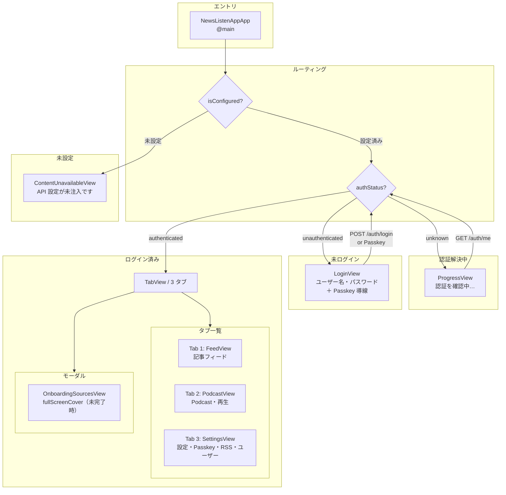
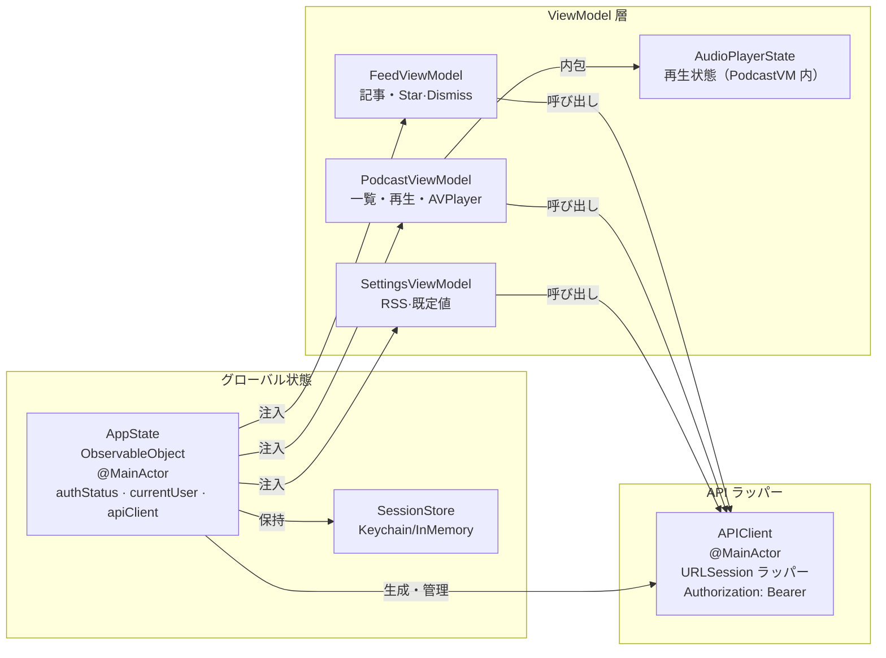

# iOS 設計書

SwiftUI ネイティブ iOS アプリケーション設計。バックエンド API は Web と共通で、ネイティブはバックエンドへ直接接続する（[ADR-007](../adr/007-ios-direct-backend-access.md)）。本書は設計・仕様の**正本**です。

**メタデータ:**
| | |
|---|---|
| UI フレームワーク | SwiftUI (iOS 17+) |
| 言語 | Swift 5.10+ |
| 最小 iOS | iOS 17 |
| Xcode | 16+ |
| 認証 | セッション（[ADR-013](../adr/013-session-auth-and-user-management.md)）+ Passkey（[ADR-035](../adr/035-passkey-webauthn-adoption.md)） |
| 音声再生 | AVFoundation (AVPlayer)・バックグラウンド対応・ロック画面制御 |
| 設定管理 | ビルド時注入（Secrets.xcconfig→Info.plist、[ADR-037](../adr/037-gateway-api-key-client-distribution.md)） |
| 最終更新 | 2026-06-29 |
| ステータス | **Phase1 完了** (#26/#27/#77/#79 マージ済み、HEAD 1eca47e) |

> **本書の位置づけ:** iOS 設計・仕様の**正本**。確定内容を本書に集約する。実装の正本はコード、本書は責務・契約・意図の記述に徹する。**旧 `ios-design.html` は本書へ統合し廃止**（[計画](../plan/2026-06-14-ios-app-requirements.md)）。

> ⚠️ **是正済み（2026-06-29）:**
> - **音声再生（AVPlayer）は実装済み** (#79・#28)：`PodcastViewModel.swift` 内に AVPlayer/AVAudioSession/MPNowPlayingInfoCenter/MPRemoteCommandCenter ルーチンを内包。背景再生・ロック画面/コントロールセンター操作・割り込み対応・deinit 確実解放を実装。旧「TASK 6 未着手」は廃止。
> - **再生位置・既定設定はサーバー同期** (#27)：`PATCH /podcasts/{id}/position`（15秒ごと＋停止時）・`GET/PUT /settings/preferences` を実装。旧「端末ローカルのみ」は誤り。[ADR-022](../adr/022-server-side-playback-position-and-preferences.md) が [ADR-008](../adr/008-ios-local-state-persistence.md) を上書き。
> - **API URL/キー入力は廃止** (#26・[ADR-037](../adr/037-gateway-api-key-client-distribution.md))：`InitialSetupView` 存在しない。実行時不変・ビルド時注入。未注入時は `ContentUnavailableView` で構成不備を案内。
> - **Passkey（WebAuthn）を新実装** (#77・[ADR-035](../adr/035-passkey-webauthn-adoption.md))：`Passkey/` 8ファイル、API 6 種（register/login options/verify、credentials 一覧/削除）、`AccountSettingsView` の登録/一覧/削除、LoginView の Passkey 導線、Associated Domains・RP_ID 設定。
> - **オンボーディング・おすすめサイト管理を新実装**（[ADR-012](../adr/012-featured-sites-and-onboarding.md)）：`Onboarding/OnboardingSourcesView.swift`、`Models/FeaturedSite.swift`、API `/settings/featured-sources`・`/settings/onboarding`・`/settings/onboarding/complete`、起動時 fullScreenCover。
> - **生成ステータス・ロック画面表示は実装済み** (#79・[ADR-021](../adr/021-podcast-generation-status-visualization.md))：API は `status` 提供済み、ロック画面`MPNowPlayingInfoCenter` に反映。iOS 側のポーリング・自動更新は未実装（pull-to-refresh で表示）。
> - **APNs は未実装** (#29・#80 OPEN・未マージ)：push 通知は今後の課題。本書は実装済みとして記さない。

---

## 1. 概要・技術スタック

| 項目 | 選定技術 | 理由 |
|---|---|---|
| UI フレームワーク | SwiftUI (iOS 17+) | 宣言的 UI・モダン API・拡張性 |
| ビジュアルデザイン | Editorial デザインシステム（[ios-design-system.md](ios-design-system.md)・[ADR-040](../adr/040-ios-editorial-design-system.md)） | 汎用 UI を脱却。色/書体/余白をトークン化し全画面へ一貫適用・ライト/ダーク対応 |
| アーキテクチャ | MVVM（`ObservableObject` + `@MainActor`） | SwiftUI との相性・テストしやすい ViewModel 分離 |
| 非同期処理 | Swift Concurrency (async/await) | コールバック地獄なし・型安全 |
| ネットワーク | URLSession (async/await)・`URLSessionProtocol` 注入 | 標準ライブラリで完結・テスト容易 |
| 音声再生 | AVFoundation (AVPlayer) | 速度制御・再生位置保存・バックグラウンド再生・ロック画面制御 |
| 設定永続化 | UserDefaults（@AppStorage） + Keychain | API URL/キー・既定値・再生位置を端末に保存（トークンは Keychain） |
| セッション保管 | Keychain（[ADR-013](../adr/013-session-auth-and-user-management.md)） | 認証トークンは UserDefaults ではなく Keychain（端末ロック連動・バックアップ外） |
| オフライン再生 | AudioCacheManager + NetworkMonitoring | 音声をローカルディスクキャッシュ・ネットワーク状態連動 |
| テスト | XCTest（`MockURLSession` / `InMemorySessionStore` 注入） | APIClient・ViewModel の単体テスト |

---

## 2. 画面構成・ナビゲーション

起動時は API 設定の有無、続いて認証状態（[ADR-013](../adr/013-session-auth-and-user-management.md)）でルーティングする。設定済みかつ未注入なら `ContentUnavailableView` で構成不備を案内。設定済みなら `refreshAuth()`（`GET /auth/me`）でセッションを解決し、未ログインなら `LoginView` を挟んでから本体（`ContentView`）へ入る。本体は標準 `TabView` の **3 タブ**（Feed / Podcast / Settings）。RSS 購読管理・アカウント管理・Passkey 管理・管理者によるユーザー管理は Settings タブ内に置く。



---

## 3. 各画面の設計

### LoginView

API 設定済みかつ未ログイン（`authStatus == .unauthenticated`）のときに提示する（[ADR-013](../adr/013-session-auth-and-user-management.md)）。

| 要素 | 詳細 |
|---|---|
| 入力 | ユーザー名（ログイン ID）・パスワード（`SecureField`） |
| 送信 | `POST /auth/login` → 成功で `AppState.completeLogin(response)`（トークンを Keychain 保存・`currentUser` 設定・`authStatus = .authenticated`） |
| 失敗 | ユーザー存在の有無を伏せた汎用文言（「ユーザー ID またはパスワードが正しくありません」）。`401` |
| Passkey 導線 | LoginView 内に「Passkey でログイン」ボタン・登録ページリンク（[ADR-035](../adr/035-passkey-webauthn-adoption.md)） |

### FeedView（Tab 1）

| 要素 | 詳細 |
|---|---|
| 記事リスト | `ScrollView` + `LazyVStack`（`SwipeableArticleCard`）。スコア降順（最大 50 件）。スコアは横バーで可視化（[ADR-044](../adr/044-feed-card-gestures.md)） |
| ジェスチャ（[ADR-044](../adr/044-feed-card-gestures.md)） | 記事カードに対し: **右スワイプ→Star**（金）/ **左スワイプ→Dismiss**（赤）。閾値（110pt）超で確定・未満はスプリングバック。指追従 offset・方向別の背景色/アイコン・閾値到達で触覚（`sensoryFeedback`）。**タップ→全文展開 + Star/Dismiss ボタン**（トグル）/ **ダブルタップ→ソースを `SafariView`**。縦スクロール共存のため `simultaneousGesture` + 横優位ガード。VoiceOver には `accessibilityAction` で Star/Dismiss を公開 |
| 取り消し（undo） | Star/Dismiss は**楽観削除 + 遅延コミット**。確定前は「取り消す」トーストで `undoLast()`、4 秒・別操作・`loadFeed`・バックグラウンドで `commitPending()`（サーバに un-star/un-dismiss API が無いための方式。[ADR-044](../adr/044-feed-card-gestures.md)） |
| タップ（選択モード以外）| 上記ジェスチャ。記事を開く導線はダブルタップ（`AppState.articleOpenMode`: `in_app`→`SafariView` / `external`→`openURL`） |
| 日付表記 | `AppState.timeFormat` に従う。「2026-06-29」 vs「2日前」（設定で切替） |
| ローディング | `.task` 初回フェッチ・`.refreshable` プルトゥリフレッシュ |
| 空/エラー | `ContentUnavailableView`（iOS 17 標準） |

### PodcastView（Tab 2）

| 要素 | 詳細 |
|---|---|
| エピソード一覧 | タイトル・難易度バッジ・種別・イントロ抜粋・再生時間・前回の続き位置・生成状態バッジ |
| 生成状態表示 | API は `status`（`generating`/`completed`/`failed`）を提供済み（[ADR-021](../adr/021-podcast-generation-status-visualization.md)）。バッジ表示実装済み。自動ポーリング・APNs は未実装；pull-to-refresh で手動更新 |
| 再生 | タップで再生→詳細ビューで全文・速度・シーク表示。再生中なら一時停止・速度変更可能 |
| 連続再生・キュー（[ADR-045](../adr/045-continuous-playback-queue.md)） | プレイヤー非依存の `PlaybackQueue`（`items`+`currentIndex`）を `PodcastViewModel` が保持。`AVPlayerItem.didPlayToEndTimeNotification` で**再生終了→自動で次へ**（末尾で停止しミニプレイヤーを閉じる）。行のコンテキストメニューで「次に再生／キューに追加」、`QueueSheet` で待機列の確認・並べ替え（onMove）・削除。行タップは待機列を壊さず現在の次に挿入して再生 |
| キャッシュ表示 | ダウンロード済み・ダウンロード中・未ダウンロードを icon で表示 |

### SettingsView（Tab 3）

アカウント管理・Passkey 管理・RSS 購読管理・既定値・API 設定を 1 タブに集約する。

| セクション | 内容 | 保存先 |
|---|---|---|
| **アカウント管理** | `AccountSettingsView`：表示名・パスワード変更・ログアウト・管理者導線・Passkey 登録/一覧/削除・**ログイン中のデバイス**（一覧/個別/一括失効・issue #84） | サーバー（セッション）+ Keychain（トークン） |
| **Passkey 管理** | `PasskeyRegistrationViewModel` / `PasskeyCredentialsViewModel`：登録・一覧・削除（[ADR-035](../adr/035-passkey-webauthn-adoption.md)） | サーバー（WebAuthn 認証器） |
| **RSS ソース管理** | 一覧 + `onDelete`→確認→削除、追加シート（名前/URL・クライアント検証・409/422 インライン表示） | サーバー `/settings/sources`（URL キー） |
| **既定難易度** | Picker（6 段階） | UserDefaults（端末ローカル） |
| **既定再生速度** | Picker（[0.75, 1.0, 1.25, 1.5, 2.0]） | UserDefaults（端末ローカル） |
| **記事の開き方** | Picker（アプリ内 / 外部 Safari） | UserDefaults |
| **日付表記** | Picker（絶対 / 相対） | UserDefaults |
| **API 設定** | 表示のみ（ビルド時注入・実行時不変） | — |

### AccountSettingsView（Settings 内 — アカウント）

| 要素 | 詳細 |
|---|---|
| 表示名の変更 | `PATCH /auth/me`（`display_name`） |
| パスワード変更 | `POST /auth/password`（現在 PW 検証必須） |
| Passkey 登録 | `PasskeyRegistrationViewModel`：WebAuthn 登録フロー ([ADR-035](../adr/035-passkey-webauthn-adoption.md)) |
| Passkey 一覧・削除 | `PasskeyCredentialsViewModel`：`GET /auth/passkey/credentials`・`DELETE /auth/passkey/credentials/{id}`（id は base64url） |
| ログアウト | `AppState.logout()`（`POST /auth/logout` ベストエフォート・必ず Keychain のトークン破棄） |
| 管理者導線 | `currentUser?.isAdmin` のとき `AdminUsersView` への `NavigationLink` を表示 |

### AdminUsersView（Settings 内 — ユーザー管理、admin 限定）

| 要素 | 詳細 |
|---|---|
| 一覧 | `GET /admin/users`。username・表示名・ロールを表示 |
| 作成 | `POST /admin/users`（username / password / role / display_name） |
| ロール変更・PW リセット | `PATCH /admin/users/{username}`（指定フィールドのみ） |
| 削除 | `DELETE /admin/users/{username}` |
| 自己ロックアウト防止 | 自分自身（`user.username == currentUser?.username`）の行はロール変更・削除ボタンを**非表示**。サーバー側も最後の admin を `409` で拒否（二重防御） |

### OnboardingSourcesView（起動時 fullScreenCover、未完了の場合のみ）

初回ユーザーへのおすすめ RSS ソース追加ステップ。

| 要素 | 詳細 |
|---|---|
| ステータス | `AppState.onboardingCompleted`：`nil`=取得待ち、`false`=未完了（画面提示）、`true`=完了（提示しない） |
| フロー | `GET /settings/featured-sources`（おすすめ）→ toggleable list（複数選択）→ `POST /settings/onboarding/complete` |
| タイミング | `ContentView` 起動時に `refreshOnboardingStatus()` で状態取得、未完了なら `fullScreenCover` で被せる。ブロッキングなし（非同期） |

---

## 4. 認証・セッション（[ADR-013](../adr/013-session-auth-and-user-management.md)）

利用者は username + パスワードでログインし、以降は不透明トークンで認証する。Web は httpOnly Cookie、**iOS は `Authorization: Bearer <token>`** でトークンを送る（バックエンドの認証依存が両系統を吸収）。[ADR-035](../adr/035-passkey-webauthn-adoption.md) により WebAuthn 認証も並行対応。

### 認証モデル（`Models/AuthModels.swift`）

| 型 | 内容 |
|---|---|
| `AuthUser` | `username` / `role`（admin\|user） / `displayName`（`display_name`）。`isAdmin` 派生を持つ |
| `LoginResponse` | `token` + `user`（`POST /auth/login` のレスポンス） |
| `UserListResponse` | `users`（`GET /admin/users`） |
| `AuthStatus`（enum） | `unknown`（解決前） / `authenticated` / `unauthenticated` |

### セッションストア（`Networking/SessionStore.swift`）

| 型 | 役割 |
|---|---|
| `SessionStore`（protocol） | トークンの読み書き抽象 |
| `KeychainSessionStore` | 本番。Keychain（generic password）に保管。service=`com.newslisten.app.session`・account=`nl_session`・アクセス属性 `kSecAttrAccessibleAfterFirstUnlock`（端末ロック連動・バックアップ外） |
| `InMemorySessionStore` | テスト用インメモリ実装 |

### 認証フロー

- **起動解決**: 設定済みなら `AppState.refreshAuth()` が `GET /auth/me` を呼ぶ。成功 → `authStatus = .authenticated`、失敗 → トークン破棄 + `.unauthenticated`。
- **ログイン**: `LoginView` → `POST /auth/login` → `completeLogin(response)`（Keychain へトークン保存・`currentUser` 設定・トークン付き `APIClient` を再生成）。
- **Passkey**: `LoginView` → [ADR-035](../adr/035-passkey-webauthn-adoption.md) フロー → `POST /auth/passkey/login/verify` → `completeLogin(response)`。
- **ログアウト**: `logout()` は `POST /auth/logout` をベストエフォートで呼び、必ず Keychain のトークンを破棄して `.unauthenticated` 化。
- **失効への追従**: 管理者による降格・PW リセット・削除でサーバー側セッションが失効すると、以降のリクエストは `401`。これを未認証として扱い再ログインへ誘導する。

---

## 5. MVVM アーキテクチャ

依存関係図（`AppState` → `APIClient` → ViewModels）:



### レイヤー責務

| 要素 | 責務 |
|---|---|
| `AppState`（ObservableObject・@MainActor） | API 設定・既定値の保持、認証状態（authStatus / currentUser / sessionStore）、設定変更・ログイン状態変化時の `APIClient` 再生成、`isConfigured` 等の派生 |
| `APIClient`（@MainActor） | 全エンドポイント呼び出し。`URLSessionProtocol` 注入。レスポンスを Codable でデコードし非 2xx を `APIError` に正規化。初期化時の `sessionToken` を Bearer ヘッダへ反映 |
| `FeedViewModel`（ObservableObject・@MainActor） | 記事フィード状態（loading/error/items）と Star/Dismiss 操作。`AppState.apiClient` 経由で通信 |
| `PodcastViewModel`（ObservableObject・@MainActor・NSObject） | Podcast 一覧・キャッシュ・AVPlayer 再生制御。`AppState.apiClient` 経由で通信。キャッシュマネージャ・ネットワーク監視を注入 |
| `SettingsViewModel`（ObservableObject・@MainActor） | RSS ソース・既定値・アカウント設定の同期。`AppState.apiClient` 経由で通信 |

---

## 6. AppState 設計

`AppState`（`ObservableObject`・`@MainActor`）はアプリ全体のグローバル状態を保持する。API 接続設定は **ビルド時注入**（Secrets.xcconfig → Info.plist、[ADR-037](../adr/037-gateway-api-key-client-distribution.md)）で実行時不変。再生既定値は `@AppStorage`（UserDefaults）に、**セッショントークンは `SessionStore`（Keychain）** に永続化する。音声再生中の一時状態はメモリのみ。

| プロパティ / メソッド | 保存先 | 説明 |
|---|---|---|
| `apiBaseURL` / `apiKey` | Info.plist（ビルド時注入） | API のベース URL・共有ゲートウェイキー。ユーザー入力・UserDefaults 保存は廃止し、実行時は不変（[ADR-037](../adr/037-gateway-api-key-client-distribution.md)） |
| `defaultDifficulty` / `defaultPlaybackSpeed` | UserDefaults（@AppStorage） | 既定難易度（既定 toeic_900）・既定速度（既定 1.0）。端末ローカルのみ |
| `articleOpenMode` | UserDefaults（@AppStorage） | 記事の開き方（`in_app` / `external`、既定 `in_app`） |
| `timeFormat` | UserDefaults（@AppStorage） | 記事の日付表記（"absolute" / "relative"、既定 "relative"） |
| `authStatus` | メモリ（起動時に解決） | `unknown` → `authenticated` / `unauthenticated` |
| `currentUser` | メモリ | ログイン中ユーザー（`AuthUser?`） |
| `sessionStore` | Keychain | トークン保管先（本番 `KeychainSessionStore`） |
| `onboardingCompleted` | メモリ（起動時に取得） | 初回オンボーディング完了状態。`nil`=取得待ち、`false`=未完了、`true`=完了 |
| `completeLogin(response)` | — | トークン保存 + `currentUser` 設定 + `.authenticated` + APIClient 再生成 |
| `refreshAuth()` | — | `GET /auth/me` で解決。失敗ならトークン破棄 + `.unauthenticated` |
| `refreshOnboardingStatus()` | — | `GET /settings/onboarding` で状態取得。起動時・設定変更後に実行 |
| `logout()` | — | `POST /auth/logout`（ベストエフォート）+ 必ずトークン破棄 + `.unauthenticated` |
| `isConfigured`（派生） | 計算で導出 | `apiBaseURL` / `apiKey` が Info.plist から読めるか（ビルド構成が正しいか）の判定 |
| `apiClient`（派生） | 計算で導出 | トークン付き APIClient の生成・キャッシュ |

---

## 7. API クライアント設計

`APIClient` は `@MainActor` で動作し、ベース URL・API キー・セッショントークンを保持する。全リクエストに基盤の `X-API-Key` を付与し、**ログイン後はさらに `Authorization: Bearer <token>`** を付与する（[ADR-013](../adr/013-session-auth-and-user-management.md)）。テスト可能性のため `URLSessionProtocol` を注入する。エラーは `APIError` 型（`invalidURL` / `httpError(statusCode)` / `rateLimited(retryAfter:)` / `decodingError`）。**429** は既存の `httpError(404)` 等のパターンを壊さないよう専用ケース `rateLimited(retryAfter:)`（`Retry-After` 秒）で表し、Star 確定時に「本日の生成上限に達しました（次回可能時刻）」を表示する（issue #82・[ADR-042](../adr/042-cost-monitoring-and-daily-generation-limit.md)）。

### メソッド一覧

| メソッド | パス | 用途 |
|---|---|---|
| `fetchFeed()` | GET /feed | 記事フィード一覧 |
| `starArticle(id)` / `dismissArticle(id)` | POST /articles/{id}/star·/dismiss | Star / Dismiss |
| `fetchPodcasts()` | GET /podcasts | Podcast 一覧 |
| `fetchPodcast(id)` | GET /podcasts/{id} | 単体（再生直前の署名付き URL 再取得用） |
| `updatePlaybackPosition(podcastId, seconds)` | PATCH /podcasts/{id}/position | 再生位置同期 |
| `downloadAudio(from:)` | GET（署名付き URL） | 音声ダウンロード |
| `fetchSources()` / `addSource(...)` / `deleteSource(url)` | GET/POST /settings/sources · DELETE ?url= | RSS 一覧 / 追加 / 削除（URL キー） |
| `fetchFeaturedSources()` | GET /settings/featured-sources | おすすめサイト一覧 |
| `fetchOnboardingStatus()` | GET /settings/onboarding | オンボーディング完了状態 |
| `completeOnboarding()` | POST /settings/onboarding/complete | オンボーディング完了記録 |
| `fetchPreferences()` | GET /settings/preferences | 難易度・速度の設定 |
| `updatePreferences(difficulty, speed)` | PUT /settings/preferences | 難易度・速度更新 |
| `login(username, password)` | POST /auth/login | ログイン |
| `logout()` | POST /auth/logout | ログアウト |
| `fetchMe()` | GET /auth/me | ログイン中ユーザー取得 |
| `updateProfile(displayName)` | PATCH /auth/me | 表示名更新 |
| `changePassword(current, new)` | POST /auth/password | パスワード変更 |
| `listUsers()` | GET /admin/users | ユーザー一覧（admin） |
| `createUser(username, password, role, displayName)` | POST /admin/users | ユーザー作成（admin） |
| `updateUser(username, ...)` | PATCH /admin/users/{username} | ユーザー更新（admin） |
| `deleteUser(username)` | DELETE /admin/users/{username} | ユーザー削除（admin） |
| `passkeyRegisterOptions()` | GET /auth/passkey/register/options | Passkey 登録オプション（[ADR-035](../adr/035-passkey-webauthn-adoption.md)） |
| `passkeyRegisterVerify(response)` | POST /auth/passkey/register/verify | Passkey 登録検証・保存 |
| `passkeyLoginOptions()` | GET /auth/passkey/login/options | Passkey 認証オプション |
| `passkeyLoginVerify(response)` | POST /auth/passkey/login/verify | Passkey 認証検証・セッション発行 |
| `passkeyCredentials()` | GET /auth/passkey/credentials | 登録済み Passkey 一覧 |
| `passkeyDeleteCredential(id)` | DELETE /auth/passkey/credentials/{id} | Passkey 削除（id は base64url） |
| `listSessions()` | GET /auth/sessions | ログイン中のデバイス一覧（issue #84） |
| `revokeSession(id)` | DELETE /auth/sessions/{id} | セッション個別失効（404 は冪等成功扱い） |
| `revokeOtherSessions()` | POST /auth/sessions/revoke-others | 現在以外を一括失効 |
| `reportClientError(payload)` | POST /client-errors | クラッシュ/エラー報告（認証不要・X-API-Key のみ・issue #83） |

**注記:**
- 再生位置（`PATCH /podcasts/{id}/position`）と既定難易度・速度（`GET/PUT /settings/preferences`）は**サーバー保存し端末間で同期する**（[ADR-022](../adr/022-server-side-playback-position-and-preferences.md)）。
- 主要エラーコード: `401`（キー不正・未認証/失効セッション） / `403`（admin 権限不足） / `404`（不存在） / `409`（重複・最後の admin 保護） / `422`（不正フィード）。
- 音声 URL は 1 時間失効の署名付き URL。`downloadAudio(from:)` は署名 URL へ `X-API-Key`/`Authorization` を**付けない**（既に URL に包含）。

### モックテスト戦略

`URLSessionProtocol` に準拠する `MockURLSession` を `APIClient` に注入し、固定レスポンスでデコード・エラー分岐を検証する（`APIClient` が `@MainActor` のためテストクラスも `@MainActor` 化）。セッション保管は `InMemorySessionStore` を注入してテストする。

### クラッシュ収集（MetricKit・issue #83・[ADR-046](../adr/046-client-error-aggregation.md)）

`Observability/CrashReporter.swift`（`MXMetricManagerSubscriber`）を `NewsListenAppApp.init()` で購読登録する。MetricKit は前回クラッシュの診断を**次回起動時**にまとめて配信する。受領した `MXCrashDiagnostic` は**純粋関数 `CrashReportFormatter`** が原始値（exception type/code・signal・terminationReason は 500 字に切詰・build version）のみへ整形し、自由記述（`virtualMemoryRegionInfo` 等）は PII 懸念で送らない。送信は `reportClientError(_:)` で `/client-errors` へ（セッショントークン無し・X-API-Key のみ）。`MXCrashDiagnostic` はテスト生成不可のため、整形/スクラブの純粋関数のみを単体テストする。

---

## 8. 音声再生（AVPlayer）設計

`PodcastViewModel` は `AVPlayer` を保有し、再生対象エピソード・再生中フラグ・現在位置・総再生時間・再生速度を保持する。再生は次の手順で行う（#79・#28 実装済み）。

1. 既存の再生を停止・クリーンアップする。
2. `AVAudioSession` を `.playback` カテゴリ・`.spokenAudio` モードで有効化し、バックグラウンド再生に対応する。マナーモード（消音スイッチ ON）でも再生される。
3. 再生直前に `GET /podcasts/{id}` で再取得し、失効対策済みの署名付き URL で `AVPlayerItem` を生成。キャッシュがあればローカルファイル URL を使用（`AudioCacheManager`）。保存済み再生位置へ seek し、速度（rate）を設定して再生。
4. 約 0.5 秒ごとに再生位置を `@Published currentTime` へ更新、ロック画面へ反映。
5. 約 15 秒ごとに再生位置をサーバー（`PATCH /podcasts/{id}/position`）へ同期（[ADR-022](../adr/022-server-side-playback-position-and-preferences.md)）。停止時も即座に同期。
6. 再生速度は Picker([0.75, 1.0, 1.25, 1.5, 2.0]) で変更可能；変更時は即座に `player.rate` へ反映。

### バックグラウンド再生設定

Info.plist の `UIBackgroundModes` に `audio` を追加。`AVAudioSession.Category.playback` + `AVAudioSession.Mode.spokenAudio` でポッドキャスト向けに設定する。

### ロック画面・コントロールセンター操作（MPRemoteCommandCenter）

`MPNowPlayingInfoCenter` へエピソード情報（タイトル・難易度・再生時間・進捗）を継続更新。ロック画面・コントロールセンターから以下が操作可能：
- **play / pause**: `togglePlayPause()`
- **skipForward（+30秒）**: `seek(to: currentTime + 30)`
- **skipBackward（−15秒）**: `seek(to: max(0, currentTime - 15))`

コマンド登録は `addTarget` 強参照リークを避けるため、`[weak self]` クロージャ + 解除トークン保持 → `deinit` で確実に外す。

### 割り込み（電話・アラーム等）対応

`AVAudioSession.interruptionNotification` を購読し、以下を実装：
- 割り込み開始 → `wasPlayingBeforeInterruption = isPlaying` → `pause()`。
- 割り込み終了・`.shouldResume` → `wasPlayingBeforeInterruption` なら再開。

### オフライン再生キャッシュ

`AudioCacheManager` がポッドキャスト音声をローカルディスク（`Caches/NewsListenApp/audio-cache/{id}.mp3`）にキャッシュ。`NetworkMonitoring` でネットワーク接続状態を監視。

- **キャッシュ有**: ローカルファイル URL を再生。
- **キャッシュ無+オンライン**: 署名付き URL から再生。同時にバックグラウンドでダウンロード・キャッシュ化。
- **キャッシュ無+オフライン**: 再生不可（エラー案内）。

---

## 9. ファイル構成

Xcode 生成構造に合わせ、アプリソースを `ios/NewsListenApp/NewsListenApp/`、テストを `ios/NewsListenApp/NewsListenAppTests/` に置く。アプリソース配下を機能単位で分割する。

```
ios/NewsListenApp/NewsListenApp/
├── NewsListenAppApp.swift               @main エントリ・AppState 生成・ルーティング（isConfigured/authStatus）
├── ContentView                          (NewsListenAppApp 内に定義) 3 タブ TabView（Feed/Podcast/Settings）
├── AppState.swift                       ObservableObject・@MainActor のグローバル共有状態
│
├── DesignSystem/                        Editorial デザインシステム（→ design/ios-design-system.md）
│   ├── DSColor.swift                   カラートークン（paper/ink/accent/hairline・状態色・適応色）
│   ├── DSFont.swift                    タイポグラフィトークン（serif 見出し + SF 本文・dsEyebrow）
│   ├── DSLayout.swift                  余白・角丸トークン・dsCard()/dsScreenBackground()
│   ├── DSAppearance.swift              UIKit グローバル外観（ナビ見出しのセリフ化）
│   └── Components/                     DSBadge・RelevanceBar 等の共通コンポーネント
│
├── Models/
│   ├── Article.swift                   記事モデル（Codable）
│   ├── Podcast.swift                   Podcast モデル（Codable・재생위置・状態）
│   ├── RssSource.swift                 RSS 配信元モデル
│   ├── FeaturedSite.swift              おすすめサイトモデル（Codable）
│   ├── Preferences.swift               難易度・速度の設定モデル（Codable・サーバー同期）
│   └── AuthModels.swift                AuthUser / LoginResponse / AuthStatus 等
│
├── Networking/
│   ├── APIClient.swift                 @MainActor URLSession ラッパー
│   ├── APIEndpoint.swift               エンドポイント enum（パス・メソッド）
│   ├── APIError.swift                  error 型（network / invalidURL / httpError / decodingError）
│   ├── URLSessionProtocol.swift        テスト注入用 protocol
│   ├── SessionStore.swift              KeychainSessionStore / InMemorySessionStore
│   ├── AudioCacheManager.swift         音声キャッシュ（Caches/NewsListenApp/audio-cache/{id}.mp3）
│   ├── NetworkMonitoring.swift         ネットワーク接続状態監視
│   ├── FileManagerProtocol.swift       テスト注入用 FileManager protocol
│   └── Base64URL.swift                 Passkey エンコーディング用
│
├── Auth/
│   ├── LoginView.swift                 ログイン UI（username・password・Passkey 導線）
│   └── LoginViewModel.swift            ログイン API 呼び出し
│
├── Passkey/
│   ├── PasskeyModels.swift             WebAuthn リクエスト/レスポンスモデル
│   ├── PasskeyAuthorizationProviding.swift   ASAuthorizationProvider protocol
│   ├── ASAuthorizationPasskeyProvider.swift  Apple Passkey プロバイダ実装
│   ├── PasskeyRegistrationViewModel.swift    登録フロー（オプション取得→検証）
│   ├── PasskeyLoginViewModel.swift          認証フロー（オプション取得→検証）
│   ├── PasskeyCredentialsViewModel.swift    一覧・削除
│   ├── PasskeyOptionsDecoder.swift          サーバーオプションデコード（base64url）
│   └── PasskeyCredentialEncoder.swift       クレデンシャルエンコード（base64url）
│
├── Feed/
│   ├── FeedView.swift                  フィード UI（List・スワイプ・タップ）
│   ├── FeedViewModel.swift             記事取得・Star/Dismiss
│   ├── ArticleRowView.swift            1 記事の行 UI
│   └── SafariView.swift                SFSafariViewController ラッパー
│
├── Podcast/
│   ├── PodcastView.swift               Podcast 一覧 UI
│   ├── PodcastRowView.swift            1 Podcast の行 UI（生成状態バッジ・キャッシュ表示）
│   ├── PodcastViewModel.swift          一覧取得・AVPlayer 再生制御・キャッシュ・ネットワーク監視
│   ├── AudioPlayerView.swift           再生画面（全画面・ミニプレイヤー）
│   ├── NowPlayingInfo.swift            MPNowPlayingInfoCenter への情報更新
│   └── PlaybackConstants.swift         速度レンジ・seek 量等の定数
│
├── Settings/
│   ├── SettingsView.swift              設定画面（RSS・難易度・速度・API・ユーザー管理）
│   ├── SettingsViewModel.swift         RSS 同期・既定値管理
│   ├── AccountSettingsView.swift       アカウント管理（表示名・パスワード・Passkey・ログアウト）
│   └── (Passkey は Passkey/ で別管理)
│
├── Admin/
│   ├── AdminUsersView.swift            ユーザー管理（admin 限定・一覧・作成・更新・削除）
│   └── AdminUsersViewModel.swift       admin API 操作
│
├── Onboarding/
│   ├── OnboardingSourcesView.swift     おすすめ RSS ソース追加（初回・fullScreenCover）
│   └── (ViewModel は AppState 内で処理)
│
└── Utilities/
    ├── DifficultyLabel.swift           難易度表示コンポーネント
    └── RelativeTimeFormatter.swift     記事の「X 日前」表記フォーマッタ
```

---

## 10. 関連資料・今後の課題

### 関連 ADR

- [ADR-007](../adr/007-ios-direct-backend-access.md)： iOS はバックエンド直接接続
- [ADR-008](../adr/008-ios-local-state-persistence.md)： ローカル状態永続化（ADR-022 で上書き）
- [ADR-013](../adr/013-session-auth-and-user-management.md)： セッション認証・ユーザー管理
- [ADR-021](../adr/021-podcast-generation-status-visualization.md)： Podcast 生成ステータス表示
- [ADR-022](../adr/022-server-side-playback-position-and-preferences.md)： 再生位置・設定のサーバー同期
- [ADR-035](../adr/035-passkey-webauthn-adoption.md)： Passkey（WebAuthn）認証
- [ADR-037](../adr/037-gateway-api-key-client-distribution.md)： ビルド時 API 設定注入
- [ADR-040](../adr/040-ios-editorial-design-system.md)： Editorial デザインシステムの採用（→ [ios-design-system.md](ios-design-system.md)）

### Phase 1 完了（HEAD 1eca47e）

✅ #26（API URL/キー廃止） / #27（再生位置・設定同期） / #77（Passkey 実装） / #79（バックグラウンド再生） が マージ済み。オンボーディング・おすすめサイト管理も web#36・web#40・backend#57・backend#59 から取り込み済み。

### 今後の課題（未実装）

- **APNs 通知** (#29・#80 OPEN・未マージ）：Podcast 生成完了の push 通知。
- **ポーリング・自動更新** (#15 検討中)：生成ステータスのリアルタイム更新（現在は pull-to-refresh）。
- **パスワードリセット・レートリミット**：セルフサービス（メール）・ログイン試行レート制限（バックエンド側・[ADR-013](../adr/013-session-auth-and-user-management.md) 残課題）。

---

**本書の位置づけ:** iOS 設計・仕様の正本（Markdown）。詳細な実装は各ファイルのコメント・ドキュメント文字列を参照。旧 HTML ドキュメントは本書へ統合・廃止。
