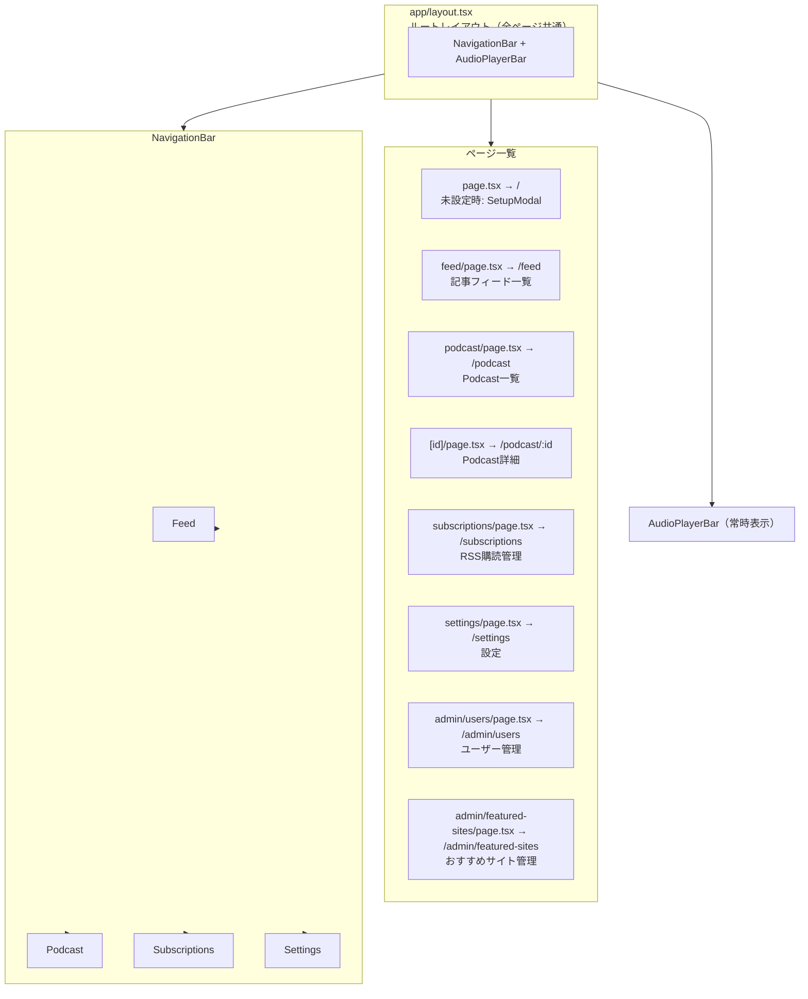

# Web フロントエンド設計書

Next.js (App Router) による Web アプリケーション設計。iOS アプリに先行してリリースし、同一バックエンド API を使用する。

**設計・仕様の正本。視覚デザイン正本は [app-ui.html](app-ui.html)。旧 `docs/spec/2026-06-10-web-frontend-spec.md` は本書へ統合し廃止。**

| | |
|---|---|
| フレームワーク | Next.js 15 (App Router) |
| 言語 | TypeScript |
| スタイル | 純 CSS + デザイントークン ([ADR-003](../adr/003-web-pure-css-design-tokens.md)) |
| ホスティング | Cloud Run (GCP) |
| 認証 | セッション ([ADR-013](../adr/013-session-auth-and-user-management.md)) |
| Web バージョン | 0.2.0 |
| 最終更新 | 2026-06-29 |
| 本書 | 設計・仕様の正本 |

> **メモ:** Web フロントエンドの設計・仕様の**正本**（API 契約・状態管理・画面/再生設計・受け入れ基準）。視覚デザイン（配色・フォント・レイアウトトークン）の正本は [app-ui.html](app-ui.html)。旧 `docs/spec/2026-06-10-web-frontend-spec.md` は本書へ統合し廃止。

## 1. 概要・技術スタック

| 項目 | 選定技術 | 理由 |
|---|---|---|
| フレームワーク | Next.js 15 (App Router) | SSR 対応・型安全・ファイルベースルーティング |
| 言語 | TypeScript | API レスポンス型の共有・バグ早期発見 |
| スタイリング | 純 CSS（`app/globals.css` 一元管理）+ CSS 変数デザイントークン | Tailwind 等のユーティリティ CSS は使わない。トークンでテーマ（dark/light）を一元制御（[ADR-003](../adr/003-web-pure-css-design-tokens.md)）。視覚仕様の正本は [app-ui.html](app-ui.html) |
| 音声再生 | HTML5 Audio API（ライブラリなし） | 追加依存なし・速度制御・シーク標準対応 |
| 状態管理 | React Context + useReducer | グローバル状態（再生状態・ユーザー設定）のみ管理。Zustand 等不要な規模。 |
| API 通信 | fetch API（カスタムラッパー） + BFF プロキシ | 追加ライブラリ不要。BFF（`/api/backend/*`）経由で env から API キーを注入（ADR-037）。 |
| 設定永続化 | localStorage | デフォルト再生速度・記事日付表記をブラウザに保存 |
| コンテナ | Docker (node:22-alpine) | Cloud Run へのデプロイに統一 |

## 2. ルーティング・画面一覧

ナビゲーションバーは全ページ共通（Feed / Podcast / Subscriptions / Settings）。画面下部には AudioPlayerBar を常時表示し、再生中エピソードを制御できる。

## 3. 認証・ユーザー管理（ADR-013）

Web はサーバーサイドセッション方式を採用する。ログイン成功時にバックエンドが `httpOnly` Cookie `nl_session` を発行し、以降の認証付きリクエストはこの Cookie で行う。トークンは JavaScript から読めないため、ブラウザ側はトークンを保持・保存しない（localStorage 等を一切使わない）。ログイン済みかどうかは `GET /auth/me` の成否で判定する。

> **メモ:** 従来の API キー（`X-API-Key`）はバックエンド接続のためのオリジン制約として引き続き用いるが、**利用者の認証はセッション Cookie で行う**。すなわちプロキシは API キーを付与しつつ、利用者の `nl_session` Cookie を中継する二層構成となる。

### AuthContext（API 設定の AppContext とは別 Context）

認証状態は `web/contexts/AuthContext.tsx` が保持する。API 接続設定を扱う `AppContext` とは独立した Context で、API 設定の復元完了後に `refreshMe()` を一度呼んで状態を解決する。`useAuth()` を Provider の外で呼ぶと例外を throw する。

| フィールド / メソッド | 説明 |
|---|---|
| status | `unknown`（解決前）/ `authenticated` / `unauthenticated` の 3 状態 |
| user | ログイン中ユーザー（`AuthUser`）。未認証時は `null` |
| login(username, password) | ログイン実行。失敗時は `ApiError` を throw する |
| logout() | ログアウト（ベストエフォート。失敗してもクライアント状態は未認証へ） |
| refreshMe() | `/auth/me` で認証状態を再解決する |

### BFF プロキシでの Cookie 中継

BFF プロキシ（`web/app/api/backend/[...path]/route.ts`）は既存の転送に加え、リクエストの `Cookie` ヘッダをバックエンドへ転送し、バックエンドの `Set-Cookie` をレスポンスへ通す。これにより `nl_session` の発行・失効を中継する。バックエンドは Cookie に `Domain` 属性を付けず、Cookie は Web オリジンにバインドされる。`httpOnly` / `SameSite` 属性は維持される。

### 認証関連 API 契約（バックエンド）

| メソッド | パス | 用途・契約 |
|---|---|---|
| POST | /auth/login | `{token, user}` を返し `Set-Cookie: nl_session` を発行。401 はユーザー存在を伏せた汎用文言 |
| POST | /auth/logout | セッション失効。冪等 |
| GET | /auth/me | 現在のログインユーザーを返す（未認証時はエラー） |
| PATCH | /auth/me | 表示名（`display_name`）の更新 |
| POST | /auth/password | パスワード変更（`current_password` を検証） |
| GET | /admin/users | ユーザー一覧（admin 必須・401/403） |
| POST | /admin/users | ユーザー作成（admin 必須・409=重複） |
| PATCH | /admin/users/{username} | ロール変更・PW リセット（admin 必須・404 / 409=最後の admin 降格） |
| DELETE | /admin/users/{username} | ユーザー削除（admin 必須・404 / 409=最後の admin 削除） |
| GET | /admin/featured-sites | おすすめサイト一覧（admin 必須・401/403） |
| POST | /admin/featured-sites | おすすめサイト作成（admin 必須・`{name, url, thumbnail_url?, description?}`・409=重複 slug） |
| PUT | /admin/featured-sites/{site_id} | おすすめサイト更新（admin 必須・全置換・404） |
| DELETE | /admin/featured-sites/{site_id} | おすすめサイト削除（admin 必須・404） |
| POST | /auth/passkey/register/options | Passkey 登録準備（challengeID と WebAuthn options を返す。ADR-035） |
| POST | /auth/passkey/register/verify | Passkey 登録完了（attestation レスポンスを検証・保存） |
| POST | /auth/passkey/login/options | Passkey ログイン準備（challengeID と WebAuthn options を返す） |
| POST | /auth/passkey/login/verify | Passkey ログイン完了（assertion レスポンスを検証）。成功時 `Set-Cookie: nl_session` |
| GET | /auth/passkey/credentials | ユーザーの登録済み Passkey 一覧 |
| DELETE | /auth/passkey/credentials/{credential_id} | Passkey を削除 |

> **メモ:** `/admin/users`・`/admin/featured-sites` 系は admin ロール必須（[ADR-038](../adr/038-featured-sites-require-admin.md)）。最後の admin を降格・削除しようとした場合、サーバー側が 409 で拒否する（自己ロックアウト防止のサーバー側ガード）。

### セキュリティ

- トークンは `httpOnly` Cookie のみが保持し、localStorage 等には保存しない（XSS 緩和）
- パスワード入力欄は `type=password` を用いる
- ログイン失敗はユーザーの存在を伏せた汎用文言とする

### CSRF 対策（Double-submit cookie）（[ADR-019](../adr/019-csrf-double-submit-cookie.md)）

Web からのブラウザ状態変更リクエスト（POST / PUT / DELETE）に対して CSRF（Cross-Site Request Forgery）攻撃を防止する。バックエンドが発行する非 httpOnly Cookie `csrf_token` をクライアントが読み取り、`X-CSRF-Token` ヘッダで送り返す double-submit cookie 方式を採用する。

| 観点 | 実装 |
|-----|------|
| トークン取得 | ログイン成功時（`/auth/login`）またはブラウザ初回読み込み時に `GET /auth/me` で取得。Cookie `csrf_token` を JavaScript で読み取る |
| 付与方式 | 状態変更メソッド（`POST /articles/:id/star` など）の全リクエストで `X-CSRF-Token: {token}` ヘッダを付与（`lib/api.ts` で一元管理） |
| BFF パススルー | BFF プロキシ（`app/api/backend/[...path]/route.ts`）がリクエストの `X-CSRF-Token` ヘッダを保持してバックエンドに転送 |
| 実装場所 | `lib/api.ts::fetchBackend` で全リクエスト時に Cookie を読み取り Header に付与。詳細は [ADR-019](../adr/019-csrf-double-submit-cookie.md) を参照 |

### Passkey / WebAuthn ログイン・登録（[ADR-035](../adr/035-passkey-webauthn-adoption.md)）

ユーザーは username + password による伝統的なログインに加え、WebAuthn（Passkey）でのログイン・登録をサポートする。Passkey は生体認証（指紋・顔）または PIN で認証を行い、フィッシング耐性が高い。

| 観点 | 実装 |
|-----|------|
| **ログイン** | `LoginModal`（`components/ui/LoginModal.tsx`）に「Passkey でログイン」ボタンを追加。クリック時は `POST /auth/passkey/login/options` で challenge 取得後、`navigator.credentials.get()` で assertion 生成。検証後セッション Cookie `nl_session` を発行（`POST /auth/passkey/login/verify`） |
| **登録** | ログイン失敗時に「新規登録 / Passkey で登録」の選択肢を提示。`POST /auth/passkey/register/options` で challenge 取得後、`navigator.credentials.create()` で attestation 生成。検証後 Passkey を保存（`POST /auth/passkey/register/verify`）。WebAuthn 非対応のフォールバック: password 設定での登録 |
| **Passkey 一覧・削除** | `/settings` アカウントセクション内に「登録済み Passkey」一覧を表示。各行に「使用日時」「デバイス」を表示。削除ボタンで `DELETE /auth/passkey/credentials/{credential_id}` を実行 |
| **ログイン中のデバイス**（issue #84・[ADR-041](../adr/041-self-service-session-management.md)） | アカウントセクションに有効セッション一覧（`GET /auth/sessions`）を表示。各行に `device_label`・ログイン/最終利用日。現在のデバイスはバッジ「現在のデバイス」で示し個別失効ボタンは出さない。他デバイスは「ログアウト」（確認後 `DELETE /auth/sessions/{id}`）、先頭に「他のデバイスからログアウト」（確認後 `POST /auth/sessions/revoke-others`・他セッション 0 件なら無効）。`AccountSection.tsx` |
| **WebAuthn 非対応フォールバック** | ブラウザが WebAuthn 非対応（或いは HTTPS でない）の場合、Passkey UI は表示されず、password のみで認証。検出は `window.PublicKeyCredential` で実施 |
| 型定義 | `PasskeyOptionsResponse`（challenge_id・options 文字列）・`PasskeyCredential`（credential_id・username・name・transports・sign_count・created_at・last_used_at）（`types/index.ts:102-123`） |
| 関連ファイル | `lib/passkey.ts`（API 関数・challengeID 管理）・`lib/webauthnBrowserPort.ts`（WebAuthn API 抽象・検出・エラーハンドリング） |

### Web Push 通知（VAPID）（[ADR-020](../adr/020-push-notification-web-push.md)）

Podcast 生成完了時にユーザーへ Web Push 通知を送信する。W3C 標準 Web Push（Service Worker + PushManager）を採用し、ユーザーの購読管理（ON/OFF）を設定画面で可能にする。

| 観点 | 実装 |
|-----|------|
| Service Worker | `public/sw.js` で push イベントを受信し `showNotification` で通知表示。notificationclick イベントで該当 URL へ遷移 |
| 購読管理 Hook | `hooks/useWebPushSubscription.ts`：状態機械で unsupported → unsubscribed/denied → subscribing → subscribed/error へ遷移。機能検出（`Notification`、`navigator.serviceWorker`）とブラウザ権限リクエスト処理を含む |
| API 連携 | `GET /notifications/vapid-public-key` で公開鍵取得（未設定は 404・機能検出）。`POST /notifications/subscriptions` で購読登録（W3C 標準形式・冪等）。`DELETE /notifications/subscriptions?endpoint=...` で購読解除（冪等） |
| UI 配置 | `/settings` ページに `PushNotificationSection` コンポーネントで Web Push ON/OFF トグルを表示。無効化理由（権限拒否・VAPID 未設定）をグレースフルに表示 |
| 関連ファイル | `lib/webpush.ts`（API 関数）・`lib/pushBrowserPort.ts`（PushManager 抽象）・`public/manifest.json`（Service Worker 登録） |

## 4. 各画面の設計

### エントリーゲート (`app/page.tsx → /`)

ルート（/）はアプリ状態に応じた振り分けを行うゲートとして機能する。判定は以下の順で評価される。

1. localStorage 復元中（`isRestoring=true`）→ スケルトン表示
2. 認証状態解決中（`authStatus==='unknown'`）→ `null`（何も描画しない）
3. **未認証（`authStatus==='unauthenticated'`）→ `LoginModal` を表示**（`components/ui/LoginModal.tsx`・username + パスワード。失敗は汎用文言。Passkey 登録・ログインの導線も含む）
4. 認証済み かつ オンボーディング未完了 → `OnboardingSourcesModal`（ADR-012・RSS 初期購読画面）
5. すべて充足 → `/feed` へ `replace` 遷移

### Feed (`/feed`)

レコメンド済み記事をカード形式で表示する。

| 要素 | 詳細 |
|---|---|
| 記事カード | タイトル・ソース名・公開日・スコアバー（0〜1.0 を視覚化）。公開日は設定（表示設定）に従い絶対表記（M/D HH:MM）または相対表記（「3時間前」等）で描画（issue #50・[ADR-030](../adr/030-web-relative-time-and-bulk-star.md)） |
| Star ボタン | ★ クリック → POST /articles/:id/star → Podcast 生成開始トースト表示 |
| Dismiss ボタン | × クリック → POST /articles/:id/dismiss → カードをリストから除去 |
| 複数選択・一括スター | ヘッダーの複数選択ボタンで選択モードに入り、各カードのチェックボックスで記事を選択。フッターの「N件を一括スター」で選択分を `Promise.allSettled` で一括 star（成功/失敗件数をトースト通知。実行中は対象を busy 化し個別操作と排他）（issue #50・[ADR-030](../adr/030-web-relative-time-and-bulk-star.md)） |
| 記事リンク | タイトルクリック → 新規タブで元記事を開く |
| ローディング状態 | スケルトンカード表示 |
| 空状態 | 「まだ記事がありません。バッチは毎日 06:00 に実行されます。」 |
| リフレッシュ | 画面上部のリフレッシュボタン or プルトゥリフレッシュ（モバイル） |

### Podcast エピソード一覧 (`/podcast`)

生成済み Podcast をカード形式で表示する。

| 要素 | 詳細 |
|---|---|
| エピソードカード | 日本語イントロ（CSS 2 行クランプで表示。旧「先頭 80 文字 slice」は撤去）・難易度バッジ・再生時間・生成日 |
| フィルタ | タブ切替「すべて / ★ スター済み」（2026-06-12） |
| 再生ボタン | クリック → AudioPlayerBar にエピソードをセットし再生開始 |
| 更新 | pull-to-refresh / 再取得で完成エピソードを反映 |
| 詳細リンク | カードクリック → /podcast/:id でイントロ全文表示 |

> **メモ:** **生成中ステータスのポーリングを実装済み（issue #38・[ADR-021](../adr/021-podcast-generation-status-visualization.md)）。** `PodcastResponse` に `status`・`error_message` を公開。StatusBadge（生成中/完成/失敗）で表示し、5 秒ポーリング（最大120秒）で completed を反映。

### RSS 購読管理 (`/subscriptions`) ← 専用画面

購読中の RSS ソースの一覧表示・追加・削除を行う専用画面。

| 要素 | 詳細 |
|---|---|
| 購読中ソース一覧 | ソース名・URL・有効/無効トグルをテーブルまたはカードで表示 |
| URL 追加フォーム | 「ソース名」「RSS URL」入力欄 + 追加ボタン（インラインバリデーション付き） |
| 削除 | 各行の削除ボタン → 確認ダイアログ → DELETE /settings/sources?url=（URL キー） |
| バリデーション | URL 形式チェック（クライアント）+ 重複チェック（サーバー 409 エラー表示） |
| 空状態 | デフォルト2件（HackerNews / Zenn.dev）が初期表示 |
| エラー表示 | 422: 「RSS フィードとして取得できません」、409: 「この URL は登録済みです」 |

#### URL 追加フォームの UI フロー

1. 「ソース名」と「RSS URL」を入力
2. 送信 → POST /settings/sources（body `{name, url}`）
3. 成功: 一覧にリアルタイム追加・トースト「追加しました」
4. 失敗: インラインエラーメッセージ表示（フォームはリセットしない）

### Settings (`/settings`)

| 設定項目 | UI | 保存先 |
|---|---|---|
| 記事の日付表記 | セレクトボックス（絶対表記 / 相対表記） | localStorage（`time_format`・[ADR-030](../adr/030-web-relative-time-and-bulk-star.md)） |
| デフォルト難易度 | セレクトボックス（6 段階） | POST /settings + localStorage |
| デフォルト再生速度 | スライダー（0.5〜2.5） | POST /settings + localStorage |

> **メモ:** API キーはサーバー環境変数（`process.env.BACKEND_API_KEY`）から BFF プロキシが注入するため、クライアントに設定UIはない（[ADR-037](../adr/037-gateway-api-key-client-distribution.md)）。

#### アカウント管理（ADR-013）(`components/ui/AccountSection.tsx`)

`/settings` 内にログイン中ユーザーのアカウント管理セクションを設ける。

| 要素 | 詳細 |
|---|---|
| 表示名編集 | 表示名（`display_name`）を更新 → `PATCH /auth/me` |
| パスワード変更 | 現在 PW と新 PW を入力 → `POST /auth/password`（現在 PW を検証） |
| ログアウト | `logout()` 実行（ベストエフォート） |
| 管理導線 | `user.role==='admin'` のときのみ `/admin/users` への導線を表示 |

### ユーザー管理（admin 限定）(`app/admin/users/page.tsx → /admin/users`)

admin ロールのユーザーのみアクセスできるユーザー管理画面。一覧・作成・ロール変更・PW リセット・削除を行う。

| 要素 | 詳細 |
|---|---|
| ユーザー一覧 | `GET /admin/users` で取得・表示 |
| ユーザー作成 | `POST /admin/users`（409=重複ユーザー名） |
| ロール変更 / PW リセット | `PATCH /admin/users/{username}` |
| 削除 | `DELETE /admin/users/{username}` |
| 自己ロックアウト防止 | 自分自身（`u.username===user?.username`）の行にはロール変更・削除ボタンを出さない。サーバー側も最後の admin を 409 で拒否する |

### おすすめサイト管理（admin 限定）(`app/admin/featured-sites/page.tsx → /admin/featured-sites`)

admin ロールのユーザーのみアクセスできるおすすめサイト（`FeaturedSource`）管理画面。一覧・作成・編集・削除を行う。ユーザー管理画面と同じ保護パターン（`useAuth()` の `role==='admin'`、非 admin は未認可 UI）を共有し、バックエンドの `require_admin`（[ADR-038](../adr/038-featured-sites-require-admin.md)）と二重防御する。設定画面アカウントセクションの「ユーザー管理」導線直下に、admin のみ表示の導線を置く（サイドバーには追加しない）。

| 要素 | 詳細 |
|---|---|
| サイト一覧 | `GET /admin/featured-sites` で取得・表示（`{sites:[...]}`） |
| サイト作成 | `POST /admin/featured-sites`（doc-id は name を slug 化・409=重複） |
| 編集 | `PUT /admin/featured-sites/{site_id}`（全置換）。name / url / thumbnail_url / description を編集 |
| 削除 | `DELETE /admin/featured-sites/{site_id}`（`ConfirmDialog` で確認） |
| 表示順（order） | バックエンドの単体レスポンスが `order` を返さないため UI には出さない（編集時は既定 0。スコープ外） |

## 5. 共通コンポーネント設計

### コンポーネント一覧

| コンポーネント | 説明 |
|---|---|
| **NavigationBar** | Feed/Podcast/Subscriptions/Settings リンク。現在ページをハイライト。 |
| **AudioPlayerBar** | 画面下部固定の再生バー。再生/一時停止・シーク・速度変更・イントロテキスト。 |
| **ArticleCard** | タイトル・ソース・日付・スコアバー・Star/Dismiss ボタン。 |
| **PodcastCard** | イントロ先頭・難易度・時間・ステータス・再生ボタン。 |
| **StatusBadge** | Podcast 生成ステータス（processing/completed/failed/partial_failed）バッジ。 |
| **DifficultyBadge** | 難易度を色分けバッジで表示。 |
| **ThemeToggle** | dark/light テーマ切替（トークン制御・ADR-004）。 |
| **Toast** | 成功/エラーのフィードバック通知（3 秒後に消える）。 |
| **LoginModal** | 未認証時に表示。username + パスワード・Passkey ログイン/登録。失敗は汎用文言。 |
| **OnboardingSourcesModal** | ログイン直後の RSS 初期購読モーダル（ADR-012）。デフォルトソース + カスタム追加。 |
| **SidebarAccount** | サイドバー内のアカウント情報表示。 |
| **LogoutButton** | ログアウトボタン。 |
| **AccountSection** | /settings 内のアカウント管理。表示名・PW 変更・Passkey 管理・ログアウト・admin 導線。 |
| **SkeletonCard** | データ取得中のプレースホルダー。 |
| **ConfirmDialog** | 削除確認ダイアログ（RSS・Passkey 等）。 |
| **PushNotificationSection** | /settings 内の Web Push ON/OFF トグル。 |

> **アクセシビリティ（モーダルのフォーカス管理・issue #49・[ADR-032](../adr/032-web-modal-focus-trap.md)）:** 全モーダル（SetupModal / LoginModal / OnboardingSourcesModal / ConfirmDialog）は共通フック `useFocusTrap`（`hooks/useFocusTrap.ts`）でフォーカストラップを行う。開いたら最初の focusable へフォーカス、Tab/Shift+Tab はダイアログ内を循環、閉じたら起動元へフォーカス復帰（起動元が DOM から外れている場合は復帰しない）。これによりキーボードのみで主要動線を操作できる。

## 6. 状態管理

### グローバル状態（AppContext）

React Context（`web/contexts/AppContext.tsx`）が全ページ共通の再生・ユーザー設定を保持する。デフォルト再生速度と記事日付表記は localStorage に永続化される。AudioPlayerContext とは別の Context で、再生コントロール（isPlaying/currentTime/duration/volume）の**単一情報源は `useAudioPlayer` hook**であり AppContext には含まない。

| フィールド | 説明 |
|---|---|
| **isRestoring** | localStorage からの復元処理中フラグ。true 時はスケルトン表示してレイアウトシフト防止 |
| **currentPodcast** | 再生中の Podcast（未再生時は null）。AppContext は設定のみ管理し再生状態（isPlaying 等）は AudioPlayerContext が管理 |
| **playbackSpeed** | 現在の再生速度（localStorage `KEY_DEFAULT_PLAYBACK_SPEED` 永続化） |
| **timeFormat** | 記事日付の表記（`'absolute'` / `'relative'`・localStorage `KEY_TIME_FORMAT` 永続化） |

状態更新のアクションは以下を提供する。

- **RESTORE_DONE**: localStorage からの設定復元完了を反映（スケルトン消去）
- **SET_PODCAST**: 再生対象の Podcast を設定する
- **SET_SPEED**: 再生速度を変更する（localStorage にも永続化）
- **SET_TIME_FORMAT**: 日付表記を変更する（localStorage にも永続化）

### 認証状態（AuthContext・ADR-013）

認証状態は `AppContext` とは別の `AuthContext`（`web/contexts/AuthContext.tsx`）が保持する。トークンは `httpOnly` Cookie `nl_session` が持つため Context・localStorage には保存せず、ステータスとユーザー情報のみを扱う。詳細は「3. 認証・ユーザー管理（ADR-013）」を参照。

| フィールド / メソッド | 説明 |
|---|---|
| status | `unknown`（解決中）/ `authenticated` / `unauthenticated` の 3 状態 |
| user | ログイン中ユーザー情報（`AuthUser`）。未認証時は null |
| login(username, password) | ログイン実行（失敗時は ApiError を throw） |
| logout() | ログアウト（ベストエフォート） |
| refreshMe() | `/auth/me` で認証状態を再解決 |

### 音声再生状態（AudioPlayerContext）

再生制御（isPlaying/currentTime/duration/volume）は AppContext とは独立した `AudioPlayerContext`（`web/contexts/AudioPlayerContext.tsx`）が管理する。`useAudioPlayer` hook は HTML5 Audio 要素を抽象化し、ページ遷移をまたいで再生継続を実現する（前回再生位置の復元・署名付き URL 期限切れ時の再取得）。詳細は「7. 音声再生設計」を参照。

**連続再生・再生キュー（[ADR-045](../adr/045-continuous-playback-queue.md)）:** `AudioPlayerContext` はプレイヤー非依存の純粋キュー（`lib/playbackQueue.ts`）も保持する。`useAudioPlayer` の `'ended'`（`onEnded`）で**再生終了→自動で次へ**（末尾で停止）。`AudioPlayerBar` に「次へ」・キューパネル（確認・並べ替え・削除）、`PodcastCard` に「次に再生／キューに追加」導線。一覧の▶は待機列を壊さず現在の次に挿入して再生する。

### ローカル状態（各ページ / useReducer）

| ページ | ローカル状態 |
|---|---|
| Feed | articles（表示中の記事一覧）, isLoading, error |
| Podcast | podcasts, isLoading, pollingIds（生成中のID集合） |
| Subscriptions | sources, isLoading, isAdding, addError |
| Settings | isSaving, saveError |

## 7. 音声再生設計

### AudioPlayerBar の構成要素

- エピソードタイトル（日本語イントロ先頭 50 文字）
- 難易度バッジ
- シークバー（`input[type=range]`）
  - 現在時刻表示（MM:SS）
  - 総時間表示（MM:SS）
- 再生コントロール
  - -15 秒 ボタン
  - 再生 / 一時停止 ボタン
  - +30 秒 ボタン
- 速度セレクタ（×0.5 〜 ×2.5 の 8 段階）

### HTML5 Audio API の実装方針

再生制御は単一の HTML5 `<audio>` 要素を全ページで共有し、ページ遷移をまたいでも再生が継続するように設計する。再生速度は ×0.5 〜 ×2.5 の 8 段階（0.5 / 0.75 / 1.0 / 1.25 / 1.5 / 1.75 / 2.0 / 2.5）から選択でき、選択値は `playbackRate` に反映する。

再生位置は、保存済み位置の取得処理（getSavedPosition）で前回位置を読み出して再生開始時に復元する。再生中は約 10 秒ごとに現在位置を localStorage（キー `podcast_position:{id}`）へ保存し、再生終了時には位置をリセットする。音量設定も localStorage に永続化し、次回再生時に復元する。要素はアンマウント時に停止・解放してリソースをクリーンアップする。

### 再生位置の保存フロー（ADR-022）

1. `timeupdate` イベントで現在位置を約 10 秒ごとに **サーバー（`PATCH /podcasts/:id/position`）へ保存**する（端末間同期・ADR-022）
2. localStorage はキャッシュとして即時反映用途で併存（後続セッションでの復元）
3. 次回再生時に、まず localStorage から前回位置を復元（高速）。サーバー位置との齟齬は同期フローで解消される

## 8. API クライアント設計

クライアントは直接バックエンドを叩かず、Next.js 側の BFF プロキシ（`web/app/api/backend/[...path]/route.ts`）を経由する。プロキシはサーバー環境変数（`process.env.BACKEND_BASE_URL`, `process.env.BACKEND_API_KEY`）から接続情報を読み、`X-API-Key` ヘッダでバックエンドへ注入する（[ADR-037](../adr/037-gateway-api-key-client-distribution.md)）。クライアントは接続情報を保持しない。これによりブラウザのオリジン制約（CORS）、混在コンテンツ、クライアント側シークレット保持を回避する。

プロキシは以下を中継する：

- **リクエスト**: Cookie（セッション）・`X-CSRF-Token`（CSRF 対策）・リクエストボディ
- **レスポンス**: `Set-Cookie`（セッション発行・失効）・ステータスコード・本文

レスポンスが非正常の場合は本文の `detail` を含む `ApiError` へ正規化し、ステータスコードとメッセージを一貫した形で扱う。プロキシ経由で公開する API エンドポイントは以下のとおり。

認証関連のクライアント関数（`web/lib/api.ts`）は `login` / `logout` / `getMe` / `updateProfile(displayName)` / `changePassword(current, next)` と、管理用の `listUsers` / `createUser` / `updateUser` / `deleteUser` を提供する。これらはいずれも BFF を経由し、`nl_session` Cookie を自動で送受信する。クライアントはトークンを保持しない。API 契約の詳細は「3. 認証・ユーザー管理（ADR-013）」を参照。

| メソッド | パス | 用途 |
|---|---|---|
| GET | /feed | 記事フィードの取得 |
| POST | /articles/:id/star | 記事のスター登録 |
| POST | /articles/:id/dismiss | 記事の非表示 |
| GET | /podcasts | Podcast 一覧の取得 |
| GET | /podcasts/:id | Podcast 詳細の取得（`status`・`error_message` 含む・ADR-021） |
| PATCH | /podcasts/:id/position | 再生位置のサーバー保存（body `{position_seconds}`、`updatePosition`・ADR-022） |
| GET | /settings/sources | RSS ソース一覧の取得 |
| POST | /settings/sources | RSS ソースの追加（body `{name, url}`） |
| DELETE | /settings/sources?url= | RSS ソースの削除（URL キー） |
| GET | /settings/preferences | 既定難易度・再生速度・ダイジェスト設定の取得（`getPreferences`） |
| PUT | /settings/preferences | 上記の部分更新（`updatePreferences`） |

> **メモ:** 再生位置・既定難易度・既定再生速度は**サーバー保存し端末間で同期する**（`updatePosition` / `getPreferences` / `updatePreferences` が BFF 経由で `PATCH /podcasts/:id/position`・`GET·PUT /settings/preferences` を呼ぶ。[ADR-022](../adr/022-server-side-playback-position-and-preferences.md) が [ADR-008](../adr/008-ios-local-state-persistence.md) のローカル保存方針を上書き。localStorage は即時反映用キャッシュとして併存しうる）。RSS の購読画面（フロントエンドのページ）は `/subscriptions` だが、呼び出すバックエンド API は `/settings/sources`（URL キー）である点に注意。

### 型定義

難易度（DifficultyLevel）は次の列挙値を取る。

| 値 | 説明 |
|---|---|
| toeic_600 | TOEIC 600 相当 |
| toeic_900 | TOEIC 900 相当 |
| ielts_55 | IELTS 5.5 相当 |
| ielts_7 | IELTS 7.0 相当 |
| eiken_2 | 英検 2 級相当 |
| eiken_p1 | 英検準 1 級相当 |

Article（記事）

| 項目 | 型 | 説明 |
|---|---|---|
| id | string | 記事 ID |
| title | string | 記事タイトル |
| url | string | 記事 URL |
| source | string | ソース名 |
| score | number | 表示順を決めるスコア |
| published_at | string | 公開日時 |

Podcast（生成音声）

| 項目 | 型 | 説明 |
|---|---|---|
| id | string | Podcast ID |
| type | 'single' \| 'digest' | 単一記事 / ダイジェストの種別 |
| article_ids | string[] | 対象記事 ID の配列 |
| difficulty | DifficultyLevel | 難易度 |
| audio_url | string | 署名付き音声 URL（API が GCS blob から変換して返す。期限切れ時は再取得・ADR-009） |
| japanese_intro_text | string | 日本語イントロ文 |
| duration_seconds | number | 総再生時間（秒） |
| created_at | string | 生成日時 |
| status | PodcastStatus | 生成ステータス（processing/completed/failed/partial_failed・[ADR-021](../adr/021-podcast-generation-status-visualization.md)） |
| error_message | string \| null | 生成失敗時のエラー詳細 |
| playback_position_seconds | number | サーバー保存済み再生位置（端末間同期・[ADR-022](../adr/022-server-side-playback-position-and-preferences.md)） |

Source（RSS 購読ソース）

| 項目 | 型 | 説明 |
|---|---|---|
| name | string | ソース名 |
| url | string | RSS フィード URL（バックエンド側で一意キー） |

認証・ユーザー関連の型（`web/types/index.ts`・ADR-013）

| 型 | 定義 | 説明 |
|---|---|---|
| UserRole | `'admin' \| 'user'` | ユーザーのロール |
| AuthUser | `{ username, role, display_name }` | ログイン中ユーザー |
| LoginResponse | `{ token, user }` | `POST /auth/login` のレスポンス |
| UserListResponse | `{ users }` | `GET /admin/users` のレスポンス |

## 9. ファイル構成

| ディレクトリ / ファイル | 責務 |
|---|---|
| app/layout.tsx | ルートレイアウト（NavigationBar + AudioPlayerBar） |
| app/page.tsx | / のエントリーゲート（skeleton → LoginModal → OnboardingSourcesModal → /feed） |
| app/feed/page.tsx | /feed ページ（記事フィード） |
| app/podcast/page.tsx | /podcast（Podcast 一覧・ステータス表示・ポーリング） |
| app/podcast/[id]/page.tsx | /podcast/:id（Podcast 詳細） |
| app/subscriptions/page.tsx | /subscriptions（RSS 購読管理） |
| app/settings/page.tsx | /settings ページ（アカウント管理・Web Push ON/OFF）。サブコンポーネント: `AccountSection`・`PushNotificationSection` |
| app/admin/users/page.tsx | /admin/users（admin 限定ユーザー管理） |
| app/admin/featured-sites/page.tsx | /admin/featured-sites（admin 限定おすすめサイト管理） |
| app/api/backend/[...path]/route.ts | BFF プロキシ（env から API キー注入・Cookie/CSRF トークン中継・[ADR-037](../adr/037-gateway-api-key-client-distribution.md)） |
| components/NavigationBar.tsx | グローバルナビゲーション |
| components/AudioPlayerBar.tsx | 全ページ共通の音声プレイヤー |
| components/ArticleCard.tsx | 記事カード（Star/Dismiss・相対/絶対日時・スコアバー） |
| components/PodcastCard.tsx | Podcast カード（イントロ・難易度・時間・ステータス・再生ボタン） |
| components/ui/StatusBadge.tsx | Podcast ステータスバッジ（processing/completed/failed/partial_failed） |
| components/ui/DifficultyBadge.tsx | 難易度バッジ |
| components/ui/ThemeToggle.tsx | dark/light テーマ切替（[ADR-004](../adr/004-web-theme-dom-state.md)） |
| components/ui/Toast.tsx | トースト通知 |
| components/ui/ConfirmDialog.tsx | 削除確認ダイアログ |
| components/ui/LoginModal.tsx | ログインモーダル（username + password・Passkey ログイン/登録・[ADR-035](../adr/035-passkey-webauthn-adoption.md)） |
| components/ui/OnboardingSourcesModal.tsx | RSS 初期購読モーダル（ログイン直後・[ADR-012](../adr/012-featured-sites-and-onboarding.md)） |
| components/ui/SidebarAccount.tsx | サイドバー内のアカウント情報（ユーザー名・ロール表示） |
| components/ui/LogoutButton.tsx | ログアウトボタン |
| components/ui/AccountSection.tsx | /settings 内アカウント管理（表示名編集・PW 変更・Passkey 管理・ログアウト・admin 導線） |
| components/ui/PushNotificationSection.tsx | /settings 内 Web Push 設定（ON/OFF トグル） |
| components/ui/SkeletonCard.tsx | 読み込み中プレースホルダー |
| components/providers/AppProvider.tsx | AppContext のプロバイダ |
| contexts/AppContext.tsx | グローバル状態の定義（`isRestoring`/`currentPodcast`/`playbackSpeed`/`timeFormat`） |
| contexts/AuthContext.tsx | 認証状態の定義（`status`/`user`・[ADR-013](../adr/013-session-auth-and-user-management.md)） |
| contexts/AudioPlayerContext.tsx | 音声再生状態の定義（`isPlaying`/`currentTime`/`duration`/`volume`・単一情報源） |
| hooks/useAudioPlayer.ts | HTML5 Audio API ラッパー（署名付き URL 期限切れ時の再取得・[ADR-009](../adr/009-ios-signed-url-refetch.md)） |
| hooks/useLocalStorage.ts | localStorage の型付きラッパー |
| hooks/useFocusTrap.ts | モーダルフォーカス管理（[ADR-032](../adr/032-web-modal-focus-trap.md)） |
| hooks/useWebPushSubscription.ts | Web Push 購読管理・状態機械（[ADR-020](../adr/020-push-notification-web-push.md)） |
| lib/api.ts | API クライアント・全 API 関数・CSRF トークン付与・BFF プロキシ中継 |
| lib/config.ts | localStorage キー定数 |
| lib/passkey.ts | WebAuthn/Passkey クライアント関数（登録・ログイン・一覧・削除・[ADR-035](../adr/035-passkey-webauthn-adoption.md)） |
| lib/webauthnBrowserPort.ts | WebAuthn API ポート（ブラウザ検出・エラーハンドリング） |
| lib/webpush.ts | Web Push API クライアント関数（購読登録・解除・[ADR-020](../adr/020-push-notification-web-push.md)） |
| lib/pushBrowserPort.ts | PushManager API ポート（ブラウザ検出・エラーハンドリング） |
| lib/format.ts | フォーマット関数（相対時刻・duration 等） |
| lib/cookie.ts | Cookie 読み取り（CSRF トークン取得） |
| lib/playbackPosition.ts | 再生位置の localStorage キャッシュ・サーバー同期 |
| lib/podcastPolling.ts | Podcast ステータスポーリング（[ADR-021](../adr/021-podcast-generation-status-visualization.md)） |
| types/index.ts | 全型定義（Article/Podcast/Source/AuthUser/Passkey 等） |
| public/sw.js | Service Worker（Web Push 受信・通知表示） |
| public/manifest.json | Web App Manifest（Service Worker 登録） |
| Dockerfile | Cloud Run 用コンテナビルド定義（Node.js Alpine・マルチステージ） |
| next.config.ts | Next.js 設定（`output: 'standalone'` for Cloud Run） |
| app/globals.css | 純 CSS + デザイントークン（テーマ一元管理・[ADR-003](../adr/003-web-pure-css-design-tokens.md)。視覚正本は app-ui.html） |
| tsconfig.json | TypeScript 設定 |

## 10. デプロイ設計（Cloud Run）

### Dockerfile

Node.js（Alpine）ベースのマルチステージビルドを採用する。ビルドステージで依存解決と `next build` を行い、ランタイムステージには Next.js のスタンドアローン出力（standalone）と静的アセットのみを取り込み、軽量なコンテナを生成する。具体的なビルド定義の正本はリポジトリ内の `web/Dockerfile` を参照する。

### デプロイコマンド

デプロイは大きく以下の流れで行う。リージョンは `asia-northeast1` を基本とする。

1. コンテナイメージをビルドし、コンテナレジストリへプッシュする
2. そのイメージを Cloud Run サービス（news-listen-web）へデプロイする（待受ポート 3000）
3. 個人利用のため未認証アクセスを許可する。アクセス制限が必要な場合は IAP 等で保護する

実際のコマンド列の正本は運用文書およびリポジトリ内のデプロイスクリプトに置く。本設計書では手順の方針のみを記載する。

> **メモ:** **next.config.ts** で `output: 'standalone'` を設定し、`node_modules` を含まない軽量なスタンドアローンサーバーを生成する。  
> API エンドポイントは環境変数ではなく localStorage で管理するため、ビルド時に注入不要。

### iOS との差異まとめ

| 機能 | Web（Next.js） | iOS（Phase 2） |
|---|---|---|
| Star/Dismiss 操作 | ★ ボタン / × ボタン | 右/左スワイプ |
| 一括スター・相対日時表記 | 複数選択＋一括スター・相対/絶対の切替（[ADR-030](../adr/030-web-relative-time-and-bulk-star.md)） | 同等（選択モード＋一括スター・相対/絶対切替。[ADR-033](../adr/033-ios-relative-time-and-bulk-star.md)） |
| 音声再生 | HTML5 Audio API + カスタム UI | AVFoundation (AVPlayer) |
| 設定永続化 | localStorage（speed・timeFormat）+ サーバー（preferences）| UserDefaults + サーバー |
| Push 通知 | Web Push（VAPID・Service Worker。[ADR-020](../adr/020-push-notification-web-push.md)） | APNs（P2） |
| オフライン再生 | Service Worker キャッシュ（P2） | デバイスキャッシュ（P2） |
| RSS 購読管理 | /subscriptions 専用ページ | SubscriptionsView（タブ遷移） |
| API 設定 | localStorage（SetupModal 初回） | UserDefaults（InitialSetupView 初回） |
| アクセシビリティ | モーダルのフォーカストラップ・キーボード操作（[ADR-032](../adr/032-web-modal-focus-trap.md)） | VoiceOver ラベル・Dynamic Type 対応（[ADR-034](../adr/034-ios-accessibility-voiceover-dynamic-type.md)） |

## 11. 品質保証（テスト・エラーバウンダリ）（issue #48・[ADR-031](../adr/031-web-e2e-and-error-boundary.md)）

### テスト階層

| 種別 | ツール | 対象 | 実行 |
|---|---|---|---|
| ユニット・コンポーネント | vitest（`npm test`） | 関数・hooks・コンポーネント・Context | `tests/**/*.test.tsx` |
| E2E（主要動線） | Playwright（`npm run test:e2e`） | ログイン→フィード→Star→再生 の一気通貫 | `e2e/**/*.e2e.ts` |

- **隔離**: vitest は `e2e/**` を `exclude`、Playwright は `testMatch: '**/*.e2e.ts'`。両者がテストファイルを取り違えないよう二重に防御する。
- **バックエンド非依存**: E2E は同一オリジンの BFF プロキシ `**/api/backend/**` を Playwright `page.route()` でスタブし、ネットワーク非依存で主要動線を検証する。音声は再生可能な無音 WAV を返す（`page.route` の登録順は後勝ちのため、汎用キャッチオールを最初に登録する）。
- **本番ビルドで実行**: `webServer` は `next start`（本番ビルド）で起動する。`next dev` のエラーオーバーレイが `error.tsx` を覆い隠すため。

### グローバルエラーバウンダリ

予期しない実行時例外で白画面化させず、安全な日本語フォールバックを表示する。

| ファイル | 役割 |
|---|---|
| `app/error.tsx` | ルートセグメントのエラー境界。既存 `empty-state` トークンで「予期しないエラーが発生しました」＋「再試行」（`reset()`）を表示 |
| `app/global-error.tsx` | ルート `layout.tsx` 自体の例外専用境界。自前の `<html><body>` を描画（layout を置換するため） |

- **内部情報を漏らさない**: `error.message`／`error.stack`／`error.digest` を UI に描画せず、console にも出さない（セキュリティガイドライン準拠）。安全フォールバックと no-leak 契約は vitest（`tests/app/error.test.tsx`）で固定する。

### クライアントエラー収集（issue #83・[ADR-046](../adr/046-client-error-aggregation.md)）

UI には出さない一方で、エラーは監視基盤（backend `POST /client-errors` → Cloud Logging）へ**送信**して収集する（no-leak 契約は UI/console が対象であり、監視基盤への送信は本来用途。PII/秘密は backend が scrub）。

| ファイル | 役割 |
|---|---|
| `lib/reportClientError.ts` | BFF 経由で `/api/backend/client-errors` へ最小ペイロード POST。送信失敗は握りつぶす（報告で本処理を壊さない）・`keepalive` |
| `app/error.tsx` / `app/global-error.tsx` | `useEffect` で render エラーを `reportClientError({source:'web', kind:'render'\|'global', message, context:{digest}})` 送信 |
| `components/ClientErrorReporter.tsx` | `layout` にマウント。`window` の `error`／`unhandledrejection` を購読し非同期/イベント由来の例外も報告 |
