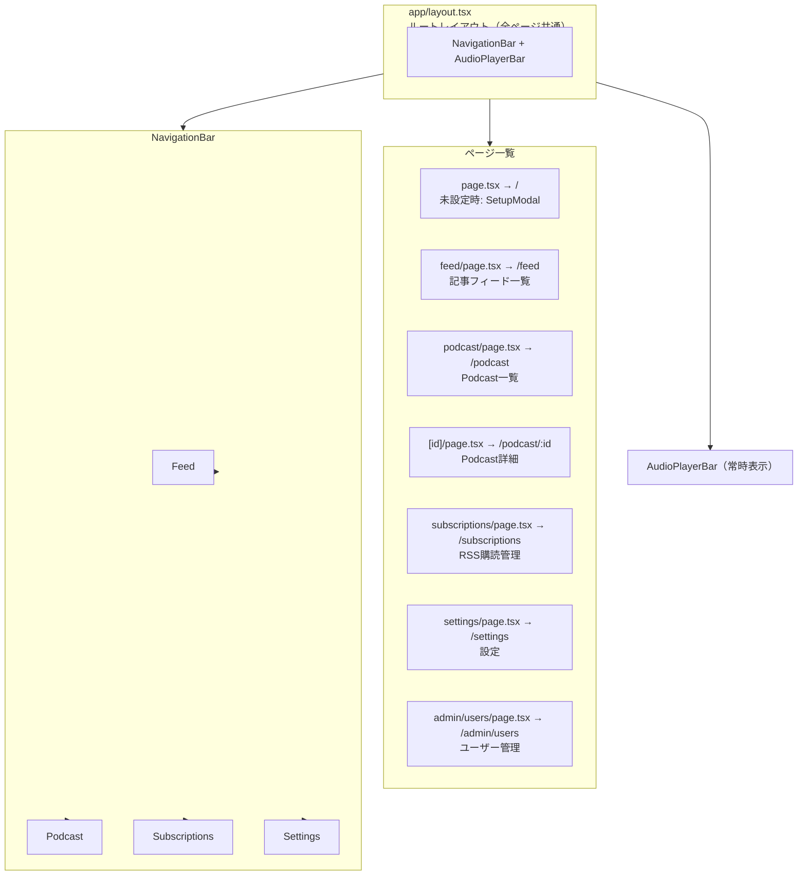

# Web フロントエンド設計書

Next.js (App Router) による Web アプリケーション設計。iOS アプリに先行してリリースし、同一バックエンド API を使用する。

**設計・仕様の正本。視覚デザイン正本は [app-ui.html](app-ui.html)。旧 `docs/spec/2026-06-10-web-frontend-spec.md` は本書へ統合し廃止。**

| | |
|---|---|
| フレームワーク | Next.js 15 (App Router) |
| 言語 | TypeScript |
| スタイル | 純 CSS + デザイントークン ([ADR-003](../adr/003-web-pure-css-design-tokens.md)) |
| ホスティング | Cloud Run (GCP) |
| 認証 | セッション ([ADR-013](../adr/013-session-auth-and-user-management.md)) |
| 最終更新 | 2026-06-24 |
| 本書 | 設計・仕様の正本 |

> **メモ:** Web フロントエンドの設計・仕様の**正本**（API 契約・状態管理・画面/再生設計・受け入れ基準）。視覚デザイン（配色・フォント・レイアウトトークン）の正本は [app-ui.html](app-ui.html)。旧 `docs/spec/2026-06-10-web-frontend-spec.md` は本書へ統合し廃止。

## 1. 概要・技術スタック

| 項目 | 選定技術 | 理由 |
|---|---|---|
| フレームワーク | Next.js 15 (App Router) | SSR 対応・型安全・ファイルベースルーティング |
| 言語 | TypeScript | API レスポンス型の共有・バグ早期発見 |
| スタイリング | 純 CSS（`app/globals.css` 一元管理）+ CSS 変数デザイントークン | Tailwind 等のユーティリティ CSS は使わない。トークンでテーマ（dark/light）を一元制御（[ADR-003](../adr/003-web-pure-css-design-tokens.md)）。視覚仕様の正本は [app-ui.html](app-ui.html) |
| 音声再生 | HTML5 Audio API（ライブラリなし） | 追加依存なし・速度制御・シーク標準対応 |
| 状態管理 | React Context + useReducer | グローバル状態（APIキー・再生状態）のみ管理。Zustand 等不要な規模。 |
| API 通信 | fetch API（カスタムラッパー） | 追加ライブラリ不要。App Router の Server Components とも相性良い。 |
| 設定永続化 | localStorage | APIキー・デフォルト設定をブラウザに保存 |
| コンテナ | Docker (node:22-alpine) | Cloud Run へのデプロイに統一 |

## 2. ルーティング・画面一覧

ナビゲーションバーは全ページ共通（Feed / Podcast / Subscriptions / Settings）。画面下部には AudioPlayerBar を常時表示し、再生中エピソードを制御できる。

## 3. 認証・ユーザー管理（ADR-013）

Web はサーバーサイドセッション方式を採用する。ログイン成功時にバックエンドが `httpOnly` Cookie `nl_session` を発行し、以降の認証付きリクエストはこの Cookie で行う。トークンは JavaScript から読めないため、ブラウザ側はトークンを保持・保存しない（localStorage 等を一切使わない）。ログイン済みかどうかは `GET /auth/me` の成否で判定する。

> **メモ:** 従来の API キー（`X-API-Key`）はバックエンド接続のためのオリジン制約として引き続き用いるが、**利用者の認証はセッション Cookie で行う**。すなわちプロキシは API キーを付与しつつ、利用者の `nl_session` Cookie を中継する二層構成となる。

### AuthContext（API 設定の AppContext とは別 Context）

認証状態は `web/contexts/AuthContext.tsx` が保持する。API 接続設定を扱う `AppContext` とは独立した Context で、API 設定の復元完了後に `refreshMe()` を一度呼んで状態を解決する。`useAuth()` を Provider の外で呼ぶと例外を throw する。

| フィールド / メソッド | 説明 |
|---|---|
| status | `unknown`（解決前）/ `authenticated` / `unauthenticated` の 3 状態 |
| user | ログイン中ユーザー（`AuthUser`）。未認証時は `null` |
| login(username, password) | ログイン実行。失敗時は `ApiError` を throw する |
| logout() | ログアウト（ベストエフォート。失敗してもクライアント状態は未認証へ） |
| refreshMe() | `/auth/me` で認証状態を再解決する |

### BFF プロキシでの Cookie 中継

BFF プロキシ（`web/app/api/backend/[...path]/route.ts`）は既存の転送に加え、リクエストの `Cookie` ヘッダをバックエンドへ転送し、バックエンドの `Set-Cookie` をレスポンスへ通す。これにより `nl_session` の発行・失効を中継する。バックエンドは Cookie に `Domain` 属性を付けず、Cookie は Web オリジンにバインドされる。`httpOnly` / `SameSite` 属性は維持される。

### 認証関連 API 契約（バックエンド）

| メソッド | パス | 用途・契約 |
|---|---|---|
| POST | /auth/login | `{token, user}` を返し `Set-Cookie: nl_session` を発行。401 はユーザー存在を伏せた汎用文言 |
| POST | /auth/logout | セッション失効。冪等 |
| GET | /auth/me | 現在のログインユーザーを返す（未認証時はエラー） |
| PATCH | /auth/me | 表示名（`display_name`）の更新 |
| POST | /auth/password | パスワード変更（`current_password` を検証） |
| GET | /admin/users | ユーザー一覧（admin 必須・401/403） |
| POST | /admin/users | ユーザー作成（admin 必須・409=重複） |
| PATCH | /admin/users/{username} | ロール変更・PW リセット（admin 必須・404 / 409=最後の admin 降格） |
| DELETE | /admin/users/{username} | ユーザー削除（admin 必須・404 / 409=最後の admin 削除） |

> **メモ:** `/admin/users` 系は admin ロール必須。最後の admin を降格・削除しようとした場合、サーバー側が 409 で拒否する（自己ロックアウト防止のサーバー側ガード）。

### セキュリティ

- トークンは `httpOnly` Cookie のみが保持し、localStorage 等には保存しない（XSS 緩和）
- パスワード入力欄は `type=password` を用いる
- ログイン失敗はユーザーの存在を伏せた汎用文言とする

### CSRF 対策（Double-submit cookie）（[ADR-019](../adr/019-csrf-double-submit-cookie.md)）

Web からのブラウザ状態変更リクエスト（POST / PUT / DELETE）に対して CSRF（Cross-Site Request Forgery）攻撃を防止する。バックエンドが発行する非 httpOnly Cookie `csrf_token` をクライアントが読み取り、`X-CSRF-Token` ヘッダで送り返す double-submit cookie 方式を採用する。

| 観点 | 実装 |
|-----|------|
| トークン取得 | ログイン成功時（`/auth/login`）またはブラウザ初回読み込み時に `GET /auth/me` で取得。Cookie `csrf_token` を JavaScript で読み取る |
| 付与方式 | 状態変更メソッド（`POST /articles/:id/star` など）の全リクエストで `X-CSRF-Token: {token}` ヘッダを付与（`lib/api.ts` で一元管理） |
| BFF パススルー | BFF プロキシ（`app/api/backend/[...path]/route.ts`）がリクエストの `X-CSRF-Token` ヘッダを保持してバックエンドに転送 |
| 実装場所 | `lib/api.ts::fetchBackend` で全リクエスト時に Cookie を読み取り Header に付与。詳細は [ADR-019](../adr/019-csrf-double-submit-cookie.md) を参照 |

### Web Push 通知（VAPID）（[ADR-020](../adr/020-push-notification-web-push.md)）

Podcast 生成完了時にユーザーへ Web Push 通知を送信する。W3C 標準 Web Push（Service Worker + PushManager）を採用し、ユーザーの購読管理（ON/OFF）を設定画面で可能にする。

| 観点 | 実装 |
|-----|------|
| Service Worker | `public/sw.js` で push イベントを受信し `showNotification` で通知表示。notificationclick イベントで該当 URL へ遷移 |
| 購読管理 Hook | `hooks/useWebPushSubscription.ts`：状態機械で Idle → Requesting → Granted/Denied/Unavailable へ遷移。機能検出（`Notification`、`navigator.serviceWorker`）とブラウザ権限リクエスト処理を含む |
| API 連携 | `GET /notifications/vapid-public-key` で公開鍵取得（未設定は 404・機能検出）。`POST /notifications/subscriptions` で購読登録（W3C 標準形式・冪等）。`DELETE /notifications/subscriptions?endpoint=...` で購読解除（冪等） |
| UI 配置 | `/settings` ページに Web Push ON/OFF トグルを追加。無効化理由（権限拒否・VAPID 未設定）をグレースフルに表示 |
| 関連ファイル | `lib/webpush.ts`（API 関数）・`lib/pushBrowserPort.ts`（PushManager 抽象）・`public/manifest.json`（Service Worker 登録） |

## 4. 各画面の設計

### エントリーゲート (`app/page.tsx → /`)

ルート（/）はアプリ状態に応じた振り分けを行うゲートとして機能する。判定は以下の順で評価される。

1. API 設定の復元前 → スケルトンを表示
2. API 未設定 → `SetupModal` を表示
3. **未認証 → `LoginModal` を表示**（`components/ui/LoginModal.tsx`・username + パスワード。失敗は汎用文言）
4. オンボーディング未完了 → `OnboardingSourcesModal`（ADR-012）
5. すべて充足 → `/feed` へ `replace` 遷移

### Feed (`/feed`)

レコメンド済み記事をカード形式で表示する。

| 要素 | 詳細 |
|---|---|
| 記事カード | タイトル・ソース名・公開日・スコアバー（0〜1.0 を視覚化） |
| Star ボタン | ★ クリック → POST /articles/:id/star → Podcast 生成開始トースト表示 |
| Dismiss ボタン | × クリック → POST /articles/:id/dismiss → カードをリストから除去 |
| 記事リンク | タイトルクリック → 新規タブで元記事を開く |
| ローディング状態 | スケルトンカード表示 |
| 空状態 | 「まだ記事がありません。バッチは毎日 06:00 に実行されます。」 |
| リフレッシュ | 画面上部のリフレッシュボタン or プルトゥリフレッシュ（モバイル） |

### Podcast エピソード一覧 (`/podcast`)

生成済み Podcast をカード形式で表示する。

| 要素 | 詳細 |
|---|---|
| エピソードカード | 日本語イントロ（CSS 2 行クランプで表示。旧「先頭 80 文字 slice」は撤去）・難易度バッジ・再生時間・生成日 |
| フィルタ | タブ切替「すべて / ★ スター済み」（2026-06-12） |
| 再生ボタン | クリック → AudioPlayerBar にエピソードをセットし再生開始 |
| 更新 | pull-to-refresh / 再取得で完成エピソードを反映 |
| 詳細リンク | カードクリック → /podcast/:id でイントロ全文表示 |

> **メモ:** **生成中ステータスのポーリングは実装しない（Phase 2）。** 現行 `PodcastResponse` に `status` は含まれず（[ADR-011](../adr/011-podcast-generation-status.md)）、StatusBadge / 5 秒ポーリングは行わない。完成したエピソードは再取得で表示する。

### RSS 購読管理 (`/subscriptions`) ← 専用画面

購読中の RSS ソースの一覧表示・追加・削除を行う専用画面。

| 要素 | 詳細 |
|---|---|
| 購読中ソース一覧 | ソース名・URL・有効/無効トグルをテーブルまたはカードで表示 |
| URL 追加フォーム | 「ソース名」「RSS URL」入力欄 + 追加ボタン（インラインバリデーション付き） |
| 削除 | 各行の削除ボタン → 確認ダイアログ → DELETE /settings/sources?url=（URL キー） |
| バリデーション | URL 形式チェック（クライアント）+ 重複チェック（サーバー 409 エラー表示） |
| 空状態 | デフォルト2件（HackerNews / Zenn.dev）が初期表示 |
| エラー表示 | 422: 「RSS フィードとして取得できません」、409: 「この URL は登録済みです」 |

#### URL 追加フォームの UI フロー

1. 「ソース名」と「RSS URL」を入力
2. 送信 → POST /settings/sources（body `{name, url}`）
3. 成功: 一覧にリアルタイム追加・トースト「追加しました」
4. 失敗: インラインエラーメッセージ表示（フォームはリセットしない）

### Settings (`/settings`)

| 設定項目 | UI | 保存先 |
|---|---|---|
| デフォルト難易度 | セレクトボックス（6 段階） | POST /settings + localStorage |
| デフォルト再生速度 | スライダー（0.5〜2.5） | POST /settings + localStorage |
| API エンドポイント URL | テキスト入力（初回設定） | localStorage |
| API キー | パスワード入力 | localStorage（要注意: XSS リスク） |

> **メモ:** API キーは localStorage に保存するため XSS への注意が必要。CSP ヘッダーと `httpOnly` Cookie への移行を Phase 2 で検討する。

#### アカウント管理（ADR-013）(`components/ui/AccountSection.tsx`)

`/settings` 内にログイン中ユーザーのアカウント管理セクションを設ける。

| 要素 | 詳細 |
|---|---|
| 表示名編集 | 表示名（`display_name`）を更新 → `PATCH /auth/me` |
| パスワード変更 | 現在 PW と新 PW を入力 → `POST /auth/password`（現在 PW を検証） |
| ログアウト | `logout()` 実行（ベストエフォート） |
| 管理導線 | `user.role==='admin'` のときのみ `/admin/users` への導線を表示 |

### ユーザー管理（admin 限定）(`app/admin/users/page.tsx → /admin/users`)

admin ロールのユーザーのみアクセスできるユーザー管理画面。一覧・作成・ロール変更・PW リセット・削除を行う。

| 要素 | 詳細 |
|---|---|
| ユーザー一覧 | `GET /admin/users` で取得・表示 |
| ユーザー作成 | `POST /admin/users`（409=重複ユーザー名） |
| ロール変更 / PW リセット | `PATCH /admin/users/{username}` |
| 削除 | `DELETE /admin/users/{username}` |
| 自己ロックアウト防止 | 自分自身（`u.username===user?.username`）の行にはロール変更・削除ボタンを出さない。サーバー側も最後の admin を 409 で拒否する |

## 5. 共通コンポーネント設計

### コンポーネント一覧

| コンポーネント | 説明 |
|---|---|
| **NavigationBar** | Feed/Podcast/Subscriptions/Settings リンク。現在ページをハイライト。 |
| **AudioPlayerBar** | 画面下部固定の再生バー。再生/一時停止・シーク・速度変更・イントロテキスト。 |
| **ArticleCard** | タイトル・ソース・日付・スコアバー・Star/Dismiss ボタン。 |
| **PodcastCard** | イントロ先頭・難易度・時間・ステータス・再生ボタン。 |
| **SubscriptionRow** | ソース名・URL・削除ボタン。各行。 |
| **AddSubscriptionForm** | ソース名 + URL 入力フォーム。インラインバリデーション付き。 |
| **DifficultyBadge** | 難易度を色分けバッジで表示。 |
| **ThemeToggle** | dark/light テーマ切替（トークン制御・ADR-004）。 |
| **Toast** | 成功/エラーのフィードバック通知（3 秒後に消える）。 |
| **SetupModal** | API キー未設定時にモーダル表示。 |
| **LoginModal** | 未認証時に表示。username + パスワード。失敗は汎用文言。 |
| **AccountSection** | /settings 内のアカウント管理。表示名・PW 変更・ログアウト・admin 導線。 |
| **SkeletonCard** | データ取得中のプレースホルダー。 |
| **ConfirmDialog** | RSS 削除時の確認ダイアログ。 |

## 6. 状態管理

### グローバル状態（React Context）

React Context（`AppContext`）が全ページ共通のグローバル状態を保持する。API 接続設定とデフォルト設定は localStorage に永続化し、音声再生状態は全ページ共通で同期される。状態は次のフィールドで構成される。

| カテゴリ | フィールド | 説明 |
|---|---|---|
| API 設定（localStorage 永続化） | apiBaseUrl | バックエンド API のベース URL |
| | apiKey | API キー |
| | isConfigured | 初期設定が完了済みかどうか |
| デフォルト設定 | defaultDifficulty | 既定の難易度 |
| | defaultPlaybackSpeed | 既定の再生速度 |
| 音声再生状態（全ページ共通） | currentPodcast | 再生中の Podcast（未再生時は未設定） |
| | isPlaying | 再生中かどうか |
| | currentTime | 現在の再生位置（秒） |
| | duration | 総再生時間（秒） |
| | playbackSpeed | 現在の再生速度 |

状態更新のアクションは以下を提供する。

- **CONFIGURE**: API 接続設定を登録し設定完了状態へ遷移させる
- **RESTORE_DONE**: localStorage からの設定復元完了を反映する
- **SET_PODCAST**: 再生対象の Podcast を設定する
- **SET_SPEED**: 再生速度を変更する

### 認証状態（AuthContext・ADR-013）

認証状態は `AppContext` とは別の `AuthContext`（`web/contexts/AuthContext.tsx`）が保持する。トークンは `httpOnly` Cookie `nl_session` が持つため Context・localStorage には保存せず、状態のみを扱う。詳細は「3. 認証・ユーザー管理（ADR-013）」を参照。

| フィールド / メソッド | 説明 |
|---|---|
| status | `unknown` / `authenticated` / `unauthenticated` |
| user | `AuthUser \| null` |
| login / logout / refreshMe | ログイン・ログアウト・`/auth/me` での再解決 |

### ローカル状態（各ページ / useReducer）

| ページ | ローカル状態 |
|---|---|
| Feed | articles（表示中の記事一覧）, isLoading, error |
| Podcast | podcasts, isLoading, pollingIds（生成中のID集合） |
| Subscriptions | sources, isLoading, isAdding, addError |
| Settings | isSaving, saveError |

## 7. 音声再生設計

### AudioPlayerBar の構成要素

- エピソードタイトル（日本語イントロ先頭 50 文字）
- 難易度バッジ
- シークバー（`input[type=range]`）
  - 現在時刻表示（MM:SS）
  - 総時間表示（MM:SS）
- 再生コントロール
  - -15 秒 ボタン
  - 再生 / 一時停止 ボタン
  - +30 秒 ボタン
- 速度セレクタ（×0.5 〜 ×2.5 の 8 段階）

### HTML5 Audio API の実装方針

再生制御は単一の HTML5 `<audio>` 要素を全ページで共有し、ページ遷移をまたいでも再生が継続するように設計する。再生速度は ×0.5 〜 ×2.5 の 8 段階（0.5 / 0.75 / 1.0 / 1.25 / 1.5 / 1.75 / 2.0 / 2.5）から選択でき、選択値は `playbackRate` に反映する。

再生位置は、保存済み位置の取得処理（getSavedPosition）で前回位置を読み出して再生開始時に復元する。再生中は約 10 秒ごとに現在位置を localStorage（キー `podcast_position:{id}`）へ保存し、再生終了時には位置をリセットする。音量設定も localStorage に永続化し、次回再生時に復元する。要素はアンマウント時に停止・解放してリソースをクリーンアップする。

### 再生位置の保存フロー

1. `timeupdate` イベントで現在位置を約 10 秒ごとに localStorage（キー `podcast_position:{id}`）へ保存する（サーバーへは送信しない）
2. 次回 /podcast ページ訪問時、保存済み位置を localStorage から取得する（`getSavedPosition`）
3. 再生開始時に `audio.currentTime = savedPosition` で位置を復元する

## 8. API クライアント設計

クライアントは直接バックエンドを叩かず、Next.js 側の BFF プロキシ（`/api/backend/*`）を経由する。クライアントが localStorage に保持する API キーとバックエンドのベース URL は、リクエスト時に `X-API-Key`・`X-Backend-Base-Url` ヘッダとしてプロキシへ渡し、プロキシがバックエンドへ中継する。これによりブラウザのオリジン制約（CORS）や混在コンテンツを回避する。

レスポンスが非正常の場合は本文の `detail` を含む `ApiError` へ正規化し、ステータスコードとメッセージを一貫した形で扱う。プロキシ経由で公開する API エンドポイントは以下のとおり。

認証関連のクライアント関数（`web/lib/api.ts`）は `login` / `logout` / `getMe` / `updateProfile(displayName)` / `changePassword(current, next)` と、管理用の `listUsers` / `createUser` / `updateUser` / `deleteUser` を提供する。これらはいずれも BFF を経由し、`nl_session` Cookie を自動で送受信する。クライアントはトークンを保持しない。API 契約の詳細は「3. 認証・ユーザー管理（ADR-013）」を参照。

| メソッド | パス | 用途 |
|---|---|---|
| GET | /feed | 記事フィードの取得 |
| POST | /articles/:id/star | 記事のスター登録 |
| POST | /articles/:id/dismiss | 記事の非表示 |
| GET | /podcasts | Podcast 一覧の取得 |
| GET | /podcasts/:id | Podcast 詳細の取得 |
| GET | /settings/sources | RSS ソース一覧の取得 |
| POST | /settings/sources | RSS ソースの追加（body `{name, url}`） |
| DELETE | /settings/sources?url= | RSS ソースの削除（URL キー） |

> **メモ:** 再生位置・既定難易度・既定再生速度はサーバー API を持たず、すべて localStorage に保存する（`PATCH /podcasts/:id/position`・`GET·PUT /settings` は存在しない）。RSS の購読画面（フロントエンドのページ）は `/subscriptions` だが、呼び出すバックエンド API は `/settings/sources`（URL キー）である点に注意。

### 型定義

難易度（DifficultyLevel）は次の列挙値を取る。

| 値 | 説明 |
|---|---|
| toeic_600 | TOEIC 600 相当 |
| toeic_900 | TOEIC 900 相当 |
| ielts_55 | IELTS 5.5 相当 |
| ielts_7 | IELTS 7.0 相当 |
| eiken_2 | 英検 2 級相当 |
| eiken_p1 | 英検準 1 級相当 |

Article（記事）

| 項目 | 型 | 説明 |
|---|---|---|
| id | string | 記事 ID |
| title | string | 記事タイトル |
| url | string | 記事 URL |
| source | string | ソース名 |
| score | number | 表示順を決めるスコア |
| published_at | string | 公開日時 |

Podcast（生成音声）

| 項目 | 型 | 説明 |
|---|---|---|
| id | string | Podcast ID |
| type | 'single' \| 'digest' | 単一記事 / ダイジェストの種別 |
| article_ids | string[] | 対象記事 ID の配列 |
| difficulty | DifficultyLevel | 難易度 |
| audio_url | string | 署名付き音声 URL（API が GCS blob から変換して返す。期限切れ時は再取得・ADR-009） |
| japanese_intro_text | string | 日本語イントロ文 |
| duration_seconds | number | 総再生時間（秒） |
| created_at | string | 生成日時 |

> **メモ:** `PodcastResponse` に `status` / 再生位置は**含まれない**（生成中表示は Phase 2・ADR-011／再生位置は端末ローカル保存・ADR-008）。

Source（RSS 購読ソース）

| 項目 | 型 | 説明 |
|---|---|---|
| id | string | ソース ID |
| name | string | ソース名 |
| url | string | RSS フィード URL |
| enabled | boolean | 購読が有効かどうか |

認証・ユーザー関連の型（`web/types/index.ts`・ADR-013）

| 型 | 定義 | 説明 |
|---|---|---|
| UserRole | `'admin' \| 'user'` | ユーザーのロール |
| AuthUser | `{ username, role, display_name }` | ログイン中ユーザー |
| LoginResponse | `{ token, user }` | `POST /auth/login` のレスポンス |
| UserListResponse | `{ users }` | `GET /admin/users` のレスポンス |

## 9. ファイル構成

| ディレクトリ / ファイル | 責務 |
|---|---|
| app/layout.tsx | ルートレイアウト（NavigationBar + AudioPlayerBar） |
| app/page.tsx | / のリダイレクト、またはセットアップ画面 |
| app/feed/page.tsx | /feed ページ |
| app/podcast/page.tsx | /podcast（一覧）ページ |
| app/podcast/[id]/page.tsx | /podcast/:id（詳細）ページ |
| app/subscriptions/page.tsx | /subscriptions（RSS 購読管理）ページ |
| app/settings/page.tsx | /settings ページ（アカウント管理を含む） |
| app/admin/users/page.tsx | /admin/users（admin 限定ユーザー管理）ページ |
| app/api/backend/[...path]/route.ts | BFF プロキシ（API キー付与・`nl_session` Cookie 中継） |
| components/NavigationBar.tsx | グローバルナビゲーション |
| components/AudioPlayerBar.tsx | 全ページ共通の音声プレイヤー |
| components/ArticleCard.tsx | 記事カード |
| components/PodcastCard.tsx | Podcast カード |
| components/subscriptions/SubscriptionRow.tsx | 購読ソースの行 |
| components/subscriptions/AddSubscriptionForm.tsx | URL 入力フォーム |
| components/ui/DifficultyBadge.tsx | 難易度バッジ |
| components/ui/ThemeToggle.tsx | dark/light テーマ切替（ADR-004） |
| components/ui/Toast.tsx | トースト通知 |
| components/ui/ConfirmDialog.tsx | 確認ダイアログ |
| components/ui/SetupModal.tsx | 初期設定モーダル |
| components/ui/LoginModal.tsx | ログインモーダル（未認証時） |
| components/ui/AccountSection.tsx | /settings 内のアカウント管理セクション |
| components/ui/SkeletonCard.tsx | 読み込み中プレースホルダー |
| components/providers/AppProvider.tsx | AppContext のプロバイダ |
| contexts/AppContext.tsx | グローバル状態の定義 |
| contexts/AuthContext.tsx | 認証状態の定義（ADR-013） |
| hooks/useAudioPlayer.ts | HTML5 Audio API ラッパー（署名付き URL 期限切れ時の再取得・ADR-009） |
| hooks/useLocalStorage.ts | localStorage の型付きラッパー |
| lib/api.ts | API クライアント・全 API 関数 |
| lib/config.ts | localStorage キー定数 |
| types/index.ts | 全型定義 |
| Dockerfile | Cloud Run 用コンテナビルド定義 |
| next.config.ts | Next.js 設定 |
| app/globals.css | 純 CSS + デザイントークン（テーマ一元管理・ADR-003。視覚正本は app-ui.html） |
| tsconfig.json | TypeScript 設定 |

## 10. デプロイ設計（Cloud Run）

### Dockerfile

Node.js（Alpine）ベースのマルチステージビルドを採用する。ビルドステージで依存解決と `next build` を行い、ランタイムステージには Next.js のスタンドアローン出力（standalone）と静的アセットのみを取り込み、軽量なコンテナを生成する。具体的なビルド定義の正本はリポジトリ内の `web/Dockerfile` を参照する。

### デプロイコマンド

デプロイは大きく以下の流れで行う。リージョンは `asia-northeast1` を基本とする。

1. コンテナイメージをビルドし、コンテナレジストリへプッシュする
2. そのイメージを Cloud Run サービス（news-listen-web）へデプロイする（待受ポート 3000）
3. 個人利用のため未認証アクセスを許可する。アクセス制限が必要な場合は IAP 等で保護する

実際のコマンド列の正本は運用文書およびリポジトリ内のデプロイスクリプトに置く。本設計書では手順の方針のみを記載する。

> **メモ:** **next.config.ts** で `output: 'standalone'` を設定し、`node_modules` を含まない軽量なスタンドアローンサーバーを生成する。  
> API エンドポイントは環境変数ではなく localStorage で管理するため、ビルド時に注入不要。

### iOS との差異まとめ

| 機能 | Web（Next.js） | iOS（Phase 2） |
|---|---|---|
| Star/Dismiss 操作 | ★ ボタン / × ボタン | 右/左スワイプ |
| 音声再生 | HTML5 Audio API + カスタム UI | AVFoundation (AVPlayer) |
| 設定永続化 | localStorage | UserDefaults |
| Push 通知 | 再取得（pull-to-refresh）。Web Push は P2 | APNs（P2） |
| オフライン再生 | Service Worker キャッシュ（P2） | デバイスキャッシュ（P2） |
| RSS 購読管理 | /subscriptions 専用ページ | SubscriptionsView（タブ遷移） |
| API 設定 | localStorage（SetupModal 初回） | UserDefaults（InitialSetupView 初回） |
