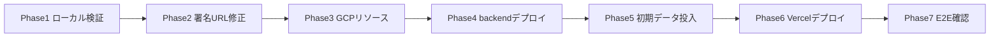

# デプロイ状況記録

- **対象読者**: 本プロジェクトの運用・開発担当
- **最終更新日**: 2026-06-11
- **ステータス**: 本番デプロイは Phase 4 まで完了し、Phase 5 直前で**意図的に中断**。ローカル Docker での PoC 検証を優先するため。

## 1. 決定事項（前提）

| 項目 | 決定 | 補足 |
|------|------|------|
| バックエンド | GCP（Cloud Run サービス + Cloud Run Jobs） | `infra/setup.sh` / `infra/deploy.sh` |
| フロントエンド | Vercel（予定） | デプロイスクリプト未整備。Phase 6 で対応 |
| backend ローカル実行 | uv に統一 | `README.md` 更新済み（`agent-rules/11` に準拠） |
| GCP プロジェクト | `news-listen-20260610` / `asia-northeast1` | 課金有効・`.env` 記入済み |

## 2. 実装と当初設計の差異（運用上の注意）

- **Star → Podcast 即時生成は未実装**: README/spec は Cloud Tasks worker による即時生成を記述しているが、コードに Cloud Tasks 連携は存在しない。実体は `podcast-generator` ジョブによる**バッチ処理**（Cloud Scheduler または手動実行）。Star 後にジョブ実行が必要。
- **初期 RSS ソースが空**: `UserPrefs.rss_sources` は空リスト初期値。デプロイ直後は記事ゼロ。Settings タブまたは `POST /settings/sources` でソース追加が必須。
- **署名付き URL の修正済み**: Cloud Run の SA 認証情報には秘密鍵が無く、引数なしの `generate_signed_url()` は失敗する。IAM signBlob 方式（`service_account_email` + `access_token`）に修正済み。SA 自身への `roles/iam.serviceAccountTokenCreator` と `iamcredentials.googleapis.com` が前提（`infra/setup.sh` に反映済み）。

## 3. Phase 進捗

| Phase | 内容 | 状態 |
|-------|------|------|
| Phase 1 | ローカル検証（pytest / vitest） | ✅ 完了（backend 92 passed 他） |
| Phase 2 | 署名 URL を IAM signBlob 方式へ修正（TDD） | ✅ 完了（`feature/signed-url-iam`、storage 含め 93 passed） |
| Phase 3 | GCP リソース作成（`infra/setup.sh`） | ✅ 完了（冪等。signBlob 権限 / iamcredentials API を新規反映） |
| Phase 4 | backend デプロイ（`infra/deploy.sh`） | ✅ 完了（下記） |
| Phase 5 | 初期 RSS 投入 & ジョブ実行 | ⏸ **中断（未実施）** |
| Phase 6 | Vercel デプロイ | ⏸ 未着手 |
| Phase 7 | E2E 動作確認（特に署名 URL での再生実証） | ⏸ 未着手 |

## 4. Phase 4 デプロイ結果（稼働中の本番リソース）

- **デプロイコミット**: `6b96a5c`（`feature/signed-url-iam`）
- **API URL**: `https://news-listen-api-ck5vowuina-an.a.run.app`
- **疎通**: `GET /health` → 200 / 認証なし `GET /feed` → 401（X-API-Key 認証が機能）
- **Cloud Run サービス**: `news-listen-api`（min=0 / max=3、`--allow-unauthenticated` + アプリ層 API キー認証）
- **Cloud Run Jobs**: `rss-fetcher` / `recommendation` / `podcast-generator`（デプロイ済み・未実行）
- **Cloud Scheduler**: 未設定（`SETUP_SCHEDULER=1 bash infra/deploy.sh` で有効化可能）

> 注: API は稼働中だが Firestore にデータが無いため、現状 Feed は空。Phase 5 を実施するまで実データは流れない。

## 5. 中断理由と次アクション

本番運用に踏み切る前に、ローカル Docker で MVP を立ち上げ PoC として動作確認する方針に切り替えた。

- **再開条件**: ローカル PoC で主要フロー（Feed → Star → Podcast 生成・再生）を確認後、Phase 5 以降を再開。
- **本番リソースは稼働したまま**: 課金は Cloud Run min-instances=0 のためアイドル時はほぼ発生しない。停止が必要なら Cloud Run サービス/ジョブを削除する。

### ローカル Docker PoC（構築済み・稼働中）

- **方式**: 実 GCP 接続（Firestore / Cloud Storage / Gemini）。コンテナは SA 鍵 `infra/keys/news-listen-sa.json`（gitignore 済み・key_id `9a7a1be5…`）で認証。
- **構成**: ルートの `docker-compose.yml`。`api`（`backend/Dockerfile.api`）/ `web`（`web/Dockerfile.web`、Next.js standalone）/ オンデマンド jobs（`profiles: ["jobs"]`）。
- **起動**: `docker compose up --build api web` → Web `http://localhost:3000` / API `http://localhost:8080`。
- **SetupModal 入力**: バックエンド URL = `http://api:8080`（BFF が Web コンテナ内から解決する名前）、API キー = `.env` の `API_KEY`。
- **ジョブ実行**: `docker compose run --rm rss-fetcher` / `recommendation` / `podcast-generator`。

#### 検証結果（2026-06-11）
- `GET /health` 200 / web トップ 200 / BFF 経由 `/feed` 200（SA 鍵での Firestore アクセス成功）/ 認証なし 401。
- `rss-fetcher`: HackerNews から 20 記事取得・保存成功。
- `recommendation`: 記事保存は成功するが **Gemini 呼び出しが失敗**（フォールバックで全件 score=0.5）。Feed には 20 記事表示。

#### ⚠ 既知のブロッカー
- **`GEMINI_API_KEY` が無効**（`API_KEY_INVALID` / `generativelanguage.googleapis.com`）。キー形式は正常（`AIzaSy…`・39 文字）だが API に拒否される。
  - 影響: レコメンドの実スコアリングと **Podcast 生成・TTS が動作しない**（PoC の中核機能）。
  - 対処: 有効な AI Studio キーへ差し替え（Generative Language API 有効化・キー制限確認）。差し替え後に `recommendation` / `podcast-generator` を再実行する。
- Feed/Star/Dismiss/Settings の UI フローは Gemini 無しでも触れる状態。
</content>
</invoke>
