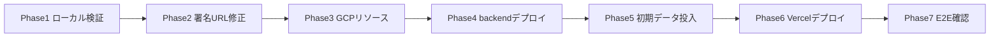

# デプロイ状況記録

- **対象読者**: 本プロジェクトの運用・開発担当
- **最終更新日**: 2026-06-27
- **ステータス**: フロントエンド（Vercel）本番デプロイ完了（Phase 6 ✅／§7 参照）。backend は Cloud Run で稼働中（Phase 4 ✅）。残るは Phase 5（初期データ投入）と Phase 7（E2E 確認）。

## 1. 決定事項（前提）

| 項目 | 決定 | 補足 |
|------|------|------|
| バックエンド | GCP（Cloud Run サービス + Cloud Run Jobs） | `infra/setup.sh` / `infra/deploy.sh` |
| フロントエンド | Vercel（予定） | デプロイスクリプト未整備。Phase 6 で対応 |
| backend ローカル実行 | uv に統一 | `README.md` 更新済み（`agent-rules/11` に準拠） |
| GCP プロジェクト | `news-listen-20260610` / `asia-northeast1` | 課金有効・`.env` 記入済み |

## 2. 実装と当初設計の差異（運用上の注意）

- **Star → Podcast 生成のトリガ**: Cloud Tasks 連携は存在しない。**（2026-06-24 更新）** Star/Dismiss を起点に API がジョブを自動起動する仕組みを実装済み（[ADR-005](../adr/005-job-trigger-on-action.md)、`shared/job_trigger.py`）。起動先は `JOB_TRIGGER_BACKEND`（`cloud_run` / `local_process` / `disabled`）で切替え、`jobLocks` の TTL でデバウンスする。**既定は `disabled`** のため、明示設定しない限り従来通り `podcast-generator` ジョブの**バッチ処理**（Cloud Scheduler または手動実行）に委ねる。即時生成を有効化する場合は `JOB_TRIGGER_BACKEND` を設定する。
- **初期 RSS ソースが空**: `UserPrefs.rss_sources` は空リスト初期値。デプロイ直後は記事ゼロ。Settings タブまたは `POST /settings/sources` でソース追加が必須。
- **署名付き URL の修正済み**: Cloud Run の SA 認証情報には秘密鍵が無く、引数なしの `generate_signed_url()` は失敗する。IAM signBlob 方式（`service_account_email` + `access_token`）に修正済み。SA 自身への `roles/iam.serviceAccountTokenCreator` と `iamcredentials.googleapis.com` が前提（`infra/setup.sh` に反映済み）。
- **（2026-06-23 追記）利用者認証が必須に**: セッションベース認証・マルチユーザー管理を導入済み（[ADR-013](../adr/013-session-auth-and-user-management.md)）。デプロイ後は **`backend/scripts/seed_users.py` で初期ユーザー（admin / user）を投入**しないとログインできない。初期パスワードは環境変数（`INITIAL_ADMIN_USERNAME`/`INITIAL_ADMIN_PASS` ほか）で与え、**初回ログイン後に必ず変更**する。`SESSION_COOKIE_SECURE` はローカル（http）では `false`、本番（https）では `true`。`USER_ID` 固定によるフィード参照はログインセッション由来へ変更された（旧 PoC で `USER_ID` を流用していた場合は `seed_users.py` がその値を初期 user の `user_id` に引き継ぐ）。

## 3. Phase 進捗

| Phase | 内容 | 状態 |
|-------|------|------|
| Phase 1 | ローカル検証（pytest / vitest） | ✅ 完了（backend 92 passed 他） |
| Phase 2 | 署名 URL を IAM signBlob 方式へ修正（TDD） | ✅ 完了（`feature/signed-url-iam`、storage 含め 93 passed） |
| Phase 3 | GCP リソース作成（`infra/setup.sh`） | ✅ 完了（冪等。signBlob 権限 / iamcredentials API を新規反映） |
| Phase 4 | backend デプロイ（`infra/deploy.sh`） | ✅ 完了（下記） |
| Phase 5 | 初期 RSS 投入 & ジョブ実行 | ⏸ **未実施**（go-live ブロッカー） |
| Phase 6 | Vercel デプロイ | ✅ **完了**（2026-06-27、§7 参照） |
| Phase 7 | E2E 動作確認（特に署名 URL での再生実証） | ⏸ 未着手 |

## 4. Phase 4 デプロイ結果（稼働中の本番リソース）

- **デプロイコミット**: `6b96a5c`（`feature/signed-url-iam`）
- **API URL**: `https://news-listen-api-ck5vowuina-an.a.run.app`
- **疎通**: `GET /health` → 200 / 認証なし `GET /feed` → 401（X-API-Key 認証が機能）
- **Cloud Run サービス**: `news-listen-api`（min=0 / max=3、`--allow-unauthenticated` + アプリ層 API キー認証）
- **Cloud Run Jobs**: `rss-fetcher` / `recommendation` / `podcast-generator`（デプロイ済み・未実行）
- **Cloud Scheduler**: 未設定（`SETUP_SCHEDULER=1 bash infra/deploy.sh` で有効化可能）

> 注: API は稼働中だが Firestore にデータが無いため、現状 Feed は空。Phase 5 を実施するまで実データは流れない。

## 5. 中断理由と次アクション

本番運用に踏み切る前に、ローカル Docker で MVP を立ち上げ PoC として動作確認する方針に切り替えた。

- **再開条件**: ローカル PoC で主要フロー（Feed → Star → Podcast 生成・再生）を確認後、Phase 5 以降を再開。
- **本番リソースは稼働したまま**: 課金は Cloud Run min-instances=0 のためアイドル時はほぼ発生しない。停止が必要なら Cloud Run サービス/ジョブを削除する。

### ローカル Docker PoC（構築済み・稼働中）

- **方式**: 実 GCP 接続（Firestore / Cloud Storage / Gemini）。コンテナは SA 鍵 `infra/keys/news-listen-sa.json`（gitignore 済み・key_id `9a7a1be5…`）で認証。
- **構成**: ルートの `docker-compose.yml`。`api`（`backend/Dockerfile.api`）/ `web`（`web/Dockerfile.web`、Next.js standalone）/ オンデマンド jobs（`profiles: ["jobs"]`）。
- **起動**: `docker compose up --build api web` → Web `http://localhost:3000` / API `http://localhost:8080`。
- **SetupModal 入力**: バックエンド URL = `http://api:8080`（BFF が Web コンテナ内から解決する名前）、API キー = `.env` の `API_KEY`。
- **ジョブ実行**: `docker compose run --rm rss-fetcher` / `recommendation` / `podcast-generator`。

#### 検証結果（2026-06-11）
- `GET /health` 200 / web トップ 200 / BFF 経由 `/feed` 200（SA 鍵での Firestore アクセス成功）/ 認証なし 401。
- `rss-fetcher`: HackerNews から 20 記事取得・保存成功。
- `recommendation`: 記事保存は成功するが **Gemini 呼び出しが失敗**（フォールバックで全件 score=0.5）。Feed には 20 記事表示。

#### ⚠ 既知のブロッカー
- **`GEMINI_API_KEY` が無効**（`API_KEY_INVALID` / `generativelanguage.googleapis.com`）。キー形式は正常（`AIzaSy…`・39 文字）だが API に拒否される。
  - 影響: レコメンドの実スコアリングと **Podcast 生成・TTS が動作しない**（PoC の中核機能）。
  - 対処: 有効な AI Studio キーへ差し替え（Generative Language API 有効化・キー制限確認）。差し替え後に `recommendation` / `podcast-generator` を再実行する。
- Feed/Star/Dismiss/Settings の UI フローは Gemini 無しでも触れる状態。

## 6. main 取り込み方針（このブランチの位置づけ）

`feature/signed-url-iam` の署名付き URL（IAM signBlob）実装は **PR #3 で main 取り込み済み**。
本ブランチに残る未マージ差分は **ローカル Docker PoC のインフラと本運用文書のみ**であり、ブランチ名と実体が乖離している点に留意する。

- **取り込み対象はインフラのみ**: `docker-compose.yml` / `web/Dockerfile.web` / `web/.dockerignore` / `web/next.config.ts`(standalone) / 本ドキュメント。いずれも **ローカル PoC スコープ**の成果物（本番フロントは Vercel、本番バックエンドは Cloud Run であり、この compose は本番デプロイ手段ではない）。
- **Gemini ブロッカーはマージ阻害要因ではない**: §5 の `GEMINI_API_KEY` 無効によりレコメンド実スコアリングと Podcast/TTS は未実証だが、これは「PoC インフラの検証」ではなく「中核フローの実証」の宿題。インフラ自体（ビルド・起動・Firestore アクセス・RSS 取得 20 件）は検証済みのため、インフラを main に置くこと自体は妥当と判断する。
  - **残タスク（マージ後に継続）**: 有効な AI Studio キーへ差し替え → `recommendation` / `podcast-generator` を再実行し、Feed → Star → Podcast 生成・再生の中核フローを実証する。
- **standalone 出力**: `web/next.config.ts` の `output:'standalone'` は全ビルドに影響する横断的設定。本番 Vercel は当該値を無視するため影響はないが、Docker PoC 専用の意図的設定であることを明記する（コード内コメント参照）。

## 7. Phase 6 結果: Vercel フロントエンド本番デプロイ（2026-06-27）

`news-listen-web`（Next.js）を Vercel に本番デプロイした。GitHub 連携による自動デプロイ方式。

### 7.1 稼働中のリソース

| 項目 | 値 |
|------|-----|
| 本番ドメイン | `https://www.news-listen.com`（canonical） |
| apex ドメイン | `https://news-listen.com` → `308` で www へリダイレクト |
| デプロイ識別 URL | `https://news-listen-h2w3w61is-examinare000s-projects.vercel.app` |
| デプロイ方式 | GitHub 連携（`news-listen-web` リポジトリへの push で自動ビルド・デプロイ） |
| 本番ブランチ | `main`（`news-listen-web` の main への push で本番デプロイ） |
| ビルド | Vercel 既定の Next.js ビルド（`next.config.ts` の `output:'standalone'` は Vercel では無視される） |

### 7.2 環境変数: **設定不要**（重要な設計事実）

本フロントは **サーバーサイド環境変数を一切使用しない**（`web/` 配下に `process.env` 参照ゼロ）。
backend URL と API キーは **ブラウザの SetupModal で利用者が入力し localStorage に保存**する方式（[ADR-001](../adr/001-web-bff-proxy.md)）。
したがって **Vercel プロジェクト側で設定すべき環境変数は無い**。

### 7.3 backend CORS: **web に関しては不要**

web → backend 通信は **BFF プロキシ経由のサーバー間 fetch**（Vercel の Next.js サーバー → Cloud Run）であり、ブラウザは backend に直接アクセスしない。
よって **web の本番化に backend の `CORS_ALLOWED_ORIGINS` 設定は不要**。
（CORS 許可が要るのは backend を直接叩く iOS 側のみ。[ADR-007](../adr/007-ios-direct-backend-access.md) / [ADR-016](../adr/016-cors-and-security-headers.md)）

### 7.4 疎通確認（2026-06-27）

- `https://news-listen.com` → `308` → `https://www.news-listen.com/` → `200`（トップ `<title>Podcast App</title>`）。
- BFF プロキシ `GET /api/backend/health`（ヘッダ無し）→ `400 {"detail":"Missing or invalid X-Backend-Base-Url header"}`（SSRF 対策が設計通り稼働）。
- backend `GET /health` → `200` / 認証なし `GET /feed` → `401`（API キー認証が稼働）。

### 7.5 利用者が本番で記事を見るための前提

www.news-listen.com を開いた利用者は、SetupModal で以下を入力する必要がある:
- **backend URL**: `https://news-listen-api-ck5vowuina-an.a.run.app`（§4 の Cloud Run、本番 backend として継続利用）
- **API キー**: backend の `API_KEY`
- その後ログイン（要 Phase 5 の初期ユーザー投入）。

### 7.6 残りの go-live ブロッカー（2026-06-27 診断で更新）

フロントは稼働中だが、利用者がログインして記事を見るには以下が残る。**優先順位は再デプロイが最上位**である。

- **🔴 最優先・backend 再デプロイ（フロント/バックエンドの版ズレ）**: 稼働中の Cloud Run backend は §4 の Phase 4 デプロイ（`6b96a5c`, 2026-06-11）のままで、**認証導入（[ADR-013](../adr/013-session-auth-and-user-management.md), 2026-06-23）より前の古い版**。実測した本番 OpenAPI のルートは `/feed` `/articles/{id}/star|dismiss` `/podcasts` `/settings/sources` `/health` のみで、**`/auth/login` も users も Passkey も存在しない**。一方 Vercel にデプロイした web は最新（ログイン画面・Passkey 前提）。このため**新フロントからはログインできず（`/auth/login` → 404）、アプリが機能しない**。`infra/deploy.sh` で backend を現行版（submodule HEAD）へ再デプロイすることが他の全作業の前提。再デプロイ時の追加考慮: 認証必須化（破壊的変更）、`SESSION_COOKIE_SECURE=true`（本番 https）、初期ユーザー用シークレット。
- **Phase 5（再デプロイ後に実施）**: `backend/scripts/seed_users.py` で初期ユーザー投入 → RSS ソース投入 → `rss-fetcher` / `recommendation` / `podcast-generator` ジョブ実行。※認証導入で feed は per-user になったため、seed は再デプロイ後に行う。実測では現行デプロイの `/feed` は空（記事ゼロ）。
- **✅ Gemini ブロッカーは解消**: §5 の `GEMINI_API_KEY` 無効問題は、`.env` 更新後の鍵で `models.list` が 50 件・エラー無しを確認（2026-06-27）。実生成（`generateContent`）はジョブ実行で最終確認する。
- **Phase 7**: www.news-listen.com → SetupModal → 最新 backend の E2E（Feed → Star → Podcast 生成・署名 URL 再生）実証。
