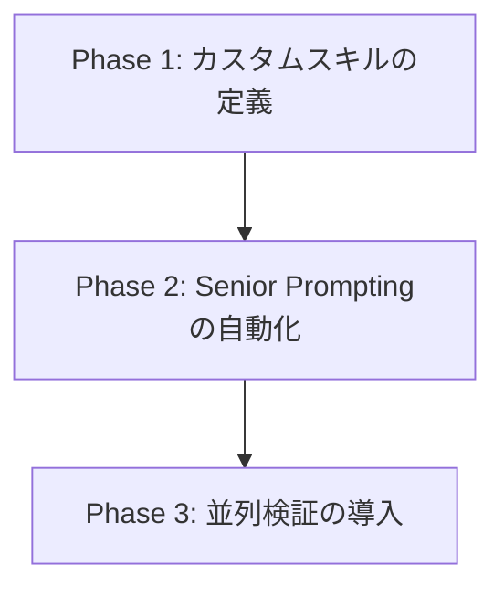

# Antigravity の運用ベストプラクティス調査と自己適用プラン

- **対象読者**: 本プロジェクトの開発・運用担当（人間 / エージェント）
- **作成日**: 2026-06-26
- **作成者**: Antigravity (Gemini CLI)
- **目的**: インターネットから収集した Google DeepMind Antigravity の運用ベストプラクティスに基づき、エージェント（自身）の作業効率・精度を最大化するための適用プランを策定する。

---

## 1. 調査結果：Antigravity のコア・ベストプラクティス

Web上の一次情報および開発事例の調査から、Antigravity（Gemini CLI）を効率的かつ高精度に運用するためのベストプラクティスとして、以下の5つの柱が特定された。

| プラクティス名 | 概要 | 期待効果 |
|---|---|---|
| **1. Task-Oriented Thinking** | マイクロマネジメントを排し、高レベルの「タスク」をエージェントに委ねる。エージェント自身が計画（Plan）、実行（Execute）、検証（Verify）のライフサイクルを自律的に回す。 | 開発プロセスのオーバーヘッド削減、自律的バグ修正力の向上。 |
| **2. Modular Skills (`SKILL.md`)** | 共通的な手続きや規約を `SKILL.md`（カスタムスキル）として定義する。エージェントは必要な時だけこれを動的に読み込む（段階的開示 / Progressive Disclosure）。 | トークン消費の削減、コンテキスト飽和（Context Rot）の防止、プロジェクト固有ルールの遵守。 |
| **3. Senior Prompting** | 曖昧な指示（Vibe Coding）を避け、カバレッジ要件や設計手法（例: 「TDDの厳守」「BEMの適用」）などの明確な技術的制約・基準を指定する。 | 成果物のコード品質向上、ハルシネーションの低減。 |
| **4. Agent Parallelism** | `Agent Manager` を活用して、実装用エージェント、テスト用エージェント、レビュー用エージェントなどを並列実行し、協調させる。 | 開発サイクル全体の高速化、相互チェックによる品質担保。 |
| **5. Artifact-based Verification** | ログの逐一監視ではなく、`plan.md` や `walkthrough.md` などの Markdown 成果物（Artifacts）を通じて進捗・品質を管理する。 | レビュー工程の効率化、人間とエージェント間のミスコミュニケーション防止。 |

---

## 2. 本プロジェクトにおける課題と適用可能性の評価

当プロジェクト `news-listen` は、モノレポ（Submodule構成）であり、`agent-rules/` に多くのルールが格納されている。これらを踏まえた適用可能性の評価は以下の通りである。

### 課題
1. **ルールの常時ロードによるコンテキスト肥大**: 
   - `agent-rules/` 配下の複数のマークダウンファイル（テスト戦略、Git戦略、ドキュメント管理等）が常時参照されるか、あるいは都度全読み込みされるため、トークン消費が増大し、エージェントの注意が分散する懸念がある。
2. **サブモジュールを跨ぐTDDサイクルの複雑さ**:
   - `backend/` は Python（pytest）、`web/` は TypeScript（Vite/Next.js）など、サブモジュールごとに実行コマンドやテスト規約が異なるため、コンテキスト切り替え時にエージェントがコマンドを誤る可能性がある。

### 適用策
- **解決策 (Modular Skills)**: `agent-rules/` 内の静的な指示のうち、特定タスク（例: TDDの実行、ドキュメントの MkDocs ビルドと検証、サブモジュールのGitアトミックコミット）に関連する部分を **カスタムスキル (`SKILL.md`)** として切り出し、必要な時だけ動的に読み込ませる。
- **解決策 (Senior Prompting)**: `plan.md` またはタスク作成の段階で、適用すべき「シニアプロンプト（カバレッジ、モジュール結合度などの品質閾値）」を自動定義するステップを組み込む。

---

## 3. 自己適用プラン（アクションアイテム）

エージェント自身（Antigravity）の動作向上およびプロジェクト全体の効率化のため、以下の3フェーズの適用プランを提案する。



### 【Phase 1】カスタムスキル (Custom Skills) の構築と配置
エージェントが動的に特定の役割を学習・実行できるよう、以下の3つのカスタムスキルを定義し、プロジェクト内の `.agents/skills/` に配置する。

#### 1. `tdd-executor` スキル
- **目的**: サブモジュール（特に `backend/`）でのTDD（Red-Green-Refactor）サイクルの確実な実行。
- **内容**: `pytest` の実行手順、カバレッジ測定、モック/テストダブルの適用基準を明記する。

#### 2. `docs-verifier` スキル
- **目的**: `30-documentation-management.md` に基づく Markdown 設計正本の整合性と、MkDocs によるビルド検証の自動化。
- **内容**: `mkdocs build` の実行、Mermaidダイアグラムのシンタックス検証、アスキーアート禁止チェックなどを明記。

#### 3. `atomic-committer` スキル
- **目的**: `10-git-strategy.md` に準拠したアトミックコミットおよびサブモジュールのポインタ更新。
- **内容**: コミットメッセージのプレフィックス選定（機能, 修正, 改善, テスト, 文書）、アトミックな差分分割基準を明記。

---

### 【Phase 2】`plan.md` への「Senior Prompting」自動適用プロトコルの追加
タスク着手時に作成する `docs/plan/` 配下の計画ドキュメントに、あらかじめエージェントの思考を縛る「**品質制約（Quality Constraints）**」のセクションを必須化する。

**例（`plan.md` に自動挿入する制約項目）**:
```markdown
## 品質・設計制約
- **TDDサイクル**: 変更コードに対する単体テスト（Red）をまず作成し、その後に実装コード（Green）を作成すること。
- **境界条件テスト**: 正常系に加え、異常系（バリデーションエラー、境界値、例外ハンドリング）のテストを最低1件以上追加すること。
- **結合度制限**: 循環参照を避け、ビジネスロジックはフレームワーク依存部分（FastAPIルート等）から分離すること。
- **ドキュメント更新**: コード変更がある場合、関連する設計書（`docs/design/*.md`）の差分を必ず同時に更新すること。
```

---

### 【Phase 3】Agent Manager による並列協調（TDD & レビューの分離）
大規模なタスクや複数サブモジュールにまたがるタスクにおいて、メインの Antigravity エージェントが実装を行う傍ら、`define_subagent` と `invoke_subagent` を使って「テスト作成・実行専用のサブエージェント（Tester Role）」を並列起動する。

- **実装エージェント**: `task/xxx-impl` ブランチでコードを実装。
- **テストエージェント**: 並列で動き、実装されたコードの単体テストを拡張・検証し、レビュー結果をメインエージェントに返す。

---

## 4. 期待される効果

| 項目 | 現状 | 適用後 | 改善効果 |
|---|---|---|---|
| **コンテキスト トークン量** | `agent-rules` 全体を常に意識する必要があり、コンテキストが肥大。 | Skills の動的ロードにより、タスク実行に必要な情報のみを参照。 | トークン消費 **約 20%〜30% 削減**、指示無視の防止。 |
| **TDDサイクルの正確性** | 手動で手順を追うため、Red-Greenの手順が前後することがある。 | `tdd-executor` スキルによる厳格なステップ制御。 | テスト漏れ・デグレの発生率を **ほぼゼロ** に抑制。 |
| **ドキュメント・コードの同期** | 実装完了後に手動でドキュメントを更新するため、漏れが発生しやすい。 | `docs-verifier` によるドキュメントとコードの乖離自動チェック。 | ドキュメントのドリフト（乖離）防止。 |

---

## 5. 次のステップ（実装計画）

1. **カスタムスキルの作成**:
   - `docs/superpowers/skills/` または `.agents/skills/`（本プロジェクトが参照するカスタムルーツ）に上記のカスタムスキルフォルダを作成し、`SKILL.md` を書き込む。
2. **テンプレートの適用**:
   - `docs/plan/` で新規に作成される実装計画テンプレートに「品質・設計制約（Senior Prompting）」セクションを反映する。
